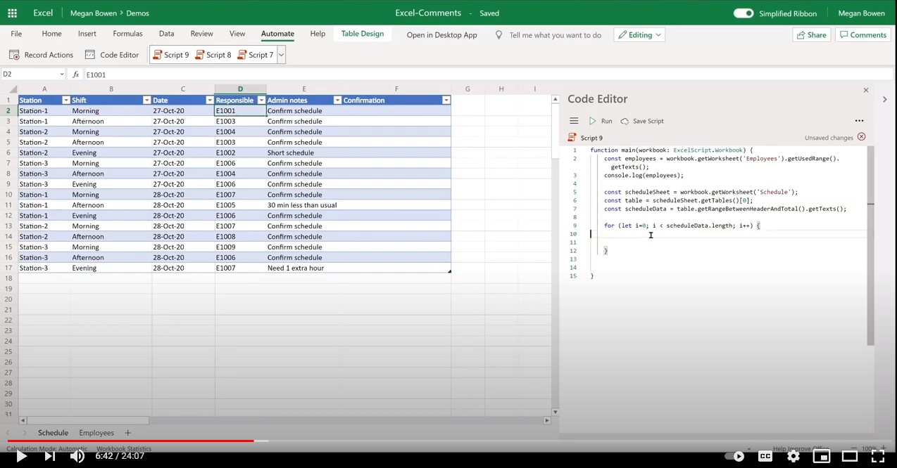

# <a name="add-comments-in-excel"></a>Добавление комментариев в Excel

В этом примере показано, как добавлять комментарии в ячейку, [включая](https://support.microsoft.com/office/90701709-5dc1-41c7-aa48-b01d4a46e8c7) @mentioning коллегу.

## <a name="example-scenario"></a>Пример сценария

* Руководство группы поддерживает расписание смены. Руководство группы назначает ID сотрудника для записи смены.
* Руководство группы хочет уведомить сотрудника. Добавляя комментарий, @mentions сотрудник, сотрудник получает электронное сообщение из таблицы.
* Впоследствии сотрудник может просматривать книгу и отвечать на комментарий в удобное для него время.

## <a name="solution"></a>Решение

1. Сценарий извлекает сведения о сотрудниках из таблицы сотрудников.
1. Затем скрипт добавляет комментарий (включая соответствующую электронную почту сотрудника) в соответствующую ячейку в записи смены.
1. Существующие комментарии в ячейке удаляются перед добавлением нового комментария.

## <a name="sample-code-add-comments"></a>Пример кода: добавление комментариев

Скачайте файл <a href="excel-comments.xlsx">excel-comments.xlsx, </a> используемый в этом примере, и попробуйте его самостоятельно!

```TypeScript
function main(workbook: ExcelScript.Workbook) {
    const employees = workbook.getWorksheet('Employees').getUsedRange().getTexts();
    console.log(employees); 

    const scheduleSheet = workbook.getWorksheet('Schedule');
    const table = scheduleSheet.getTables()[0];
    const range = table.getRangeBetweenHeaderAndTotal();
    const scheduleData = range.getTexts();

    for (let i=0; i < scheduleData.length; i++) {
      let eId = scheduleData[i][3];

      let employeeInfo = employees.find(e => e[0] === eId);
      if (employeeInfo) {
        console.log("Found a match " + employeeInfo);
        let adminNotes = scheduleData[i][4];
        try { 
          let comment = workbook.getCommentByCell(range.getCell(i, 5));
          comment.delete();
        } catch {
            console.log("Ignore if there is no existing comment in the cell");
        }
        workbook.addComment(range.getCell(i,5), {
          mentions: [{
            email: employeeInfo[1],
            id: 0,
            name: employeeInfo[2]
          }],
          richContent: `<at id=\"0\">${employeeInfo[2]}</at> ${adminNotes}`
        }, ExcelScript.ContentType.mention);        
        
      } else {
        console.log("No match for: " + eId);
      }
    }
    return;
}
```

## <a name="training-video-add-comments"></a>Обучающее видео: добавление комментариев

[](https://youtu.be/CpR78nkaOFw "Пошаговая видеозапись добавления комментариев в файл Excel")
