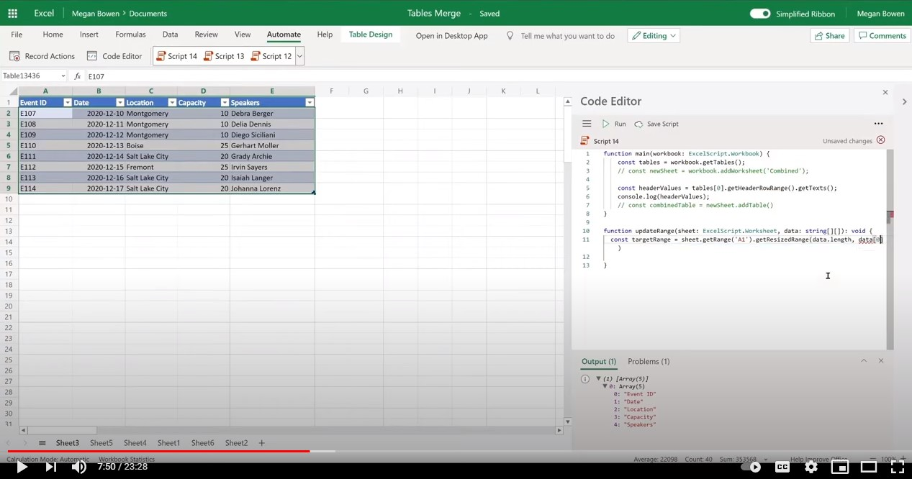

# <a name="combine-data-from-multiple-excel-tables-into-a-single-table"></a>Объединяйте данные из нескольких таблиц Excel в одну таблицу

Этот пример объединяет данные из нескольких таблиц Excel в одну таблицу, которая включает все строки. Предполагается, что все используемые таблицы имеют ту же структуру.

Существует два варианта этого сценария:

1. Первый [сценарий объединяет](#sample-code-combine-data-from-multiple-excel-tables-into-a-single-table) все таблицы в файле Excel.
1. Второй [сценарий](#sample-code-combine-data-from-multiple-excel-tables-in-select-worksheets-into-a-single-table) выборочно получает таблицы в наборе таблиц.

## <a name="sample-code-combine-data-from-multiple-excel-tables-into-a-single-table"></a>Пример кода. Объединяйте данные из нескольких таблиц Excel в одну таблицу

Скачайте пример файла <a href="tables-copy.xlsx">tables-copy.xlsx</a> и используйте его со следующим скриптом, чтобы попробовать его самостоятельно!

```TypeScript
function main(workbook: ExcelScript.Workbook) {
    workbook.getWorksheet('Combined')?.delete();
    const newSheet = workbook.addWorksheet('Combined');
    
    const tables = workbook.getTables();    
    const headerValues = tables[0].getHeaderRowRange().getTexts();
    console.log(headerValues);
    const targetRange = updateRange(newSheet, headerValues);
    const combinedTable = newSheet.addTable(targetRange.getAddress(), true);
    for (let table of tables) {      
      let dataValues = table.getRangeBetweenHeaderAndTotal().getTexts();
      let rowCount = table.getRowCount();
      if (rowCount > 0) {
        combinedTable.addRows(-1, dataValues);
      }
    }
}

function updateRange(sheet: ExcelScript.Worksheet, data: string[][]): ExcelScript.Range {
  const targetRange = sheet.getRange('A1').getResizedRange(data.length-1, data[0].length-1);
  targetRange.setValues(data);
  return targetRange;
}
```

## <a name="sample-code-combine-data-from-multiple-excel-tables-in-select-worksheets-into-a-single-table"></a>Пример кода. Объединяйте данные из нескольких таблиц Excel в отдельных листах в одну таблицу

Скачайте пример файла <a href="tables-select-copy.xlsx">tables-select-copy.xlsx</a> и используйте его со следующим скриптом, чтобы попробовать его самостоятельно!

```TypeScript
function main(workbook: ExcelScript.Workbook) {
    const sheetNames = ['Sheet1', 'Sheet2', 'Sheet3'];
    
    workbook.getWorksheet('Combined')?.delete();
    const newSheet = workbook.addWorksheet('Combined');
    let targetTableCreated = false;
    let combinedTable;
    sheetNames.forEach((sheet) => {
      const tables = workbook.getWorksheet(sheet).getTables();
      if (!targetTableCreated) {
        const headerValues = tables[0].getHeaderRowRange().getTexts();
        const targetRange = updateRange(newSheet, headerValues);
        combinedTable = newSheet.addTable(targetRange.getAddress(), true);
        targetTableCreated = true;
      }      
      for (let table of tables) {
        let dataValues = table.getRangeBetweenHeaderAndTotal().getTexts();
        let rowCount = table.getRowCount();
        if (rowCount > 0) {
        combinedTable.addRows(-1, dataValues);
        }
      }
    })
}

function updateRange(sheet: ExcelScript.Worksheet, data: string[][]): ExcelScript.Range {
  const targetRange = sheet.getRange('A1').getResizedRange(data.length-1, data[0].length-1);
  targetRange.setValues(data);
  return targetRange;
}
```

## <a name="training-video-combine-data-from-multiple-excel-tables-into-a-single-table"></a>Обучающее видео. Объединяйте данные из нескольких таблиц Excel в одну таблицу

[](https://youtu.be/di-8JukK3Lc "Пошаговая видеозапись объединения данных из нескольких таблиц Excel в одну таблицу")
