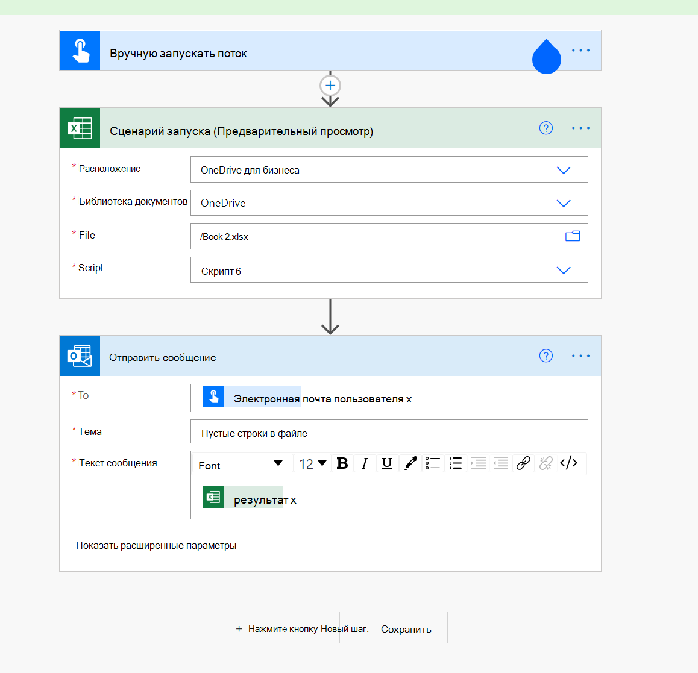

# <a name="count-blank-rows-on-sheets"></a>Подсчет пустых строк на листах

Этот проект включает два сценария:

* [Подсчитайте пустые строки на заданном листе:](#sample-code-count-blank-rows-on-a-given-sheet)пересекает используемый диапазон на заданном листе и возвращает количество пустых строк.
* [Подсчитайте пустые строки](#sample-code-count-blank-rows-on-all-sheets)на всех листах: пересекает используемый диапазон на всех листах и возвращает количество пустых строк. 

> [!NOTE]
> Для нашего скрипта пустая строка — это строка, в которой нет данных. Строка может иметь форматирование.

_Этот лист возвращает количество 4 пустых строк_


_Этот лист возвращает количество 0 пустых строк (все строки имеют некоторые данные)_


## <a name="sample-code-count-blank-rows-on-a-given-sheet"></a>Пример кода. Подсчитайте пустые строки на заданном листе

```TypeScript
function main(workbook: ExcelScript.Workbook): number
{
  const sheet = workbook.getWorksheet('Sheet1'); 
  // Getting the active worksheet is not suitable for a script used by Power Automate.
  // const sheet = workbook.getActiveWorksheet();
  
  const range = sheet.getUsedRange(true); // Get value only.
  if (!range) {
    console.log(`No data on this sheet. `);
    return;
  }
  console.log(`Used range for the worksheet: ${range.getAddress()}`);
  const values = range.getValues();
  let emptyRows = 0;
  for (let row of values) {
    let len = 0; 
    for (let cell of row) {
      len = len + cell.toString().length;
    }
    if (len === 0) { 
      emptyRows++;
    }
  }
  console.log(`Total empty row: ` + emptyRows);
  return emptyRows;
}
```

## <a name="sample-code-count-blank-rows-on-all-sheets"></a>Пример кода: количество пустых строк на всех листах

```TypeScript
function main(workbook: ExcelScript.Workbook): number
{
  const sheets = workbook.getWorksheets();
  let emptyRows = 0;
  for (let sheet of sheets) { 
    const range = sheet.getUsedRange(true); // Get value only.
    if (!range) {
      console.log(`No data on this sheet. `);
      continue;
    }
    console.log(`Used range for the worksheet ${sheet.getName()}: ${range.getAddress()}`);
    const values = range.getValues();

    for (let row of values) {
      let len = 0;
      for (let cell of row) {
        len = len + cell.toString().length;
      }
      if (len === 0) {
        emptyRows++;
      }
    }
  }
  console.log(`Total empty row: ` + emptyRows);
  return emptyRows;
}
```

## <a name="use-with-power-automate"></a>Использование с помощью power Automate


