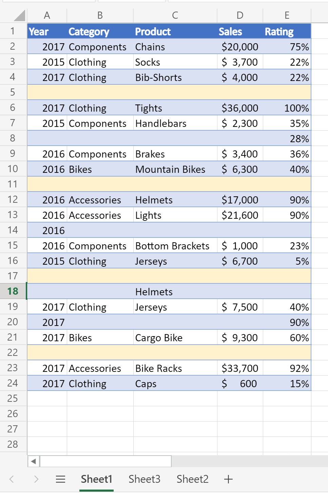

# <a name="count-blank-rows-on-sheets"></a><span data-ttu-id="8ea03-103">Подсчет пустых строк на листах</span><span class="sxs-lookup"><span data-stu-id="8ea03-103">Count blank rows on sheets</span></span>

<span data-ttu-id="8ea03-104">Этот проект включает два сценария:</span><span class="sxs-lookup"><span data-stu-id="8ea03-104">This project includes two scripts:</span></span>

* <span data-ttu-id="8ea03-105">[Подсчитайте пустые строки на заданном листе:](#sample-code-count-blank-rows-on-a-given-sheet)пересекает используемый диапазон на заданном листе и возвращает количество пустых строк.</span><span class="sxs-lookup"><span data-stu-id="8ea03-105">[Count blank rows on a given sheet](#sample-code-count-blank-rows-on-a-given-sheet): Traverses the used range on a given worksheet and returns a blank row count.</span></span>
* <span data-ttu-id="8ea03-106">[Подсчитайте пустые строки](#sample-code-count-blank-rows-on-all-sheets)на всех листах: пересекает используемый диапазон на всех листах и возвращает количество пустых строк. </span><span class="sxs-lookup"><span data-stu-id="8ea03-106">[Count blank rows on all sheets](#sample-code-count-blank-rows-on-all-sheets): Traverses the used range on _all of the worksheets_ and returns a blank row count.</span></span>

> [!NOTE]
> <span data-ttu-id="8ea03-107">Для нашего скрипта пустая строка — это строка, в которой нет данных.</span><span class="sxs-lookup"><span data-stu-id="8ea03-107">For our script, a blank row is any row where there's no data.</span></span> <span data-ttu-id="8ea03-108">Строка может иметь форматирование.</span><span class="sxs-lookup"><span data-stu-id="8ea03-108">The row can have formatting.</span></span>

<span data-ttu-id="8ea03-109">_Этот лист возвращает количество 4 пустых строк_</span><span class="sxs-lookup"><span data-stu-id="8ea03-109">_This sheet returns count of 4 blank rows_</span></span>



<span data-ttu-id="8ea03-111">_Этот лист возвращает количество 0 пустых строк (все строки имеют некоторые данные)_</span><span class="sxs-lookup"><span data-stu-id="8ea03-111">_This sheet returns count of 0 blank rows (all rows have some data)_</span></span>


## <a name="sample-code-count-blank-rows-on-a-given-sheet"></a><span data-ttu-id="8ea03-113">Пример кода. Подсчитайте пустые строки на заданном листе</span><span class="sxs-lookup"><span data-stu-id="8ea03-113">Sample code: Count blank rows on a given sheet</span></span>

```TypeScript
function main(workbook: ExcelScript.Workbook): number
{
  const sheet = workbook.getWorksheet('Sheet1'); 
  // Getting the active worksheet is not suitable for a script used by Power Automate.
  // const sheet = workbook.getActiveWorksheet();
  
  const range = sheet.getUsedRange(true); // Get value only.
  if (!range) {
    console.log(`No data on this sheet. `);
    return;
  }
  console.log(`Used range for the worksheet: ${range.getAddress()}`);
  const values = range.getValues();
  let emptyRows = 0;
  for (let row of values) {
    let len = 0; 
    for (let cell of row) {
      len = len + cell.toString().length;
    }
    if (len === 0) { 
      emptyRows++;
    }
  }
  console.log(`Total empty row: ` + emptyRows);
  return emptyRows;
}
```

## <a name="sample-code-count-blank-rows-on-all-sheets"></a><span data-ttu-id="8ea03-114">Пример кода: количество пустых строк на всех листах</span><span class="sxs-lookup"><span data-stu-id="8ea03-114">Sample code: Count blank rows on all sheets</span></span>

```TypeScript
function main(workbook: ExcelScript.Workbook): number
{
  const sheets = workbook.getWorksheets();
  let emptyRows = 0;
  for (let sheet of sheets) { 
    const range = sheet.getUsedRange(true); // Get value only.
    if (!range) {
      console.log(`No data on this sheet. `);
      continue;
    }
    console.log(`Used range for the worksheet ${sheet.getName()}: ${range.getAddress()}`);
    const values = range.getValues();

    for (let row of values) {
      let len = 0;
      for (let cell of row) {
        len = len + cell.toString().length;
      }
      if (len === 0) {
        emptyRows++;
      }
    }
  }
  console.log(`Total empty row: ` + emptyRows);
  return emptyRows;
}
```

## <a name="use-with-power-automate"></a><span data-ttu-id="8ea03-115">Использование с помощью power Automate</span><span class="sxs-lookup"><span data-stu-id="8ea03-115">Use with Power Automate</span></span>


