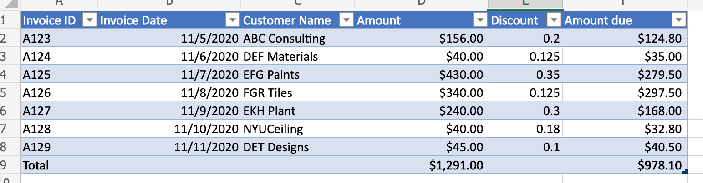
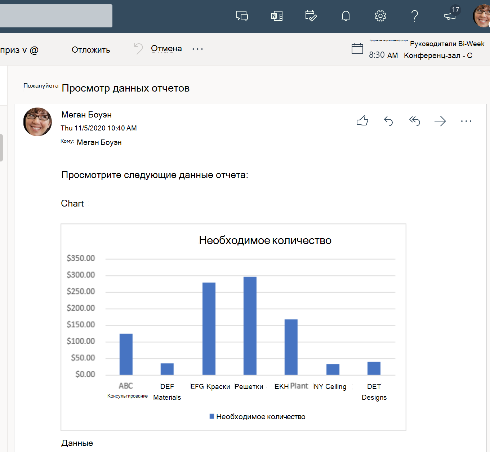

# <a name="use-office-scripts-and-power-automate-to-email-images-of-a-chart-and-table"></a><span data-ttu-id="61d28-103">Использование скриптов Office и power Automate для отправки изображений диаграммы и таблицы по электронной почте</span><span class="sxs-lookup"><span data-stu-id="61d28-103">Use Office Scripts and Power Automate to email images of a chart and table</span></span>

<span data-ttu-id="61d28-104">В этом примере для создания диаграммы используются скрипты Office и Power Automate.</span><span class="sxs-lookup"><span data-stu-id="61d28-104">This sample uses Office Scripts and Power Automate to create a chart.</span></span> <span data-ttu-id="61d28-105">Затем он передает по электронной почте изображения диаграммы и базовой таблицы.</span><span class="sxs-lookup"><span data-stu-id="61d28-105">It then emails images of the chart and its base table.</span></span>

## <a name="example-scenario"></a><span data-ttu-id="61d28-106">Пример сценария</span><span class="sxs-lookup"><span data-stu-id="61d28-106">Example scenario</span></span>

* <span data-ttu-id="61d28-107">Вычислять, чтобы получить последние результаты.</span><span class="sxs-lookup"><span data-stu-id="61d28-107">Calculate to get latest results.</span></span>
* <span data-ttu-id="61d28-108">Создание диаграммы.</span><span class="sxs-lookup"><span data-stu-id="61d28-108">Create chart.</span></span>
* <span data-ttu-id="61d28-109">Получите изображения диаграммы и таблицы.</span><span class="sxs-lookup"><span data-stu-id="61d28-109">Get chart and table images.</span></span>
* <span data-ttu-id="61d28-110">Отправьте изображения по электронной почте с помощью Power Automate.</span><span class="sxs-lookup"><span data-stu-id="61d28-110">Email the images with Power Automate.</span></span>

<span data-ttu-id="61d28-111">_Входные данные_</span><span class="sxs-lookup"><span data-stu-id="61d28-111">_Input data_</span></span>



<span data-ttu-id="61d28-113">_Диаграмма вывода_</span><span class="sxs-lookup"><span data-stu-id="61d28-113">_Output chart_</span></span>


<span data-ttu-id="61d28-115">_Электронная почта, полученная через поток Power Automate_</span><span class="sxs-lookup"><span data-stu-id="61d28-115">_Email that was received through Power Automate flow_</span></span>



## <a name="solution"></a><span data-ttu-id="61d28-117">Решение</span><span class="sxs-lookup"><span data-stu-id="61d28-117">Solution</span></span>

<span data-ttu-id="61d28-118">Это решение состоит из двух частей:</span><span class="sxs-lookup"><span data-stu-id="61d28-118">This solution has two parts:</span></span>

1. [<span data-ttu-id="61d28-119">Сценарий Office для вычисления и извлечения диаграммы и таблицы Excel</span><span class="sxs-lookup"><span data-stu-id="61d28-119">An Office Script to calculate and extract Excel chart and table</span></span>](#sample-code-calculate-and-extract-excel-chart-and-table)
1. <span data-ttu-id="61d28-120">Поток Power Automate для вызова скрипта и отправки результатов по электронной почте.</span><span class="sxs-lookup"><span data-stu-id="61d28-120">A Power Automate flow to invoke the script and email the results.</span></span> <span data-ttu-id="61d28-121">Пример этого см. в примере [Create an automated workflow with Power Automate.](../../tutorials/excel-power-automate-returns.md#create-an-automated-workflow-with-power-automate)</span><span class="sxs-lookup"><span data-stu-id="61d28-121">For an example on how to do this, see [Create an automated workflow with Power Automate](../../tutorials/excel-power-automate-returns.md#create-an-automated-workflow-with-power-automate).</span></span>

## <a name="sample-code-calculate-and-extract-excel-chart-and-table"></a><span data-ttu-id="61d28-122">Пример кода: Вычислять и извлекать диаграмму и таблицу Excel</span><span class="sxs-lookup"><span data-stu-id="61d28-122">Sample code: Calculate and extract Excel chart and table</span></span>

<span data-ttu-id="61d28-123">Следующий сценарий вычисляет и извлекает диаграмму и таблицу Excel.</span><span class="sxs-lookup"><span data-stu-id="61d28-123">The following script calculates and extracts an Excel chart and table.</span></span>

<span data-ttu-id="61d28-124">Скачайте пример файла <a href="email-chart-table.xlsx">email-chart-table.xlsx</a> и используйте его с помощью этого скрипта, чтобы попробовать его самостоятельно!</span><span class="sxs-lookup"><span data-stu-id="61d28-124">Download the sample file <a href="email-chart-table.xlsx">email-chart-table.xlsx</a> and use it with this script to try it out yourself!</span></span>

```TypeScript
function main(workbook: ExcelScript.Workbook): ReportImages {

  workbook.getApplication().calculate(ExcelScript.CalculationType.full);
  
  let sheet1 = workbook.getWorksheet("Sheet1");
  const table = workbook.getWorksheet('InvoiceAmounts').getTables()[0];
  const rows = table.getRange().getTexts();

  const selectColumns = rows.map((row) => {
    return [row[2], row[5]];
  });
  table.setShowTotals(true);
  selectColumns.splice(selectColumns.length-1, 1);
  console.log(selectColumns);

  workbook.getWorksheet('ChartSheet')?.delete();
  const chartSheet = workbook.addWorksheet('ChartSheet');
  const targetRange = updateRange(chartSheet, selectColumns);

  // Insert chart on sheet 'Sheet1'.
  let chart_2 = chartSheet.addChart(ExcelScript.ChartType.columnClustered, targetRange);
  chart_2.setPosition('D1');
  const chartImage = chart_2.getImage();
  const tableImage = table.getRange().getImage();
  return {
    chartImage,
    tableImage
  }
}

function updateRange(sheet: ExcelScript.Worksheet, data: string[][]): ExcelScript.Range {
  const targetRange = sheet.getRange('A1').getResizedRange(data.length-1, data[0].length-1);
  targetRange.setValues(data);
  return targetRange;
}

interface ReportImages {
  chartImage: string
  tableImage: string
}
```

## <a name="training-video-extract-and-email-images-of-chart-and-table"></a><span data-ttu-id="61d28-125">Обучающее видео: извлечение и отправка изображений диаграммы и таблицы по электронной почте</span><span class="sxs-lookup"><span data-stu-id="61d28-125">Training video: Extract and email images of chart and table</span></span>

<span data-ttu-id="61d28-126">[](https://youtu.be/152GJyqc-Kw "Пошаговая видеозапись по извлечению и отправке изображений диаграммы и таблицы по электронной почте")</span><span class="sxs-lookup"><span data-stu-id="61d28-126">[](https://youtu.be/152GJyqc-Kw "Step-by-step video on how to extract and email images of chart and table")</span></span>
