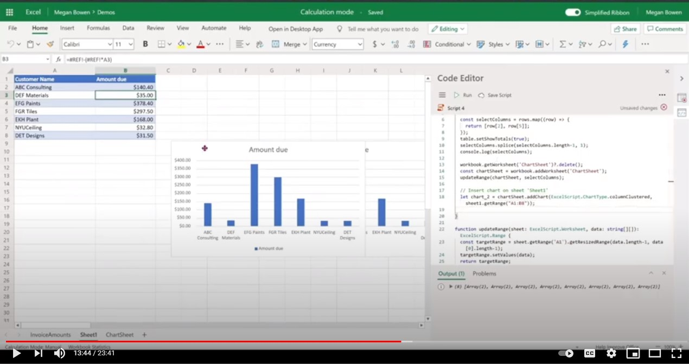

# <a name="use-office-scripts-and-power-automate-to-email-images-of-a-chart-and-table"></a>Использование скриптов Office и power Automate для отправки изображений диаграммы и таблицы по электронной почте

В этом примере для создания диаграммы используются скрипты Office и Power Automate. Затем он передает по электронной почте изображения диаграммы и базовой таблицы.

## <a name="example-scenario"></a>Пример сценария

* Вычислять, чтобы получить последние результаты.
* Создание диаграммы.
* Получите изображения диаграммы и таблицы.
* Отправьте изображения по электронной почте с помощью Power Automate.

_Входные данные_

:::image type="content" source="../../images/input-data.png" alt-text="Таблица, показывающая таблицу входных данных.":::

_Диаграмма вывода_

:::image type="content" source="../../images/chart-created.png" alt-text="Диаграмма столбцов, созданная с указанием суммы, которая должна быть засвеяна клиентом.":::

_Электронная почта, полученная через поток Power Automate_

:::image type="content" source="../../images/email-received.png" alt-text="Сообщение, отправленное потоком, с указанием диаграммы Excel, встроенной в тело.":::

## <a name="solution"></a>Решение

Это решение состоит из двух частей:

1. [Сценарий Office для вычисления и извлечения диаграммы и таблицы Excel](#sample-code-calculate-and-extract-excel-chart-and-table)
1. Поток Power Automate для вызова скрипта и отправки результатов по электронной почте. Пример этого см. в примере [Create an automated workflow with Power Automate.](../../tutorials/excel-power-automate-returns.md#create-an-automated-workflow-with-power-automate)

## <a name="sample-code-calculate-and-extract-excel-chart-and-table"></a>Пример кода: Вычислять и извлекать диаграмму и таблицу Excel

Следующий сценарий вычисляет и извлекает диаграмму и таблицу Excel.

Скачайте пример файла <a href="email-chart-table.xlsx">email-chart-table.xlsx</a> и используйте его с помощью этого скрипта, чтобы попробовать его самостоятельно!

```TypeScript
function main(workbook: ExcelScript.Workbook): ReportImages {

  workbook.getApplication().calculate(ExcelScript.CalculationType.full);
  
  let sheet1 = workbook.getWorksheet("Sheet1");
  const table = workbook.getWorksheet('InvoiceAmounts').getTables()[0];
  const rows = table.getRange().getTexts();

  const selectColumns = rows.map((row) => {
    return [row[2], row[5]];
  });
  table.setShowTotals(true);
  selectColumns.splice(selectColumns.length-1, 1);
  console.log(selectColumns);

  workbook.getWorksheet('ChartSheet')?.delete();
  const chartSheet = workbook.addWorksheet('ChartSheet');
  const targetRange = updateRange(chartSheet, selectColumns);

  // Insert chart on sheet 'Sheet1'.
  let chart_2 = chartSheet.addChart(ExcelScript.ChartType.columnClustered, targetRange);
  chart_2.setPosition('D1');
  const chartImage = chart_2.getImage();
  const tableImage = table.getRange().getImage();
  return {
    chartImage,
    tableImage
  }
}

function updateRange(sheet: ExcelScript.Worksheet, data: string[][]): ExcelScript.Range {
  const targetRange = sheet.getRange('A1').getResizedRange(data.length-1, data[0].length-1);
  targetRange.setValues(data);
  return targetRange;
}

interface ReportImages {
  chartImage: string
  tableImage: string
}
```

## <a name="training-video-extract-and-email-images-of-chart-and-table"></a>Обучающее видео: извлечение и отправка изображений диаграммы и таблицы по электронной почте

[](https://youtu.be/152GJyqc-Kw "Пошаговая видеозапись по извлечению и отправке изображений диаграммы и таблицы по электронной почте")
