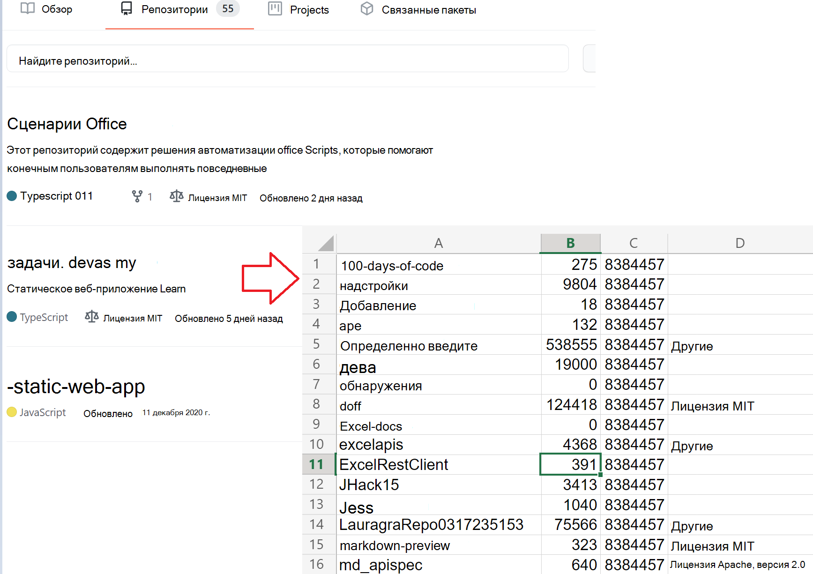

# <a name="use-external-fetch-calls-in-office-scripts"></a><span data-ttu-id="af63d-103">Использование внешних вызовов Fetch в сценариях Office</span><span class="sxs-lookup"><span data-stu-id="af63d-103">Use external fetch calls in Office Scripts</span></span>

<span data-ttu-id="af63d-104">Этот скрипт получает основные сведения о репозиториях GitHub пользователя.</span><span class="sxs-lookup"><span data-stu-id="af63d-104">This script gets basic information about a user's GitHub repositories.</span></span> <span data-ttu-id="af63d-105">В нем показано, как `fetch` использовать в простом сценарии.</span><span class="sxs-lookup"><span data-stu-id="af63d-105">It shows how to use `fetch` in a simple scenario.</span></span>

<span data-ttu-id="af63d-106">Дополнительные данные о API GItHub, используемых в ссылке GitHub [API.](https://docs.github.com/rest/reference/repos#list-repositories-for-a-user)</span><span class="sxs-lookup"><span data-stu-id="af63d-106">You can learn more about the GItHub APIs being used in the [GitHub API reference](https://docs.github.com/rest/reference/repos#list-repositories-for-a-user).</span></span> <span data-ttu-id="af63d-107">Вы также можете увидеть необработанный результат вызова API, посетив веб-браузер (не забудьте заменить местообладатель `https://api.github.com/users/{USERNAME}/repos` {USERNAME} на код Github).</span><span class="sxs-lookup"><span data-stu-id="af63d-107">You can also see the raw API call output by visiting `https://api.github.com/users/{USERNAME}/repos` in a web browser (be sure to replace the {USERNAME} placeholder with your Github ID).</span></span>



## <a name="sample-code-get-basic-information-about-users-github-repositories"></a><span data-ttu-id="af63d-109">Пример кода. Получите базовую информацию о GitHub хранилищах пользователя</span><span class="sxs-lookup"><span data-stu-id="af63d-109">Sample code: Get basic information about user's GitHub repositories</span></span>

```TypeScript
async function main(workbook: ExcelScript.Workbook) {

  // Replace the {USERNAME} placeholder with your GitHub username.
  const response = await fetch('https://api.github.com/users/{USERNAME}/repos');
  const repos: Repository[] = await response.json();
  
  const rows: (string | boolean | number)[][] = [];
  for (let repo of repos){ 
    rows.push([repo.id, repo.name, repo.license?.name, repo.license?.url])
  }
  const sheet = workbook.getActiveWorksheet();
  const range = sheet.getRange('A2').getResizedRange(rows.length - 1, rows[0].length - 1);
  range.setValues(rows);
  return;
}

interface Repository {
  name: string,
  id: string,
  license?: License 
}

interface License {
  name: string,
  url: string
}
```

## <a name="training-video-how-to-make-external-api-calls"></a><span data-ttu-id="af63d-110">Обучающее видео: как сделать внешние вызовы API</span><span class="sxs-lookup"><span data-stu-id="af63d-110">Training video: How to make external API calls</span></span>

<span data-ttu-id="af63d-111">[Смотреть Sudhi Ramamurthy ходить через этот пример на YouTube](https://youtu.be/fulP29J418E).</span><span class="sxs-lookup"><span data-stu-id="af63d-111">[Watch Sudhi Ramamurthy walk through this sample on YouTube](https://youtu.be/fulP29J418E).</span></span>
