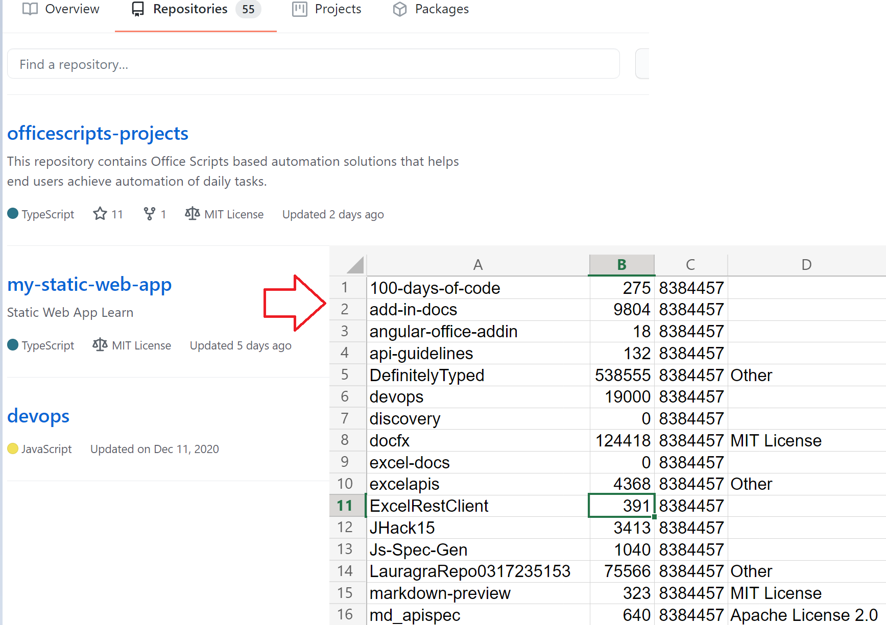

# <a name="use-external-fetch-calls-in-office-scripts"></a>Использование внешних вызовов Fetch в сценариях Office

Этот скрипт получает основные сведения о репозиториях GitHub пользователя. В нем показано, как `fetch` использовать в простом сценарии.

Дополнительные данные о API GItHub, используемых в ссылке GitHub [API.](https://docs.github.com/rest/reference/repos#list-repositories-for-a-user) Вы также можете увидеть необработанный результат вызова API, посетив веб-браузер (не забудьте заменить местообладатель `https://api.github.com/users/{USERNAME}/repos` {USERNAME} на код Github).



## <a name="sample-code-get-basic-information-about-users-github-repositories"></a>Пример кода. Получите базовую информацию о GitHub хранилищах пользователя

```TypeScript
async function main(workbook: ExcelScript.Workbook) {

  // Replace the {USERNAME} placeholder with your GitHub username.
  const response = await fetch('https://api.github.com/users/{USERNAME}/repos');
  const repos: Repository[] = await response.json();
  
  const rows: (string | boolean | number)[][] = [];
  for (let repo of repos){ 
    rows.push([repo.id, repo.name, repo.license?.name, repo.license?.url])
  }
  const sheet = workbook.getActiveWorksheet();
  const range = sheet.getRange('A2').getResizedRange(rows.length - 1, rows[0].length - 1);
  range.setValues(rows);
  return;
}

interface Repository {
  name: string,
  id: string,
  license?: License 
}

interface License {
  name: string,
  url: string
}
```

## <a name="training-video-how-to-make-external-api-calls"></a>Обучающее видео: как сделать внешние вызовы API

[Смотреть Sudhi Ramamurthy ходить через этот пример на YouTube](https://youtu.be/fulP29J418E).
