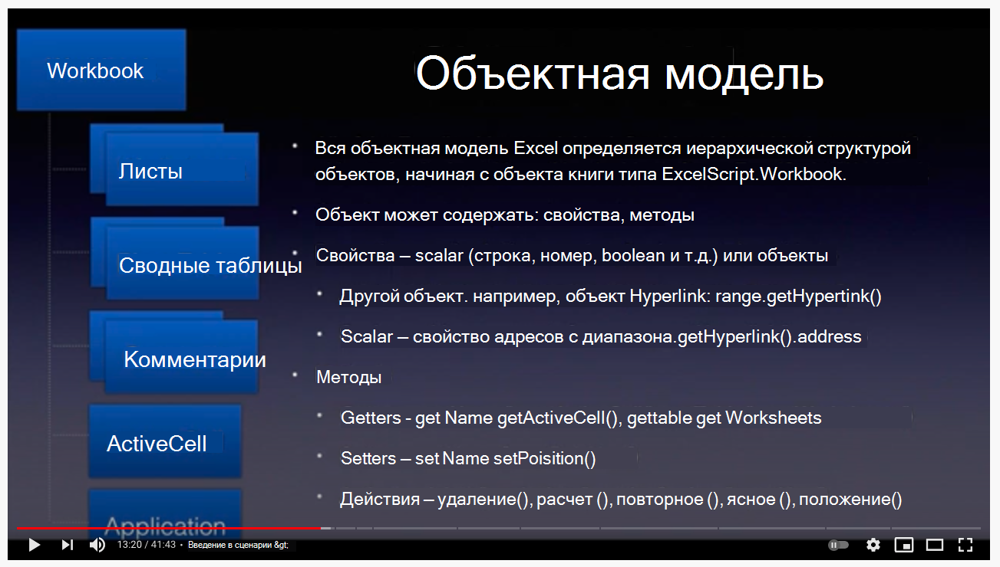

# <a name="getting-started"></a><span data-ttu-id="ab3fa-103">Начало работы</span><span class="sxs-lookup"><span data-stu-id="ab3fa-103">Getting started</span></span>

<span data-ttu-id="ab3fa-104">В этом разделе приводится подробная информация об основах Office скриптов, включая доступ, среду, основы скрипта и несколько базовых шаблонов сценариев.</span><span class="sxs-lookup"><span data-stu-id="ab3fa-104">This section provides details about the basics of Office Scripts including access, environment, script fundamentals, and few basic script patterns.</span></span>

## <a name="environment-setup"></a><span data-ttu-id="ab3fa-105">Настройка среды</span><span class="sxs-lookup"><span data-stu-id="ab3fa-105">Environment setup</span></span>

<span data-ttu-id="ab3fa-106">Узнайте об основах доступа, среды и редактора сценариев.</span><span class="sxs-lookup"><span data-stu-id="ab3fa-106">Learn about the basics of access, environment, and script editor.</span></span>

<span data-ttu-id="ab3fa-107">[](https://youtu.be/vvCtxsjPxo8 "Основы приложения Office скриптов")</span><span class="sxs-lookup"><span data-stu-id="ab3fa-107">[](https://youtu.be/vvCtxsjPxo8 "Basics of Office Scripts application")</span></span>

### <a name="access"></a><span data-ttu-id="ab3fa-108">Access</span><span class="sxs-lookup"><span data-stu-id="ab3fa-108">Access</span></span>

<span data-ttu-id="ab3fa-109">Office Скрипты требуют параметров администратора, доступных для Microsoft 365 администратора в **Параметры**  >  **параметров Org** Office  >  **Скрипты**.</span><span class="sxs-lookup"><span data-stu-id="ab3fa-109">Office Scripts requires admin settings available for Microsoft 365 administrator under **Settings** > **Org settings** > **Office Scripts**.</span></span> <span data-ttu-id="ab3fa-110">По умолчанию он включен для всех пользователей.</span><span class="sxs-lookup"><span data-stu-id="ab3fa-110">By default, it's turned on for all users.</span></span> <span data-ttu-id="ab3fa-111">Существует два подпараметров, которые администратор может включить и отключить.</span><span class="sxs-lookup"><span data-stu-id="ab3fa-111">There are two sub-settings, which the admin can turn on and off.</span></span>

* <span data-ttu-id="ab3fa-112">Возможность обмена скриптами в организации</span><span class="sxs-lookup"><span data-stu-id="ab3fa-112">Ability to share scripts within the organization</span></span>
* <span data-ttu-id="ab3fa-113">Возможность использования скриптов в Power Automate</span><span class="sxs-lookup"><span data-stu-id="ab3fa-113">Ability to use scripts in Power Automate</span></span>

<span data-ttu-id="ab3fa-114">Вы можете сказать, имеете ли вы доступ к Office скриптам, открывая файл в Excel в Интернете (браузере) и видя, появится ли вкладка **Automate** в ленте Excel или нет.</span><span class="sxs-lookup"><span data-stu-id="ab3fa-114">You can tell if you have access to Office Scripts by opening a file in Excel on the web (browser) and seeing if the **Automate** tab appears in the Excel ribbon or not.</span></span>
<span data-ttu-id="ab3fa-115">Если вы все еще не видите вкладку **Automate,** проверьте этот раздел [устранения неполадок.](../../testing/troubleshooting.md#automate-tab-not-appearing-or-office-scripts-unavailable)</span><span class="sxs-lookup"><span data-stu-id="ab3fa-115">If you still can't see the **Automate** tab, check [this troubleshooting section](../../testing/troubleshooting.md#automate-tab-not-appearing-or-office-scripts-unavailable).</span></span>

### <a name="availability"></a><span data-ttu-id="ab3fa-116">Доступность</span><span class="sxs-lookup"><span data-stu-id="ab3fa-116">Availability</span></span>

<span data-ttu-id="ab3fa-117">Office Скрипты доступны только в Excel в Интернете лицензий Enterprise E3+ (учетные записи потребителей и E1 не поддерживаются).</span><span class="sxs-lookup"><span data-stu-id="ab3fa-117">Office Scripts is available only in the Excel on the web for Enterprise E3+ licenses (Consumer and E1 accounts are not supported).</span></span> <span data-ttu-id="ab3fa-118">Office Скрипты еще не поддерживаются в Excel на Windows и Mac.</span><span class="sxs-lookup"><span data-stu-id="ab3fa-118">Office Scripts is not yet supported in Excel on Windows and Mac.</span></span>

### <a name="scripts-and-editor"></a><span data-ttu-id="ab3fa-119">Сценарии и редактор</span><span class="sxs-lookup"><span data-stu-id="ab3fa-119">Scripts and editor</span></span>

<span data-ttu-id="ab3fa-120">Редактор кода встроен прямо в Excel в Интернете (онлайн-версия).</span><span class="sxs-lookup"><span data-stu-id="ab3fa-120">The code editor is built right into Excel on the web (online version).</span></span> <span data-ttu-id="ab3fa-121">Если вы использовали редакторы Visual Studio Code или Sublime, этот опыт редактирования будет очень похож.</span><span class="sxs-lookup"><span data-stu-id="ab3fa-121">If you have used editors like Visual Studio Code or Sublime, this editing experience will be quite similar.</span></span>
<span data-ttu-id="ab3fa-122">Большинство клавиш ярлыков, Visual Studio Code редактор использует работу и в Office сценариев.</span><span class="sxs-lookup"><span data-stu-id="ab3fa-122">Most of the shortcut keys that Visual Studio Code editor uses work in the Office Scripts editing experience as well.</span></span> <span data-ttu-id="ab3fa-123">Ознакомьтесь со следующими раздатями клавиш ярлыков.</span><span class="sxs-lookup"><span data-stu-id="ab3fa-123">Check out the following shortcut keys handouts.</span></span>

* [<span data-ttu-id="ab3fa-124">macOS</span><span class="sxs-lookup"><span data-stu-id="ab3fa-124">macOS</span></span>](https://code.visualstudio.com/shortcuts/keyboard-shortcuts-macos.pdf)
* [<span data-ttu-id="ab3fa-125">Windows</span><span class="sxs-lookup"><span data-stu-id="ab3fa-125">Windows</span></span>](https://code.visualstudio.com/shortcuts/keyboard-shortcuts-windows.pdf)

#### <a name="key-things-to-note"></a><span data-ttu-id="ab3fa-126">Ключевые моменты, которые следует отметить</span><span class="sxs-lookup"><span data-stu-id="ab3fa-126">Key things to note</span></span>

* <span data-ttu-id="ab3fa-127">Office Скрипты доступны только для файлов, хранимых на OneDrive для бизнеса, SharePoint сайтах и сайтах Team.</span><span class="sxs-lookup"><span data-stu-id="ab3fa-127">Office Scripts is only available for files stored in OneDrive for Business, SharePoint sites, and Team sites.</span></span>
* <span data-ttu-id="ab3fa-128">Редактор не показывает расширение скрипта.</span><span class="sxs-lookup"><span data-stu-id="ab3fa-128">The editor doesn't show the script's extension.</span></span> <span data-ttu-id="ab3fa-129">На самом деле это файлы TypeScript, но они хранятся с пользовательским расширением под названием `.osts` .</span><span class="sxs-lookup"><span data-stu-id="ab3fa-129">In reality, these are TypeScript files but they are stored with a custom extension called `.osts`.</span></span>
* <span data-ttu-id="ab3fa-130">Скрипты хранятся в вашей OneDrive для бизнеса `My Files/Documents/OfficeScripts` папке.</span><span class="sxs-lookup"><span data-stu-id="ab3fa-130">The scripts are stored in your own OneDrive for Business folder `My Files/Documents/OfficeScripts`.</span></span> <span data-ttu-id="ab3fa-131">Управление этой папкой не требуется.</span><span class="sxs-lookup"><span data-stu-id="ab3fa-131">You won't need to manage this folder.</span></span> <span data-ttu-id="ab3fa-132">Со своей стороны, этот аспект можно игнорировать, так как редактор управляет просмотром и редактированием.</span><span class="sxs-lookup"><span data-stu-id="ab3fa-132">For your part, you can ignore this aspect as the editor manages the viewing/editing experience.</span></span>
* <span data-ttu-id="ab3fa-133">Скрипты не хранятся как часть Excel файлов.</span><span class="sxs-lookup"><span data-stu-id="ab3fa-133">Scripts are not stored as part of Excel files.</span></span> <span data-ttu-id="ab3fa-134">Они хранятся отдельно.</span><span class="sxs-lookup"><span data-stu-id="ab3fa-134">They are stored separately.</span></span>
* <span data-ttu-id="ab3fa-135">Вы можете поделиться сценарием с файлом Excel, что фактически означает, что вы связываете сценарий с файлом, а не привязывая его.</span><span class="sxs-lookup"><span data-stu-id="ab3fa-135">You can share the script with an Excel file which in effect means you are linking the script with the file, not attaching it.</span></span> <span data-ttu-id="ab3fa-136">Тот, кто имеет доступ к Excel файлу, также сможет **просматривать,** **запускать** или делать **копию** сценария.</span><span class="sxs-lookup"><span data-stu-id="ab3fa-136">Whoever has access to the Excel file will also be able to **view**, **run**, or **make a copy** of the script.</span></span> <span data-ttu-id="ab3fa-137">Это ключевое отличие по сравнению с макросами VBA.</span><span class="sxs-lookup"><span data-stu-id="ab3fa-137">This is a key difference compared to VBA macros.</span></span>
* <span data-ttu-id="ab3fa-138">Если вы не поделитесь своими скриптами, никто не сможет получить к нему доступ, так как он находится в вашей собственной библиотеке.</span><span class="sxs-lookup"><span data-stu-id="ab3fa-138">Unless you share your scripts, no one else can access it as it resides in your own library.</span></span>
* <span data-ttu-id="ab3fa-139">Сценарии нельзя связывать с локальным диском или настраиваемой облачной локацией.</span><span class="sxs-lookup"><span data-stu-id="ab3fa-139">Scripts can't be linked from a local disk or custom cloud locations.</span></span> <span data-ttu-id="ab3fa-140">Office Скрипты распознают и запускает только сценарий, который находится в предварительном расположении (OneDrive папке, упомянутой выше), или общие скрипты.</span><span class="sxs-lookup"><span data-stu-id="ab3fa-140">Office Scripts only recognizes and runs a script that is on predefined location (your OneDrive folder mentioned above) or shared scripts.</span></span>
* <span data-ttu-id="ab3fa-141">Во время редактирования файлы временно сохраняются в браузере, но перед закрытием окна Excel необходимо сохранить его в OneDrive месте.</span><span class="sxs-lookup"><span data-stu-id="ab3fa-141">During editing, files are temporarily saved in the browser but you'll have to save the script before closing the Excel window to save it to the OneDrive location.</span></span> <span data-ttu-id="ab3fa-142">Не забудьте сохранить файл после изменений.</span><span class="sxs-lookup"><span data-stu-id="ab3fa-142">Don't forget to save the file after edits.</span></span>

## <a name="gentle-introduction-to-scripting"></a><span data-ttu-id="ab3fa-143">Мягкое введение в сценарии</span><span class="sxs-lookup"><span data-stu-id="ab3fa-143">Gentle introduction to scripting</span></span>

<span data-ttu-id="ab3fa-144">Office Скрипты — это автономные скрипты, написанные на языке TypeScript, содержащие инструкции по выполнению некоторой автоматизации в отношении выбранной Excel книги.</span><span class="sxs-lookup"><span data-stu-id="ab3fa-144">Office Scripts are standalone scripts written in the TypeScript language that contain instructions to perform some automation against the selected Excel workbook.</span></span> <span data-ttu-id="ab3fa-145">Все инструкции по автоматизации содержатся в сценарии, и скрипты не могут вызывать или вызывать другие сценарии.</span><span class="sxs-lookup"><span data-stu-id="ab3fa-145">All automation instructions are self-contained within a script and scripts can't invoke or call other scripts.</span></span> <span data-ttu-id="ab3fa-146">Все скрипты хранятся в автономных файлах и хранятся в папке OneDrive пользователя.</span><span class="sxs-lookup"><span data-stu-id="ab3fa-146">All scripts are stored in standalone files and stored on the user's OneDrive folder.</span></span> <span data-ttu-id="ab3fa-147">Вы можете записать новый сценарий, изменить записанный сценарий или написать совершенно новый сценарий с нуля, все это в встроенной интерфейс редактора.</span><span class="sxs-lookup"><span data-stu-id="ab3fa-147">You can record a new script, edit a recorded script, or write a whole new script from scratch, all within a built-in editor interface.</span></span> <span data-ttu-id="ab3fa-148">Самая лучшая часть Office в том, что они не нуждаются в дальнейшей настройке от пользователей.</span><span class="sxs-lookup"><span data-stu-id="ab3fa-148">The best part of Office Scripts is that they don't need any further setup from users.</span></span> <span data-ttu-id="ab3fa-149">Нет внешних библиотек, веб-страниц или элементов пользовательского интерфейса, установки и т.д. Вся настройка среды обрабатывается Office скриптами и позволяет легко и быстро получить доступ к автоматизации с помощью простого интерфейса API.</span><span class="sxs-lookup"><span data-stu-id="ab3fa-149">No external libraries, web pages, or UI elements, setup, etc. All the environment setup is handled by Office Scripts and it allows easy and fast access to automation through a simple API interface.</span></span>

<span data-ttu-id="ab3fa-150">Некоторые из основных понятий, полезных для понимания редактирования и навигации по сценариям, включают:</span><span class="sxs-lookup"><span data-stu-id="ab3fa-150">Some of the basic concepts helpful to understand how to edit and navigate around scripts include:</span></span>

* <span data-ttu-id="ab3fa-151">Основной синтаксис языка TypeScript</span><span class="sxs-lookup"><span data-stu-id="ab3fa-151">Basic TypeScript language syntax</span></span>
* <span data-ttu-id="ab3fa-152">Понимание `main` функций и аргументов</span><span class="sxs-lookup"><span data-stu-id="ab3fa-152">Understanding of `main` function and arguments</span></span>
* <span data-ttu-id="ab3fa-153">Объекты и иерархия, методы, свойства</span><span class="sxs-lookup"><span data-stu-id="ab3fa-153">Objects and hierarchy, methods, properties</span></span>
* <span data-ttu-id="ab3fa-154">Коллекция (массив): навигация и операции</span><span class="sxs-lookup"><span data-stu-id="ab3fa-154">Collection (array): navigation and operations</span></span>
* <span data-ttu-id="ab3fa-155">Определения типа</span><span class="sxs-lookup"><span data-stu-id="ab3fa-155">Type definitions</span></span>
* <span data-ttu-id="ab3fa-156">Среда: запись/редактирование, запуск, изучение результатов, совместное</span><span class="sxs-lookup"><span data-stu-id="ab3fa-156">Environment: record/edit, run, examine results, share</span></span>

<span data-ttu-id="ab3fa-157">В этом видео и разделе подробно объясняются некоторые из этих понятий.</span><span class="sxs-lookup"><span data-stu-id="ab3fa-157">This video and section explain some of these concepts in detail.</span></span>

<span data-ttu-id="ab3fa-158">[](https://youtu.be/8Zsrc1uaiiU "Основы скриптов")</span><span class="sxs-lookup"><span data-stu-id="ab3fa-158">[](https://youtu.be/8Zsrc1uaiiU "Basics of Scripts")</span></span>

### <a name="language-typescript"></a><span data-ttu-id="ab3fa-159">Язык: TypeScript</span><span class="sxs-lookup"><span data-stu-id="ab3fa-159">Language: TypeScript</span></span>

<span data-ttu-id="ab3fa-160">[Office](../../index.md) скрипты написаны с помощью языка [TypeScript](https://www.typescriptlang.org/), который является языком с открытым исходным кодом, который строится на JavaScript (один из наиболее используемых в мире) путем добавления статических определений типов.</span><span class="sxs-lookup"><span data-stu-id="ab3fa-160">[Office Scripts](../../index.md) is written using the [TypeScript language](https://www.typescriptlang.org/), which is an open-source language that builds on JavaScript (one of the world's most used) by adding static type definitions.</span></span> <span data-ttu-id="ab3fa-161">Как говорится на веб-сайте, предопишите форму объекта, предоставляя лучшую документацию и позволяя TypeScript проверять правильность работы `Types` кода.</span><span class="sxs-lookup"><span data-stu-id="ab3fa-161">As the website says, `Types` provide a way to describe the shape of an object, providing better documentation, and allowing TypeScript to validate that your code is working correctly.</span></span>

<span data-ttu-id="ab3fa-162">Сам синтаксис языка написан с помощью [JavaScript](https://developer.mozilla.org/docs/Web/JavaScript) с дополнительными вводами, определенными в скрипте с помощью соглашений TypeScript.</span><span class="sxs-lookup"><span data-stu-id="ab3fa-162">The language syntax itself is written using [JavaScript](https://developer.mozilla.org/docs/Web/JavaScript) with additional typings defined in the script using TypeScript conventions.</span></span> <span data-ttu-id="ab3fa-163">По большей части можно придумать сценарии Office, написанные в JavaScript.</span><span class="sxs-lookup"><span data-stu-id="ab3fa-163">For the most part, you can think of Office Scripts as written in JavaScript.</span></span> <span data-ttu-id="ab3fa-164">Важно, чтобы вы поняли основы языка JavaScript, чтобы начать Office скрипты; хотя вам не нужно быть опытным в этом, чтобы начать свой путь автоматизации.</span><span class="sxs-lookup"><span data-stu-id="ab3fa-164">It is essential that you understand the basics of JavaScript language to begin your Office Scripts journey; though you don't need to be proficient at it to begin your automation journey.</span></span> <span data-ttu-id="ab3fa-165">С помощью Office скриптов можно понять утверждения сценариев, так как в него включены комментарии к коду, и вы можете следовать за ними и внести небольшие изменения.</span><span class="sxs-lookup"><span data-stu-id="ab3fa-165">With the Office Scripts' action recorder, you can understand the script statements because code comments are included and you can follow along and make small edits.</span></span>

<span data-ttu-id="ab3fa-166">Office API скриптов, которые позволяют скрипту взаимодействовать с Excel, предназначены для конечных пользователей, у которых может быть не так много фона кодирования.</span><span class="sxs-lookup"><span data-stu-id="ab3fa-166">Office Scripts APIs, which allow the script to interact with Excel, are designed for end-users who may not have much coding background.</span></span> <span data-ttu-id="ab3fa-167">API можно вызывать синхронно, и вам не нужно знать расширенные темы, такие как обещания или вызовы.</span><span class="sxs-lookup"><span data-stu-id="ab3fa-167">APIs can be invoked synchronously and you don't need to know advanced topics such as promises or callbacks.</span></span> <span data-ttu-id="ab3fa-168">Office Разработка API скриптов обеспечивает:</span><span class="sxs-lookup"><span data-stu-id="ab3fa-168">Office Scripts API design provides:</span></span>

* <span data-ttu-id="ab3fa-169">Простая объектная модель с методами, getters/setters.</span><span class="sxs-lookup"><span data-stu-id="ab3fa-169">Simple object model with methods, getters/setters.</span></span>
* <span data-ttu-id="ab3fa-170">Простые в доступе коллекции объектов в качестве обычных массивов.</span><span class="sxs-lookup"><span data-stu-id="ab3fa-170">Easy-to-access object collections as regular arrays.</span></span>
* <span data-ttu-id="ab3fa-171">Простые параметры обработки ошибок.</span><span class="sxs-lookup"><span data-stu-id="ab3fa-171">Simple error handling options.</span></span>
* <span data-ttu-id="ab3fa-172">Оптимизированная производительность для выбора сценариев, помогающих пользователям сосредоточиться на сценарии.</span><span class="sxs-lookup"><span data-stu-id="ab3fa-172">Optimized performance for select scenarios helping users to focus on the scenario at hand.</span></span>

### <a name="main-function-the-scripts-starting-point"></a><span data-ttu-id="ab3fa-173">`main` функция: отправная точка сценария</span><span class="sxs-lookup"><span data-stu-id="ab3fa-173">`main` function: The script's starting point</span></span>

<span data-ttu-id="ab3fa-174">Office Выполнение скриптов начинается с `main` функции.</span><span class="sxs-lookup"><span data-stu-id="ab3fa-174">Office Scripts' execution begins at the `main` function.</span></span> <span data-ttu-id="ab3fa-175">Скрипт — это один файл, содержащий одну или несколько функций, а также объявления типов, интерфейсов, переменных и т.д. Чтобы следовать вместе со сценарием, начните с функции, Excel всегда сначала вызывает функцию `main` `main` при выполнении любого сценария.</span><span class="sxs-lookup"><span data-stu-id="ab3fa-175">A script is a single file containing one or many functions along with declarations of types, interfaces, variables, etc. To follow along with the script, begin with the `main` function as Excel always first invokes the `main` function when you execute any script.</span></span> <span data-ttu-id="ab3fa-176">Функция всегда будет иметь по крайней мере один аргумент (или параметр) с именем , которое является просто переменной имя, определяя текущую книгу, против которой `main` `workbook` работает сценарий.</span><span class="sxs-lookup"><span data-stu-id="ab3fa-176">The `main` function will always have at least one argument (or parameter) named `workbook`, which is just a variable name identifying the current workbook against which the script is running.</span></span> <span data-ttu-id="ab3fa-177">Дополнительные аргументы для использования можно определить при Power Automate (автономном режиме).</span><span class="sxs-lookup"><span data-stu-id="ab3fa-177">You can define additional arguments for usage with Power Automate (offline) execution.</span></span>

* `function main(workbook: ExcelScript.Workbook)`

<span data-ttu-id="ab3fa-178">Скрипт можно организовать на более мелкие функции, которые помогают в повторном использования кода, ясности и т.д. Другие функции могут быть внутри или за пределами основной функции, но всегда в одном файле.</span><span class="sxs-lookup"><span data-stu-id="ab3fa-178">A script can be organized into smaller functions to aid with code reusability, clarity, etc. Other functions can be inside or outside of the main function but always in the same file.</span></span> <span data-ttu-id="ab3fa-179">Сценарий является автономным и может использовать только функции, определенные в одном файле.</span><span class="sxs-lookup"><span data-stu-id="ab3fa-179">A script is self-contained and can only use functions defined in the same file.</span></span> <span data-ttu-id="ab3fa-180">Скрипты не могут вызывать или вызывать Office скрипта.</span><span class="sxs-lookup"><span data-stu-id="ab3fa-180">Scripts cannot invoke or call another Office Script.</span></span>

<span data-ttu-id="ab3fa-181">Итак, в сводке:</span><span class="sxs-lookup"><span data-stu-id="ab3fa-181">So, in summary:</span></span>

* <span data-ttu-id="ab3fa-182">Функция `main` является точкой входа для любого сценария.</span><span class="sxs-lookup"><span data-stu-id="ab3fa-182">The `main` function is the entry point for any script.</span></span> <span data-ttu-id="ab3fa-183">Когда функция выполняется, Excel вызывает эту основную функцию, предоставляя книгу в качестве первого параметра.</span><span class="sxs-lookup"><span data-stu-id="ab3fa-183">When the function is executed, the Excel application invokes this main function by providing the workbook as its first parameter.</span></span>
* <span data-ttu-id="ab3fa-184">Важно сохранить первый аргумент и его объявление `workbook` типа, как он появляется.</span><span class="sxs-lookup"><span data-stu-id="ab3fa-184">It's important to keep the first argument `workbook` and its type declaration as it appears.</span></span> <span data-ttu-id="ab3fa-185">Вы можете добавить новые аргументы в функцию (см. следующий раздел), но сохранить первый `main` аргумент как есть.</span><span class="sxs-lookup"><span data-stu-id="ab3fa-185">You can add new arguments to the `main` function (see the next section) but do keep the first argument as is.</span></span>

:::image type="content" source="../../images/getting-started-main-introduction.png" alt-text="Основная функция — точка входа скрипта":::

#### <a name="send-or-receive-data-from-other-apps"></a><span data-ttu-id="ab3fa-187">Отправка или получение данных из других приложений</span><span class="sxs-lookup"><span data-stu-id="ab3fa-187">Send or receive data from other apps</span></span>

<span data-ttu-id="ab3fa-188">Вы можете подключить Excel к другим частям организации, запуская [скрипты в Power Automate.](https://flow.microsoft.com)</span><span class="sxs-lookup"><span data-stu-id="ab3fa-188">You can connect Excel to other parts of your organization by running scripts in [Power Automate](https://flow.microsoft.com).</span></span> <span data-ttu-id="ab3fa-189">Дополнительные новости о [запуске Office скриптов в Power Automate потоках.](../../develop/power-automate-integration.md)</span><span class="sxs-lookup"><span data-stu-id="ab3fa-189">Learn more about [running Office Scripts in Power Automate flows](../../develop/power-automate-integration.md).</span></span>

<span data-ttu-id="ab3fa-190">Способ получения или отправки данных из и Excel через `main` функцию.</span><span class="sxs-lookup"><span data-stu-id="ab3fa-190">The way to receive or send data from and to Excel is through the `main` function.</span></span> <span data-ttu-id="ab3fa-191">Думайте об этом как о шлюзе информации, который позволяет описывать и использовать в скрипте входящие и исходяющие данные.</span><span class="sxs-lookup"><span data-stu-id="ab3fa-191">Think of it as the information gateway that allows incoming and outgoing data to be described and used in the script.</span></span> <span data-ttu-id="ab3fa-192">Вы можете получать данные из-за пределов скрипта с помощью типа данных и возвращать любые данные, признанные TypeScript, такие как , или любые объекты в виде интерфейсов, определенных в `string` `string` `number` `boolean` скрипте.</span><span class="sxs-lookup"><span data-stu-id="ab3fa-192">You can receive data from outside the script using the `string` data type and return any TypeScript-recognized data such as `string`, `number`, `boolean`, or any objects in the form of interfaces you define in the script.</span></span>

:::image type="content" source="../../images/getting-started-data-in-out.png" alt-text="Входные данные и выходы сценария":::

#### <a name="use-functions-to-organize-and-reuse-code"></a><span data-ttu-id="ab3fa-194">Использование функций для организации и повторного использования кода</span><span class="sxs-lookup"><span data-stu-id="ab3fa-194">Use functions to organize and reuse code</span></span>

<span data-ttu-id="ab3fa-195">Вы можете использовать функции для организации и повторного использования кода в скрипте.</span><span class="sxs-lookup"><span data-stu-id="ab3fa-195">You can use functions to organize and reuse code within your script.</span></span>

:::image type="content" source="../../images/getting-started-use-functions.png" alt-text="Использование функций в скрипте":::

### <a name="objects-hierarchy-methods-properties-collections"></a><span data-ttu-id="ab3fa-197">Объекты, иерархия, методы, свойства, коллекции</span><span class="sxs-lookup"><span data-stu-id="ab3fa-197">Objects, hierarchy, methods, properties, collections</span></span>

<span data-ttu-id="ab3fa-198">Все объектные Excel определяются в иерархической структуре объектов, начиная с объекта книги типа `ExcelScript.Workbook` .</span><span class="sxs-lookup"><span data-stu-id="ab3fa-198">All of Excel's object model is defined in a hierarchical structure of objects, beginning with the workbook object of type `ExcelScript.Workbook`.</span></span> <span data-ttu-id="ab3fa-199">Объект может содержать методы, свойства и другие объекты в нем.</span><span class="sxs-lookup"><span data-stu-id="ab3fa-199">An object can contain methods, properties, and other objects within it.</span></span> <span data-ttu-id="ab3fa-200">Объекты связаны друг с другом с помощью методов.</span><span class="sxs-lookup"><span data-stu-id="ab3fa-200">Objects are linked to each other using the methods.</span></span> <span data-ttu-id="ab3fa-201">Метод объекта может возвращать другой объект или коллекцию объектов.</span><span class="sxs-lookup"><span data-stu-id="ab3fa-201">An object's method can return another object or collection of objects.</span></span> <span data-ttu-id="ab3fa-202">Использование функции IntelliSense (завершение кода) — отличный способ изучить иерархию объектов.</span><span class="sxs-lookup"><span data-stu-id="ab3fa-202">Using the code editor's IntelliSense (code completion) feature is a great way to explore the object hierarchy.</span></span> <span data-ttu-id="ab3fa-203">Вы также можете использовать официальный [сайт справочной документации,](/javascript/api/office-scripts/overview) чтобы следовать за отношениями между объектами.</span><span class="sxs-lookup"><span data-stu-id="ab3fa-203">You can also use the [official reference documentation site](/javascript/api/office-scripts/overview) to follow along with the relationships among objects.</span></span>

<span data-ttu-id="ab3fa-204">Объект [—](https://developer.mozilla.org/docs/Web/JavaScript/Reference/Global_Objects/Object) это коллекция свойств, а свойство — это связь между именем (или ключом) и значением.</span><span class="sxs-lookup"><span data-stu-id="ab3fa-204">An [object](https://developer.mozilla.org/docs/Web/JavaScript/Reference/Global_Objects/Object) is a collection of properties, and a property is an association between a name (or key) and a value.</span></span> <span data-ttu-id="ab3fa-205">Значение свойства может быть функцией, в этом случае свойство называется методом.</span><span class="sxs-lookup"><span data-stu-id="ab3fa-205">A property's value can be a function, in which case the property is known as a method.</span></span> <span data-ttu-id="ab3fa-206">В случае объектной модели Office Scripts объект представляет вещь в файле Excel, с чем взаимодействуют пользователи, такие как диаграмма, гиперссылка, поворотная таблица и т. д. Он также может представлять поведение объекта, например атрибуты защиты таблицы.</span><span class="sxs-lookup"><span data-stu-id="ab3fa-206">In the case of the Office Scripts object model, an object represents a thing in the Excel file that users interact with such as a chart, hyperlink, pivot-table, etc. It can also represent the behavior of an object such as the protection attributes of a worksheet.</span></span>

<span data-ttu-id="ab3fa-207">Тема объектов и свойств TypeScript по сравнению с методами довольно глубока.</span><span class="sxs-lookup"><span data-stu-id="ab3fa-207">The topic of TypeScript objects and properties vs methods is quite deep.</span></span> <span data-ttu-id="ab3fa-208">Чтобы начать работу со сценарием и быть продуктивным, можно вспомнить несколько основных вещей:</span><span class="sxs-lookup"><span data-stu-id="ab3fa-208">In order to get started with the script and be productive, you can remember a few basic things:</span></span>

* <span data-ttu-id="ab3fa-209">Как объекты, так и свойства доступны с помощью (точка) нотации, а объект слева и свойства или метода `.` `.` на правой стороне.</span><span class="sxs-lookup"><span data-stu-id="ab3fa-209">Both objects and properties are accessed using `.` (dot) notation, with the object on the left side of the `.` and the property or method on the right side.</span></span> <span data-ttu-id="ab3fa-210">Примеры: `hyperlink.address` , `range.getAddress()` .</span><span class="sxs-lookup"><span data-stu-id="ab3fa-210">Examples: `hyperlink.address`, `range.getAddress()`.</span></span>
* <span data-ttu-id="ab3fa-211">Свойства являются scalar в природе (строки, booleans, номера).</span><span class="sxs-lookup"><span data-stu-id="ab3fa-211">Properties are scalar in nature (strings, booleans, numbers).</span></span> <span data-ttu-id="ab3fa-212">Например, имя книги, положение таблицы, значение того, имеет ли таблица подножку или нет.</span><span class="sxs-lookup"><span data-stu-id="ab3fa-212">For example, name of a workbook, position of a worksheet, the value of whether the table has a footer or not.</span></span>
* <span data-ttu-id="ab3fa-213">Методы "вызываются" или "выполняются" с помощью скобок с открытыми закрытиями.</span><span class="sxs-lookup"><span data-stu-id="ab3fa-213">Methods are 'invoked' or 'executed' using the open-close parentheses.</span></span> <span data-ttu-id="ab3fa-214">Пример: `table.delete()`.</span><span class="sxs-lookup"><span data-stu-id="ab3fa-214">Example: `table.delete()`.</span></span> <span data-ttu-id="ab3fa-215">Иногда аргумент передается функции, включив их между открытыми скобами: `range.setValue('Hello')` .</span><span class="sxs-lookup"><span data-stu-id="ab3fa-215">Sometimes an argument is passed to a function by including them between open-close parentheses: `range.setValue('Hello')`.</span></span> <span data-ttu-id="ab3fa-216">Вы можете передать множество аргументов функции (как определено ее контрактом/подписью) и отделить их с помощью `,` .</span><span class="sxs-lookup"><span data-stu-id="ab3fa-216">You can pass many arguments to a function (as defined by its contract/signature) and separate them using `,`.</span></span>  <span data-ttu-id="ab3fa-217">Пример: `worksheet.addTable('A1:D6', true)`.</span><span class="sxs-lookup"><span data-stu-id="ab3fa-217">For example: `worksheet.addTable('A1:D6', true)`.</span></span> <span data-ttu-id="ab3fa-218">Вы можете передавать аргументы любого типа, как того требует метод, например строки, число, boolean или даже другие объекты, например, где находится объект, созданный в другом месте `worksheet.addTable(targetRange, true)` `targetRange` сценария.</span><span class="sxs-lookup"><span data-stu-id="ab3fa-218">You can pass arguments of any type as required by the method such as strings, number, boolean, or even other objects, for example, `worksheet.addTable(targetRange, true)`, where `targetRange` is an object created elsewhere in the script.</span></span>
* <span data-ttu-id="ab3fa-219">Методы могут возвращать свойство scalar (имя, адрес и т. д.) или другой объект (диапазон, диаграмма) или вообще ничего не возвращать (например, в случае с `delete` методами).</span><span class="sxs-lookup"><span data-stu-id="ab3fa-219">Methods can return a thing such as a scalar property (name, address, etc.) or another object (range, chart), or not return anything at all (such as the case with `delete` methods).</span></span> <span data-ttu-id="ab3fa-220">Вы получаете то, что возвращает метод, объявив переменную или назначив существующую переменную.</span><span class="sxs-lookup"><span data-stu-id="ab3fa-220">You receive what the method returns by declaring a variable or assigning to an existing variable.</span></span> <span data-ttu-id="ab3fa-221">Вы можете видеть, что на левой стороне заявления, таких как `const table = worksheet.addTable('A1:D6', true)` .</span><span class="sxs-lookup"><span data-stu-id="ab3fa-221">You can see that on the left hand side of statement such as `const table = worksheet.addTable('A1:D6', true)`.</span></span>
* <span data-ttu-id="ab3fa-222">По большей части объектная модель Office scripts состоит из объектов с методами, связывающие различные части Excel объектной модели.</span><span class="sxs-lookup"><span data-stu-id="ab3fa-222">For the most part, the Office Scripts object model consists of objects with methods that link various parts of the Excel object model.</span></span> <span data-ttu-id="ab3fa-223">Очень редко встречаются свойства, которые имеют масштабарные или объектные значения.</span><span class="sxs-lookup"><span data-stu-id="ab3fa-223">Very rarely you'll come across properties that are of scalar or object values.</span></span>
* <span data-ttu-id="ab3fa-224">В Office Скрипты метод Excel объектной модели должен содержать скобки с открытыми закрытиями.</span><span class="sxs-lookup"><span data-stu-id="ab3fa-224">In Office Scripts, an Excel object model method has to contain open-close parentheses.</span></span> <span data-ttu-id="ab3fa-225">Использование без них методов запрещено (например, назначение метода переменной).</span><span class="sxs-lookup"><span data-stu-id="ab3fa-225">Using methods without them is not allowed (such as assigning a method to a variable).</span></span>

<span data-ttu-id="ab3fa-226">Рассмотрим несколько методов на `workbook` объекте.</span><span class="sxs-lookup"><span data-stu-id="ab3fa-226">Let's look at a few methods on the `workbook` object.</span></span>

```TypeScript
function main(workbook: ExcelScript.Workbook) {
    // Return a boolean (true or false) setting of whether the workbook is set to auto-save or not. 
    const autoSave = workbook.getAutoSave(); 
    // Get workbook name.
    const name = workbook.getName();
    // Get active cell range object.
    const cell = workbook.getActiveCell();
    // Get table named SALES.
    const cell = workbook.getTable('SALES');
    // Get all slicer objects.
    const slicers = workbook.getSlicers();
}
```

<span data-ttu-id="ab3fa-227">В этом примере:</span><span class="sxs-lookup"><span data-stu-id="ab3fa-227">In this example:</span></span>

* <span data-ttu-id="ab3fa-228">Методы объекта, такие как и возвращение свойства `workbook` `getAutoSave()` `getName()` scalar (строка, номер, boolean).</span><span class="sxs-lookup"><span data-stu-id="ab3fa-228">The methods of the `workbook` object such as `getAutoSave()` and `getName()` return a scalar property (string, number, boolean).</span></span>
* <span data-ttu-id="ab3fa-229">Такие методы, как `getActiveCell()` возвращение другого объекта.</span><span class="sxs-lookup"><span data-stu-id="ab3fa-229">Methods such as `getActiveCell()` return another object.</span></span>
* <span data-ttu-id="ab3fa-230">Метод принимает аргумент (имя таблицы в этом случае) и возвращает определенную таблицу `getTable()` в книге.</span><span class="sxs-lookup"><span data-stu-id="ab3fa-230">The `getTable()` method accepts an argument (table name in this case) and returns a specific table in the workbook.</span></span>
* <span data-ttu-id="ab3fa-231">Метод возвращает массив (который во многих местах именуется коллекцией) всех объектов `getSlicers()` slicer в книге.</span><span class="sxs-lookup"><span data-stu-id="ab3fa-231">The `getSlicers()` method returns an array (referred to in many places as a collection) of all slicer objects within the workbook.</span></span>

<span data-ttu-id="ab3fa-232">Вы заметите, что все эти методы имеют префикс, который является просто конвенцией, используемой в объектной модели Office Scripts, чтобы передать, что метод возвращает `get` что-то.</span><span class="sxs-lookup"><span data-stu-id="ab3fa-232">You'll notice that all of these methods have a `get` prefix, which is just a convention used in the Office Scripts object model to convey that the method is returning something.</span></span> <span data-ttu-id="ab3fa-233">Они также часто называются "getters".</span><span class="sxs-lookup"><span data-stu-id="ab3fa-233">They are also commonly referred to as 'getters'.</span></span>

<span data-ttu-id="ab3fa-234">В следующем примере мы увидим два других типа методов:</span><span class="sxs-lookup"><span data-stu-id="ab3fa-234">There are two other types of methods that we'll now see in the next example:</span></span>

```TypeScript
function main(workbook: ExcelScript.Workbook) {
    // Get a worksheet named 'Sheet1.
    const sheet = workbook.getWorksheet('Sheet1'); 
    // Set name to SALES.
    sheet.setName('SALES');
    // Position the worksheet at the beginning.
    sheet.setPosition(0);
}
```

<span data-ttu-id="ab3fa-235">В этом примере:</span><span class="sxs-lookup"><span data-stu-id="ab3fa-235">In this example:</span></span>

* <span data-ttu-id="ab3fa-236">Метод `setName()` задает новое имя для таблицы.</span><span class="sxs-lookup"><span data-stu-id="ab3fa-236">The `setName()` method sets a new name to the worksheet.</span></span> <span data-ttu-id="ab3fa-237">`setPosition()` задает позицию для первой ячейки.</span><span class="sxs-lookup"><span data-stu-id="ab3fa-237">`setPosition()` sets the position to the first cell.</span></span>
* <span data-ttu-id="ab3fa-238">Такие методы изменяют Excel файл, устанавливая свойство или поведение книги.</span><span class="sxs-lookup"><span data-stu-id="ab3fa-238">Such methods modify the Excel file by setting a property or behavior of the workbook.</span></span> <span data-ttu-id="ab3fa-239">Эти методы называются "setters".</span><span class="sxs-lookup"><span data-stu-id="ab3fa-239">These methods are called 'setters'.</span></span>
* <span data-ttu-id="ab3fa-240">Как правило, "сеттеры" имеют компаньона "getter", например, и , оба `worksheet.getPosition` `worksheet.setPosition` из которых являются методами.</span><span class="sxs-lookup"><span data-stu-id="ab3fa-240">Typically 'setters' have a companion 'getter', for example, `worksheet.getPosition` and `worksheet.setPosition`, both of which are methods.</span></span>

#### <a name="undefined-and-null-primitive-types"></a><span data-ttu-id="ab3fa-241">`undefined` и `null` примитивные типы</span><span class="sxs-lookup"><span data-stu-id="ab3fa-241">`undefined` and `null` primitive types</span></span>

<span data-ttu-id="ab3fa-242">Ниже приводится два примитивных типа данных, которые необходимо знать:</span><span class="sxs-lookup"><span data-stu-id="ab3fa-242">The following are two primitive data types that you must be aware of:</span></span>

1. <span data-ttu-id="ab3fa-243">Это значение [`null`](https://developer.mozilla.org/docs/Web/JavaScript/Reference/Global_Objects/null) представляет преднамеренное отсутствие какого-либо значения объекта.</span><span class="sxs-lookup"><span data-stu-id="ab3fa-243">The value [`null`](https://developer.mozilla.org/docs/Web/JavaScript/Reference/Global_Objects/null) represents the intentional absence of any object value.</span></span> <span data-ttu-id="ab3fa-244">Это одно из примитивных значений JavaScript, которое используется для того, чтобы указать, что переменная не имеет значения.</span><span class="sxs-lookup"><span data-stu-id="ab3fa-244">It is one of JavaScript's primitive values and is used to indicate that a variable has no value.</span></span>
1. <span data-ttu-id="ab3fa-245">Переменная, не назначенная значению, имеет тип [`undefined`](https://developer.mozilla.org/docs/Web/JavaScript/Reference/Global_Objects/undefined) .</span><span class="sxs-lookup"><span data-stu-id="ab3fa-245">A variable that has not been assigned a value is of type [`undefined`](https://developer.mozilla.org/docs/Web/JavaScript/Reference/Global_Objects/undefined).</span></span> <span data-ttu-id="ab3fa-246">Метод или утверждение также могут возвращаться, если оцениваемая переменная не имеет `undefined` назначенного значения.</span><span class="sxs-lookup"><span data-stu-id="ab3fa-246">A method or statement can also return `undefined` if the variable that's being evaluated doesn't have an assigned value.</span></span>

<span data-ttu-id="ab3fa-247">Эти два типа возникают как часть обработки ошибок и могут вызвать довольно много головной боли, если не обрабатываются должным образом.</span><span class="sxs-lookup"><span data-stu-id="ab3fa-247">These two types crop up as part of error handling and can cause quite a bit of headache if not handled properly.</span></span> <span data-ttu-id="ab3fa-248">К счастью, TypeScript/JavaScript предлагает способ проверить, имеет ли переменная тип `undefined` или `null` .</span><span class="sxs-lookup"><span data-stu-id="ab3fa-248">Fortunately, TypeScript/JavaScript offers a way to check if a variable is of type `undefined` or `null`.</span></span> <span data-ttu-id="ab3fa-249">Мы поговорим о некоторых из этих проверок в более поздних разделах, включая обработку ошибок.</span><span class="sxs-lookup"><span data-stu-id="ab3fa-249">We will talk about some of those checks in later sections, including error handling.</span></span>

#### <a name="method-chaining"></a><span data-ttu-id="ab3fa-250">Цепочка метода</span><span class="sxs-lookup"><span data-stu-id="ab3fa-250">Method chaining</span></span>

<span data-ttu-id="ab3fa-251">Чтобы сократить код, можно использовать пунктовое нотирование, чтобы подключить возвращаемые из метода объекты.</span><span class="sxs-lookup"><span data-stu-id="ab3fa-251">You can use dot notation to connect objects being returned from a method to shorten your code.</span></span> <span data-ttu-id="ab3fa-252">Иногда этот метод упрощает чтение и управление кодом.</span><span class="sxs-lookup"><span data-stu-id="ab3fa-252">Sometimes this technique makes the code easy to read and manage.</span></span> <span data-ttu-id="ab3fa-253">Тем не менее, есть несколько вещей, которые следует знать.</span><span class="sxs-lookup"><span data-stu-id="ab3fa-253">However, there are few things to be aware of.</span></span> <span data-ttu-id="ab3fa-254">Рассмотрим следующие примеры.</span><span class="sxs-lookup"><span data-stu-id="ab3fa-254">Let's look at the following examples.</span></span>

<span data-ttu-id="ab3fa-255">Следующий код получает активную ячейку и следующую ячейку, а затем задает значение.</span><span class="sxs-lookup"><span data-stu-id="ab3fa-255">The following code gets the active cell and the next cell, then sets the value.</span></span> <span data-ttu-id="ab3fa-256">Это хороший кандидат для использования цепочки, поскольку этот код будет успешной все время.</span><span class="sxs-lookup"><span data-stu-id="ab3fa-256">This is a good candidate to use chaining as this code will succeed all the time.</span></span>

```TypeScript
function main(workbook: ExcelScript.Workbook) {
    workbook.getActiveCell().getOffsetRange(0,1).setValue('Next cell');
}
```

<span data-ttu-id="ab3fa-257">Однако следующий код (который получает таблицу с именем **SALES** и включает свой полосатой стиль столбца) имеет проблему.</span><span class="sxs-lookup"><span data-stu-id="ab3fa-257">However, the following code (which gets a table named **SALES** and turns on its banded column style) has an issue.</span></span>

```TypeScript
function main(workbook: ExcelScript.Workbook) {
  workbook.getTable('SALES').setShowBandedColumns(true);
}
```

<span data-ttu-id="ab3fa-258">Что делать, если таблица **SALES** не существует?</span><span class="sxs-lookup"><span data-stu-id="ab3fa-258">What if the **SALES** table doesn't exist?</span></span> <span data-ttu-id="ab3fa-259">Сценарий не работает с ошибкой (показано далее), так как возвращается (это тип JavaScript, указывающий на отсутствие `getTable('SALES')` `undefined` таблицы, например **SALES).**</span><span class="sxs-lookup"><span data-stu-id="ab3fa-259">The script will fail with an error (shown next) because `getTable('SALES')` returns `undefined` (which is a JavaScript type indicating that there is no table such as **SALES**).</span></span> <span data-ttu-id="ab3fa-260">Вызов метода `setShowBandedColumns` не `undefined` имеет смысла, то есть, и, следовательно, `undefined.setShowBandedColumns(true)` сценарий заканчивается ошибкой.</span><span class="sxs-lookup"><span data-stu-id="ab3fa-260">Calling the `setShowBandedColumns` method on `undefined` makes no sense, that is, `undefined.setShowBandedColumns(true)`, and hence the script ends in an error.</span></span>

```text
Line 2: Cannot read property 'setShowBandedColumns' of undefined
```

<span data-ttu-id="ab3fa-261">Для обработки [](https://developer.mozilla.org/docs/Web/JavaScript/Reference/Operators/Optional_chaining) этого условия можно использовать необязательный оператор цепочки, который предоставляет способ упростить доступ к значениям через подключенные объекты, если возможно, что ссылкой или методом может быть или (который является способом `undefined` JavaScript, указывающим неназваванный или несущестущий объект или `null` результат).</span><span class="sxs-lookup"><span data-stu-id="ab3fa-261">You could use the [optional chaining operator](https://developer.mozilla.org/docs/Web/JavaScript/Reference/Operators/Optional_chaining) that provides a way to simplify accessing values through connected objects when it's possible that a reference or method may be `undefined` or `null` (which is JavaScript's way of indicating an unassigned or nonexistent object or result) to handle this condition.</span></span>

```TypeScript
function main(workbook: ExcelScript.Workbook) {
    // This line will not fail as the setShowBandedColumns method is executed only if the SALES table is present.
    workbook.getTable('SALES')?.setShowBandedColumns(true); 
}
```

<span data-ttu-id="ab3fa-262">Если вы хотите обрабатывать несущестутные условия объекта или тип, возвращаемый методом, то лучше назначить возвращаемого значения из метода и обрабатывать его `undefined` отдельно.</span><span class="sxs-lookup"><span data-stu-id="ab3fa-262">If you wish to handle nonexistent object conditions or `undefined` type being returned by a method, then it is better to assign the return value from the method and handle that separately.</span></span>

```TypeScript
function main(workbook: ExcelScript.Workbook) {
    const salesTable = workbook.getTable('SALES');
    if (salesTable) {
        salesTable.setShowBandedColumns(true);
    } else { 
        // Handle this condition.
    }
}
```

#### <a name="get-object-reference"></a><span data-ttu-id="ab3fa-263">Получить ссылку на объект</span><span class="sxs-lookup"><span data-stu-id="ab3fa-263">Get object reference</span></span>

<span data-ttu-id="ab3fa-264">Объект `workbook` предоставляется в `main` функции.</span><span class="sxs-lookup"><span data-stu-id="ab3fa-264">The `workbook` object is given to you in the `main` function.</span></span> <span data-ttu-id="ab3fa-265">Вы можете начать использовать объект `workbook` и получить доступ к его методам напрямую.</span><span class="sxs-lookup"><span data-stu-id="ab3fa-265">You can begin to use the `workbook` object and access its methods directly.</span></span>

```TypeScript
function main(workbook: ExcelScript.Workbook) {
    // Get workbook name.
    const name = workbook.getName();
    // Display name to console.
    console.log(name);
}
```

<span data-ttu-id="ab3fa-266">Для использования всех других объектов в книге начните с объекта и спуститься по иерархии, пока не доберется до `workbook` объекта, который вы ищете.</span><span class="sxs-lookup"><span data-stu-id="ab3fa-266">For using all other objects within the workbook, begin with `workbook` object and go down the hierarchy until you get to the object you are looking for.</span></span> <span data-ttu-id="ab3fa-267">Вы можете получить ссылку на объект, извлекая объект с помощью его метода или извлекая коллекцию объектов, как показано `get` ниже:</span><span class="sxs-lookup"><span data-stu-id="ab3fa-267">You can get the object reference by fetching the object using its `get` method or by retrieving the collection of objects as shown below:</span></span>

```TypeScript
function main(workbook: ExcelScript.Workbook) {
    // Get the active worksheet.
    const sheet = workbook.getActiveWorksheet();
    // Fetch using an ID or key.
    const sheet = workbook.getWorksheet('SomeSheetName');
    // Invoke methods on the object.
    sheet.setPosition(0); 
    
    // Get collection of methods.
    const tables = sheet.getTables();
    console.log('Total tables in this sheet: ' + tables.length);
}
```

#### <a name="check-if-an-object-exists-then-delete-and-add"></a><span data-ttu-id="ab3fa-268">Проверьте, существует ли объект, затем удалите и добавьте</span><span class="sxs-lookup"><span data-stu-id="ab3fa-268">Check if an object exists, then delete, and add</span></span>

<span data-ttu-id="ab3fa-269">Для создания объекта, скажем с заранее, всегда лучше удалить аналогичный объект, который может существовать, а затем добавить его.</span><span class="sxs-lookup"><span data-stu-id="ab3fa-269">For creating an object, say with a predefined name, it is always better to remove a similar object that may exist and then add it.</span></span> <span data-ttu-id="ab3fa-270">Это можно сделать с помощью следующего шаблона.</span><span class="sxs-lookup"><span data-stu-id="ab3fa-270">You can do that using the following pattern.</span></span>

```TypeScript
function main(workbook: ExcelScript.Workbook) {
  // Name of the worksheet to be added. 
  let name = "Index";
  // Check if the worksheet already exists. If not, add the worksheet.
  let sheet = workbook.getWorksheet('Index');
  if (sheet) {
    console.log(`Worksheet by the name ${name} already exists. Deleting it.`);
    // Call the delete method on the object to remove it. 
    sheet.delete();
  } 
    // Add a blank worksheet. 
  console.log(`Adding the worksheet named  ${name}.`)
  const indexSheet = workbook.addWorksheet("Index");
}

```

<span data-ttu-id="ab3fa-271">Кроме того, для удаления объекта, который может существовать или не существует, используйте следующий шаблон.</span><span class="sxs-lookup"><span data-stu-id="ab3fa-271">Alternatively, for deleting an object that may or may not exist, use the following pattern.</span></span>

```TypeScript
    // The ? preceding delete() will ensure that the API is only invoked if the object exists. 
    workbook.getWorksheet('Index')?.delete(); 
```

#### <a name="note-about-adding-an-object"></a><span data-ttu-id="ab3fa-272">Примечание о добавлении объекта</span><span class="sxs-lookup"><span data-stu-id="ab3fa-272">Note about adding an object</span></span>

<span data-ttu-id="ab3fa-273">Чтобы создать, вставить или добавить объект, например срез, таблицу поворота, таблицу, таблицу и т. д., используйте соответствующий метод **add_Object_.**</span><span class="sxs-lookup"><span data-stu-id="ab3fa-273">To create, insert, or add an object such as a slicer, pivot table, worksheet, etc., use the corresponding **add_Object_** method.</span></span> <span data-ttu-id="ab3fa-274">Такой метод доступен на родительском объекте.</span><span class="sxs-lookup"><span data-stu-id="ab3fa-274">Such a method is available on its parent object.</span></span> <span data-ttu-id="ab3fa-275">Например, метод `addChart()` доступен на `worksheet` объекте.</span><span class="sxs-lookup"><span data-stu-id="ab3fa-275">For example, the `addChart()` method is available on `worksheet` object.</span></span> <span data-ttu-id="ab3fa-276">Метод **add_Object_** возвращает объект, который он создает.</span><span class="sxs-lookup"><span data-stu-id="ab3fa-276">The **add_Object_** method returns the object it creates.</span></span> <span data-ttu-id="ab3fa-277">Получите возвращенные значения и используйте его позже в скрипте.</span><span class="sxs-lookup"><span data-stu-id="ab3fa-277">Receive the returned value and use it later in your script.</span></span>

```TypeScript
function main(workbook: ExcelScript.Workbook) {
  // Add object and get a reference to it. 
  const indexSheet = workbook.addWorksheet("Index");
  // Use it elsewhere in the script 
  console.log(indexSheet.getPosition());
}

```

<span data-ttu-id="ab3fa-278">Кроме того, для удаления объекта, который может существовать или не существует, используйте этот шаблон:</span><span class="sxs-lookup"><span data-stu-id="ab3fa-278">Alternatively, for deleting an object that may or may not exist, use this pattern:</span></span>

```TypeScript
    workbook.getWorksheet('Index')?.delete(); // The ? preceding delete() will ensure that the API is only invoked if the object exists. 
```

#### <a name="collections"></a><span data-ttu-id="ab3fa-279">Коллекции</span><span class="sxs-lookup"><span data-stu-id="ab3fa-279">Collections</span></span>

<span data-ttu-id="ab3fa-280">Коллекции — это объекты, такие как таблицы, диаграммы, столбцы и т. д., которые можно получить в качестве массива и итерировать для обработки.</span><span class="sxs-lookup"><span data-stu-id="ab3fa-280">Collections are objects such as tables, charts, columns, etc. that can be retrieved as an array and iterated over for processing.</span></span> <span data-ttu-id="ab3fa-281">Вы можете получить коллекцию с помощью соответствующего метода и обрабатывать данные в цикле с помощью одного из многих методов обхода массива `get` TypeScript, таких как:</span><span class="sxs-lookup"><span data-stu-id="ab3fa-281">You can retrieve a collection using the corresponding `get` method and process the data in a loop using one of many TypeScript array traversal techniques such as:</span></span>

* [<span data-ttu-id="ab3fa-282">`for` или `while`</span><span class="sxs-lookup"><span data-stu-id="ab3fa-282">`for` or `while`</span></span>](https://developer.mozilla.org/docs/Web/JavaScript/Guide/Loops_and_iteration)
* [`for..of`](https://developer.mozilla.org/docs/Web/JavaScript/Reference/Statements/for...of)
* [`forEach`](https://developer.mozilla.org/docs/Web/JavaScript/Reference/Global_Objects/Array/forEach)

* [<span data-ttu-id="ab3fa-283">Языковые основы массивов</span><span class="sxs-lookup"><span data-stu-id="ab3fa-283">Language basics of arrays</span></span>](https://developer.mozilla.org//docs/Learn/JavaScript/First_steps/Arrays)

<span data-ttu-id="ab3fa-284">В этом скрипте показано, как использовать коллекции, поддерживаемые Office API скриптов.</span><span class="sxs-lookup"><span data-stu-id="ab3fa-284">This script demonstrates how to use collections supported in Office Scripts APIs.</span></span> <span data-ttu-id="ab3fa-285">Она красят каждую вкладку таблицы в файле случайным цветом.</span><span class="sxs-lookup"><span data-stu-id="ab3fa-285">It colors each worksheet tab in the file with a random color.</span></span>

```TypeScript
function main(workbook: ExcelScript.Workbook) {

  // Get all sheets as a collection.
  const sheets = workbook.getWorksheets();
  const names = sheets.map ((sheet) => sheet.getName());
  console.log(names);
  console.log(`Total worksheets inside of this workbook: ${sheets.length}`);
  // Get information from specific sheets within the collection.
  console.log(`First sheet name is: ${names[0]}`);
  if (sheets.length > 1) {
    console.log(`Last sheet's Id is: ${sheets[sheets.length -1].getId()}`);
  }
  // Color each worksheet with random color.
  for (const sheet of sheets) {
    sheet.setTabColor(`#${Math.random().toString(16).substr(-6)}`);
  }
}
```

## <a name="type-declarations"></a><span data-ttu-id="ab3fa-286">Объявления типа</span><span class="sxs-lookup"><span data-stu-id="ab3fa-286">Type declarations</span></span>

<span data-ttu-id="ab3fa-287">Объявления типа помогают пользователям понять тип переменной, с какой переменной они имеют дело.</span><span class="sxs-lookup"><span data-stu-id="ab3fa-287">Type declarations help users understand the type of variable they are dealing with.</span></span> <span data-ttu-id="ab3fa-288">Это помогает при автоматическом завершении методов и помогает в проверках качества времени разработки.</span><span class="sxs-lookup"><span data-stu-id="ab3fa-288">It helps with auto-completion of methods and assists in development time quality checks.</span></span>

<span data-ttu-id="ab3fa-289">Объявления типов в скрипте можно найти в различных местах, включая объявление функций, переменную декларацию, IntelliSense определения и т.д.</span><span class="sxs-lookup"><span data-stu-id="ab3fa-289">You can find type declarations in the script in various places including function declaration, variable declaration, IntelliSense definitions, etc.</span></span>

<span data-ttu-id="ab3fa-290">Примеры:</span><span class="sxs-lookup"><span data-stu-id="ab3fa-290">Examples:</span></span>

* `function main(workbook: ExcelScript.Workbook)`
* `let myRange: ExcelScript.Range;`
* `function getMaxAmount(range: ExcelScript.Range): number`

<span data-ttu-id="ab3fa-291">Вы можете легко определить типы в редакторе кода, так как он обычно отчетливо отображается в другом цвете.</span><span class="sxs-lookup"><span data-stu-id="ab3fa-291">You can identify the types easily in the code editor as it usually appears distinctly in a different color.</span></span> <span data-ttu-id="ab3fa-292">Обычно `:` двоеточие предшествует объявлению типа.</span><span class="sxs-lookup"><span data-stu-id="ab3fa-292">A colon `:` usually precedes the type declaration.</span></span>  

<span data-ttu-id="ab3fa-293">Типы записи могут быть необязательными в TypeScript, так как вывод типа позволяет получать много энергии без написания дополнительного кода.</span><span class="sxs-lookup"><span data-stu-id="ab3fa-293">Writing types can be optional in TypeScript because type inference allows you to get a lot of power without writing additional code.</span></span> <span data-ttu-id="ab3fa-294">По большей части язык TypeScript хорош для того, чтобы сделать вывод о типах переменных.</span><span class="sxs-lookup"><span data-stu-id="ab3fa-294">For the most part, the TypeScript language is good at inferring the types of variables.</span></span> <span data-ttu-id="ab3fa-295">Однако в некоторых Office скрипты требуют явного определения типовых деклараций, если язык не может четко определить тип.</span><span class="sxs-lookup"><span data-stu-id="ab3fa-295">However, in certain cases, Office Scripts require the type declarations to be explicitly defined if the language is unable to clearly identify the type.</span></span> <span data-ttu-id="ab3fa-296">Кроме того, явный или неявный не допускается в `any` Office Скрипт.</span><span class="sxs-lookup"><span data-stu-id="ab3fa-296">Also, explicit or implicit `any` is not allowed in Office Script.</span></span> <span data-ttu-id="ab3fa-297">Подробнее об этом см. ниже.</span><span class="sxs-lookup"><span data-stu-id="ab3fa-297">More on that later.</span></span>

### <a name="excelscript-types"></a><span data-ttu-id="ab3fa-298">`ExcelScript` типы</span><span class="sxs-lookup"><span data-stu-id="ab3fa-298">`ExcelScript` types</span></span>

<span data-ttu-id="ab3fa-299">В Office скрипты будут использовать следующие типы.</span><span class="sxs-lookup"><span data-stu-id="ab3fa-299">In Office Scripts, you will use the following kinds of types.</span></span>

* <span data-ttu-id="ab3fa-300">Типы родного `number` языка, такие как , , , и `string` `object` `boolean` `null` т.д.</span><span class="sxs-lookup"><span data-stu-id="ab3fa-300">Native language types such as `number`, `string`, `object`, `boolean`, `null`, etc.</span></span>
* <span data-ttu-id="ab3fa-301">Excel Типы API.</span><span class="sxs-lookup"><span data-stu-id="ab3fa-301">Excel API types.</span></span> <span data-ttu-id="ab3fa-302">Они начинаются `ExcelScript` с .</span><span class="sxs-lookup"><span data-stu-id="ab3fa-302">They begin with `ExcelScript`.</span></span> <span data-ttu-id="ab3fa-303">Например, `ExcelScript.Range` и `ExcelScript.Table` т.д.</span><span class="sxs-lookup"><span data-stu-id="ab3fa-303">For example, `ExcelScript.Range`, `ExcelScript.Table`, etc.</span></span>
* <span data-ttu-id="ab3fa-304">Любые настраиваемые интерфейсы, которые вы могли определить в сценарии с помощью `interface` заявлений.</span><span class="sxs-lookup"><span data-stu-id="ab3fa-304">Any custom interfaces you may have defined in the script using `interface` statements.</span></span>

<span data-ttu-id="ab3fa-305">Далее см. примеры каждой из этих групп.</span><span class="sxs-lookup"><span data-stu-id="ab3fa-305">See examples of each of these groups next.</span></span>

<span data-ttu-id="ab3fa-306">**_Типы родного языка_**</span><span class="sxs-lookup"><span data-stu-id="ab3fa-306">**_Native language types_**</span></span>

<span data-ttu-id="ab3fa-307">В следующем примере обратите внимание на места, где `string` `number` и были `boolean` использованы.</span><span class="sxs-lookup"><span data-stu-id="ab3fa-307">In the following example, notice places where `string`, `number`, and `boolean` have been used.</span></span> <span data-ttu-id="ab3fa-308">Это родные типы языков **TypeScript.**</span><span class="sxs-lookup"><span data-stu-id="ab3fa-308">These are native **TypeScript** language types.</span></span>

```TypeScript
function main(workbook: ExcelScript.Workbook)
{
  const table = workbook.getActiveWorksheet().getTables()[0];
  const sales = table.getColumnByName('Sales').getRange().getValues();
  console.log(sales);
  // Add 100 to each value.
  const revisedSales = salesAs1DArray.map(data => data as number + 100);
  // Add a column.
  table.addColumn(-1, revisedSales);  
}
/**
 * Extract a column from 2D array and return result.
 */
function extractColumn(data: (string | number | boolean)[][], index: number): (string | number | boolean)[] {

  const column = data.map((row) => {
    return row[index];
  })
  return column;
}
/**
 * Convert a flat array into a 2D array that can be used as range column.
 */
function convertColumnTo2D(data: (string | number | boolean)[]): (string | number | boolean)[][] {

  const columnAs2D = data.map((row) => {
    return [row];
  })
  return columnAs2D;
}
```

<span data-ttu-id="ab3fa-309">**_Типы ExcelScript_**</span><span class="sxs-lookup"><span data-stu-id="ab3fa-309">**_ExcelScript types_**</span></span>

<span data-ttu-id="ab3fa-310">В следующем примере функция помощника принимает два аргумента.</span><span class="sxs-lookup"><span data-stu-id="ab3fa-310">In the following example, a helper function takes two arguments.</span></span> <span data-ttu-id="ab3fa-311">Первый — переменная `sheet` типа `ExcelScript.Worksheet` типа.</span><span class="sxs-lookup"><span data-stu-id="ab3fa-311">The first one is the `sheet` variable which is of type `ExcelScript.Worksheet` type.</span></span>

```TypeScript
function main(workbook: ExcelScript.Workbook) {
    const sheet = workbook.getWorksheet('Sheet5');
    const data = ['2016', 'Bikes', 'Seats', '1500', .05];
    addRow(sheet, data);
    return;
}

function addRow(sheet: ExcelScript.Worksheet, data: (string | number | boolean)[]): void {

    const usedRange = sheet.getUsedRange();
    let startCell: ExcelScript.Range;
    // If the sheet is empty, then use A1 as starting cell for update.
    if (usedRange) { 
      startCell = usedRange.getLastRow().getCell(0, 0).getOffsetRange(1, 0);
    } else {
      startCell = sheet.getRange('A1');
    }
    console.log(startCell.getAddress());
    const targetRange = startCell.getResizedRange(0, data.length - 1);      
    targetRange.setValues([data]);
    return;
}
```

<span data-ttu-id="ab3fa-312">**_Настраиваемые типы_**</span><span class="sxs-lookup"><span data-stu-id="ab3fa-312">**_Custom types_**</span></span>

<span data-ttu-id="ab3fa-313">Пользовательский интерфейс `ReportImages` используется для возврата изображений в другое действие потока.</span><span class="sxs-lookup"><span data-stu-id="ab3fa-313">The custom interface `ReportImages` is used to return images to another flow action.</span></span> <span data-ttu-id="ab3fa-314">В `main` декларации функций содержится инструкция по указанию TypeScript о том, что объект этого `: ReportImages` типа возвращается.</span><span class="sxs-lookup"><span data-stu-id="ab3fa-314">The `main` function declaration includes `: ReportImages` instruction to tell TypeScript that an object of that type is being returned.</span></span>

```TypeScript
function main(workbook: ExcelScript.Workbook): ReportImages {
  let chart = workbook.getWorksheet("Sheet1").getCharts()[0];
  const table = workbook.getWorksheet('InvoiceAmounts').getTables()[0];
  
  const chartImage = chart.getImage();
  const tableImage = table.getRange().getImage();
  return {
    chartImage,
    tableImage
  }
}

interface ReportImages {
  chartImage: string
  tableImage: string
}
```

### <a name="type-assertion-overriding-the-type"></a><span data-ttu-id="ab3fa-315">Утверждение типа (переопределение типа)</span><span class="sxs-lookup"><span data-stu-id="ab3fa-315">Type assertion (overriding the type)</span></span>

<span data-ttu-id="ab3fa-316">Как говорится в документации [TypeScript,](https://www.typescriptlang.org/docs/handbook/basic-types.html#type-assertions) "Иногда вы будете в конечном итоге в ситуации, когда вы будете знать больше о значении, чем TypeScript делает.</span><span class="sxs-lookup"><span data-stu-id="ab3fa-316">As the TypeScript [documentation](https://www.typescriptlang.org/docs/handbook/basic-types.html#type-assertions) states, "Sometimes you'll end up in a situation where you'll know more about a value than TypeScript does.</span></span> <span data-ttu-id="ab3fa-317">Обычно это происходит, когда вы знаете, что тип какой-либо сущности может быть более конкретным, чем его текущий тип.</span><span class="sxs-lookup"><span data-stu-id="ab3fa-317">Usually, this will happen when you know the type of some entity could be more specific than its current type.</span></span> <span data-ttu-id="ab3fa-318">Тип утверждений — это способ сказать компилятору "доверяйте мне, я знаю, что делаю".</span><span class="sxs-lookup"><span data-stu-id="ab3fa-318">Type assertions are a way to tell the compiler “trust me, I know what I'm doing.”</span></span> <span data-ttu-id="ab3fa-319">Утверждение типа похоже на тип, отлитый на других языках, но не выполняет никакой специальной проверки или реструктуризации данных.</span><span class="sxs-lookup"><span data-stu-id="ab3fa-319">A type assertion is like a type cast in other languages, but it performs no special checking or restructuring of data.</span></span> <span data-ttu-id="ab3fa-320">Он не влияет на время работы и используется исключительно компилятором".</span><span class="sxs-lookup"><span data-stu-id="ab3fa-320">It has no runtime impact and is used purely by the compiler."</span></span>

<span data-ttu-id="ab3fa-321">Вы можете утверждать тип с помощью ключевого слова `as` или с помощью угловой скобки, как показано в следующем коде.</span><span class="sxs-lookup"><span data-stu-id="ab3fa-321">You can assert the type using the `as` keyword or using angle brackets as shown in following code.</span></span>

```TypeScript
function main(workbook: ExcelScript.Workbook) {
  let data = workbook.getActiveCell().getValue();
  // Since the add10 function only accepts number, assert data's type as number, otherwise the script cannot be run.
  const answer1 = add10(data as number);
  const answer2 = add10(<number> data);
}

function add10(data: number) { 
  return data + 10;
}
```

#### <a name="any-type-in-the-script"></a><span data-ttu-id="ab3fa-322">'any' type in the script</span><span class="sxs-lookup"><span data-stu-id="ab3fa-322">'any' type in the script</span></span>

<span data-ttu-id="ab3fa-323">На [веб-сайте TypeScript говорится:](https://www.typescriptlang.org/docs/handbook/basic-types.html#any)</span><span class="sxs-lookup"><span data-stu-id="ab3fa-323">The [TypeScript website states](https://www.typescriptlang.org/docs/handbook/basic-types.html#any):</span></span>

  <span data-ttu-id="ab3fa-324">В некоторых ситуациях не все сведения о типе доступны, а для ее объявления необходимо приложить неоцелесообразные усилия.</span><span class="sxs-lookup"><span data-stu-id="ab3fa-324">In some situations, not all type information is available or its declaration would take an inappropriate amount of effort.</span></span> <span data-ttu-id="ab3fa-325">Они могут возникать для значений из кода, который был написан без TypeScript или 3-й библиотеки сторон.</span><span class="sxs-lookup"><span data-stu-id="ab3fa-325">These may occur for values from code that has been written without TypeScript or a 3rd party library.</span></span> <span data-ttu-id="ab3fa-326">В этих случаях может потребоваться отказаться от проверки типа.</span><span class="sxs-lookup"><span data-stu-id="ab3fa-326">In these cases, we might want to opt-out of type checking.</span></span> <span data-ttu-id="ab3fa-327">Для этого мы пометим эти значения с помощью `any` типа:</span><span class="sxs-lookup"><span data-stu-id="ab3fa-327">To do so, we label these values with the `any` type:</span></span>

  ```TypeScript
  declare function getValue(key: string): any;
  // OK, return value of 'getValue' is not checked
  const str: string = getValue("myString");
  ```

<span data-ttu-id="ab3fa-328">**Явный `any` не допускается**</span><span class="sxs-lookup"><span data-stu-id="ab3fa-328">**Explicit `any` is NOT allowed**</span></span>

```TypeScript
// This is not allowed
let someVariable: any; 
```

<span data-ttu-id="ab3fa-329">Тип `any` представляет проблемы с тем, как Office скрипты обрабатывает Excel API.</span><span class="sxs-lookup"><span data-stu-id="ab3fa-329">The `any` type presents challenges to the way Office Scripts processes the Excel APIs.</span></span> <span data-ttu-id="ab3fa-330">Это вызывает проблемы, когда переменные отправляются Excel API для обработки.</span><span class="sxs-lookup"><span data-stu-id="ab3fa-330">It causes issues when the variables are sent to Excel APIs for processing.</span></span> <span data-ttu-id="ab3fa-331">Знание типа переменных, используемых в сценарии, имеет важное значение для обработки скрипта и, следовательно, запрещается явное определение любой `any` переменной с типом.</span><span class="sxs-lookup"><span data-stu-id="ab3fa-331">Knowing the type of variables used in the script is essential to the processing of script and hence explicit definition of any variable with `any` type is prohibited.</span></span> <span data-ttu-id="ab3fa-332">Вы получите ошибку времени компилирования (ошибка перед запуском скрипта), если в скрипте есть переменная с `any` объявленным типом.</span><span class="sxs-lookup"><span data-stu-id="ab3fa-332">You will receive a compile-time error (error prior to running the script) if there is any variable with `any` type declared in the script.</span></span> <span data-ttu-id="ab3fa-333">Вы увидите ошибку и в редакторе.</span><span class="sxs-lookup"><span data-stu-id="ab3fa-333">You will see an error in the editor as well.</span></span>

:::image type="content" source="../../images/getting-started-eanyi.png" alt-text="Явные ошибки &quot;любой&quot;":::

:::image type="content" source="../../images/getting-started-expany.png" alt-text="Явные &quot;любые&quot; ошибки, показанные в выходе":::

<span data-ttu-id="ab3fa-336">В коде, отображаемом на предыдущем изображении, указывается, что `[5, 16] Explicit Any is not allowed` строка 5 столбца 16 объявляет `any` тип.</span><span class="sxs-lookup"><span data-stu-id="ab3fa-336">In the code displayed in the previous image, `[5, 16] Explicit Any is not allowed` indicates that line 5 column 16 declares the `any` type.</span></span> <span data-ttu-id="ab3fa-337">Это поможет найти строку кода, содержаную ошибку.</span><span class="sxs-lookup"><span data-stu-id="ab3fa-337">This helps you locate the line of code that contains the error.</span></span>

<span data-ttu-id="ab3fa-338">Чтобы обойти эту проблему, всегда объявите тип переменной.</span><span class="sxs-lookup"><span data-stu-id="ab3fa-338">To get around this issue, always declare the type of the variable.</span></span>

<span data-ttu-id="ab3fa-339">Если вы не уверены в типе переменной, один классный прием в TypeScript позволяет определить [типы союзов.](https://www.typescriptlang.org/docs/handbook/unions-and-intersections.html)</span><span class="sxs-lookup"><span data-stu-id="ab3fa-339">If you are uncertain about the type of a variable, one cool trick in TypeScript allows you to define [union types](https://www.typescriptlang.org/docs/handbook/unions-and-intersections.html).</span></span> <span data-ttu-id="ab3fa-340">Это может быть использовано для переменных для удержания значений диапазона, которые могут быть многих типов.</span><span class="sxs-lookup"><span data-stu-id="ab3fa-340">This can be used for variables to hold a range values, which can be of many types.</span></span>

```TypeScript
// Define value as a union type rather than 'any' type.
let value: (string | number | boolean);
value = someValue_from_another_source;
//...
someRange.setValue(value);
```

### <a name="type-inference"></a><span data-ttu-id="ab3fa-341">Вывод типа</span><span class="sxs-lookup"><span data-stu-id="ab3fa-341">Type inference</span></span>

<span data-ttu-id="ab3fa-342">В TypeScript существует несколько [](https://www.typescriptlang.org/docs/handbook/type-inference.html) мест, где для предоставления сведений о типах используется несколько мест, где нет явной аннотации типа.</span><span class="sxs-lookup"><span data-stu-id="ab3fa-342">In TypeScript, there are several places where [type inference](https://www.typescriptlang.org/docs/handbook/type-inference.html) is used to provide type information when there is no explicit type annotation.</span></span> <span data-ttu-id="ab3fa-343">Например, тип переменной x высмеяется как номер в следующем коде.</span><span class="sxs-lookup"><span data-stu-id="ab3fa-343">For example, the type of the x variable is inferred to be a number in the following code.</span></span>

```TypeScript
let x = 3;
//  ^ = let x: number
```

<span data-ttu-id="ab3fa-344">Этот вид выводов происходит при инициализации переменных и членов, задании значений параметров по умолчанию и определении типов возврата функций.</span><span class="sxs-lookup"><span data-stu-id="ab3fa-344">This kind of inference takes place when initializing variables and members, setting parameter default values, and determining function return types.</span></span>

### <a name="no-implicit-any-rule"></a><span data-ttu-id="ab3fa-345">правило no-implicit-any</span><span class="sxs-lookup"><span data-stu-id="ab3fa-345">no-implicit-any rule</span></span>

<span data-ttu-id="ab3fa-346">Сценарий требует, чтобы типы переменных, которые были объявлены явно или неявно.</span><span class="sxs-lookup"><span data-stu-id="ab3fa-346">A script requires the types of the variables used to be explicitly or implicitly declared.</span></span> <span data-ttu-id="ab3fa-347">Если компилятор TypeScript не может определить тип переменной (либо из-за явного декларирования типа, либо невозможно сделать вывод о типе), вы получите ошибку времени компиляции (ошибка перед запуском скрипта).</span><span class="sxs-lookup"><span data-stu-id="ab3fa-347">If the TypeScript compiler is unable to determine the type of a variable (either because type is not declared explicitly or type inference is not possible), then you will receive a compilation time error (error prior to running the script).</span></span> <span data-ttu-id="ab3fa-348">Вы увидите ошибку и в редакторе.</span><span class="sxs-lookup"><span data-stu-id="ab3fa-348">You will see an error in the editor as well.</span></span>

:::image type="content" source="../../images/getting-started-iany.png" alt-text="Неявная ошибка &quot;любая&quot;, показанная в редакторе":::

<span data-ttu-id="ab3fa-350">В следующих скриптах имеются ошибки времени компиляции, так как переменные объявляются без типов, а TypeScript не может определить тип на момент объявления.</span><span class="sxs-lookup"><span data-stu-id="ab3fa-350">The following scripts have compilation time errors because variables are declared without types and TypeScript cannot determine the type at the time of declaration.</span></span>

```TypeScript
function main(workbook: ExcelScript.Workbook) {
    // The variable 'value' gets 'any' type
    // because no type is declared.
    let value; 
    // Even when a number type is assigned,
    // the type of 'value' remains any.
    value = 10; 
    // The following statement fails because
    // Office Scripts can't send an argument
    // of type 'any' to Excel for processing.
    workbook.getActiveCell().setValue(value);
    return;
}
```

```TypeScript
function main(workbook: ExcelScript.Workbook) {
    // The variable 'cell' gets 'any' type
    // because no type is defined.
    let cell; 
    cell = workbook.getActiveCell().getValue();
    // Office Scripts can't assign Range type object
    // to a variable of 'any' type.
    console.log(cell.getValue());
    return;
}
```

<span data-ttu-id="ab3fa-351">Чтобы избежать этой ошибки, используйте следующие шаблоны.</span><span class="sxs-lookup"><span data-stu-id="ab3fa-351">To avoid this error, use the following patterns instead.</span></span> <span data-ttu-id="ab3fa-352">В каждом случае переменная и ее тип объявляются одновременно.</span><span class="sxs-lookup"><span data-stu-id="ab3fa-352">In each case, the variable and its type are declared at the same time.</span></span>

```TypeScript
function main(workbook: ExcelScript.Workbook) {
    const value: number = 10; 
    workbook.getActiveCell().setValue(value);
    return;
}
```

```TypeScript
function main(workbook: ExcelScript.Workbook) {
    const cell: ExcelScript.Range = workbook.getActiveCell().getValue();
    console.log(cell.getValue()); 
    return;
}
```

## <a name="error-handling"></a><span data-ttu-id="ab3fa-353">Обработка ошибок</span><span class="sxs-lookup"><span data-stu-id="ab3fa-353">Error handling</span></span>

<span data-ttu-id="ab3fa-354">Office Ошибку скриптов можно классифицировать в одну из следующих категорий.</span><span class="sxs-lookup"><span data-stu-id="ab3fa-354">Office Scripts error can be classified into one of the following categories.</span></span>

1. <span data-ttu-id="ab3fa-355">Предупреждение о времени компилляции, показанное в редакторе</span><span class="sxs-lookup"><span data-stu-id="ab3fa-355">Compile-time warning shown in the editor</span></span>
1. <span data-ttu-id="ab3fa-356">Ошибка времени компиляции, которая появляется при запуске, но возникает до начала выполнения</span><span class="sxs-lookup"><span data-stu-id="ab3fa-356">Compile-time error that appears when you run but occurs before execution begins</span></span>
1. <span data-ttu-id="ab3fa-357">Ошибка при запуске</span><span class="sxs-lookup"><span data-stu-id="ab3fa-357">Runtime error</span></span>

<span data-ttu-id="ab3fa-358">Предупреждения редактора можно определить с помощью волнистых красных линий в редакторе:</span><span class="sxs-lookup"><span data-stu-id="ab3fa-358">Editor warnings can be identified using the wavy red underlines in the editor:</span></span>

:::image type="content" source="../../images/getting-started-eanyi.png" alt-text="Предупреждение о времени компилляции, показанное в редакторе":::

<span data-ttu-id="ab3fa-360">Иногда вы также можете видеть оранжевые линии предупреждения и серые информационные сообщения.</span><span class="sxs-lookup"><span data-stu-id="ab3fa-360">At times, you may also see orange warning underlines and grey informational messages.</span></span> <span data-ttu-id="ab3fa-361">Их следует внимательно исследовать, хотя они не вызывают ошибок.</span><span class="sxs-lookup"><span data-stu-id="ab3fa-361">They should be examined closely though they are not going to cause errors.</span></span>

<span data-ttu-id="ab3fa-362">Невозможно различить между ошибками времени компилирования и временем работы, так как оба сообщения об ошибках выглядят одинаково.</span><span class="sxs-lookup"><span data-stu-id="ab3fa-362">It isn't possible to distinguish between compile-time and runtime errors as both error messages look identical.</span></span> <span data-ttu-id="ab3fa-363">Оба они возникают при выполнении сценария.</span><span class="sxs-lookup"><span data-stu-id="ab3fa-363">They both occur when you actually execute the script.</span></span> <span data-ttu-id="ab3fa-364">На следующих изображениях покажут примеры ошибки времени компилирования и ошибки времени запуска.</span><span class="sxs-lookup"><span data-stu-id="ab3fa-364">The following images show examples of a compile-time error and a runtime error.</span></span>

:::image type="content" source="../../images/getting-started-expany.png" alt-text="Пример ошибки времени компилирования":::

:::image type="content" source="../../images/getting-started-error-basic.png" alt-text="Пример ошибки во время запуска":::

<span data-ttu-id="ab3fa-367">В обоих случаях вы увидите номер строки, где произошла ошибка.</span><span class="sxs-lookup"><span data-stu-id="ab3fa-367">In both cases, you will see the line number where the error occurred.</span></span> <span data-ttu-id="ab3fa-368">Затем можно изучить код, устранить проблему и снова запустить.</span><span class="sxs-lookup"><span data-stu-id="ab3fa-368">You can then examine the code, fix the issue, and run again.</span></span>

<span data-ttu-id="ab3fa-369">Ниже приводится несколько наиболее оптимальных методов, чтобы избежать ошибок во время работы.</span><span class="sxs-lookup"><span data-stu-id="ab3fa-369">Following are a few best practices to avoid runtime errors.</span></span>

### <a name="check-for-object-existence-before-deletion"></a><span data-ttu-id="ab3fa-370">Проверка на наличие объекта перед удалением</span><span class="sxs-lookup"><span data-stu-id="ab3fa-370">Check for object existence before deletion</span></span>

<span data-ttu-id="ab3fa-371">Кроме того, для удаления объекта, который может существовать или не существует, используйте этот шаблон:</span><span class="sxs-lookup"><span data-stu-id="ab3fa-371">Alternatively, for deleting an object that may or may not exist, use this pattern:</span></span>

```TypeScript
// The ? ensures that the delete() API is only invoked if the object exists.
workbook.getWorksheet('Index')?.delete();

// Alternative:
const indexSheet = workbook.getWorksheet('Index');
if (indexSheet) {
    indexSheet.delete();
}
```

### <a name="do-pre-checks-at-the-beginning-of-the-script"></a><span data-ttu-id="ab3fa-372">Предварительные проверки в начале сценария</span><span class="sxs-lookup"><span data-stu-id="ab3fa-372">Do pre-checks at the beginning of the script</span></span>

<span data-ttu-id="ab3fa-373">В качестве наилучшей практики всегда убедитесь, что все входные данные присутствуют в файле Excel перед запуском скрипта.</span><span class="sxs-lookup"><span data-stu-id="ab3fa-373">As a best practice, always ensure that all your inputs are present in the Excel file prior to running your script.</span></span> <span data-ttu-id="ab3fa-374">Возможно, вы сделали определенные предположения о том, что объекты присутствуют в книге.</span><span class="sxs-lookup"><span data-stu-id="ab3fa-374">You may have made certain assumptions about objects being present in the workbook.</span></span> <span data-ttu-id="ab3fa-375">Если эти объекты не существуют, скрипт может столкнуться с ошибкой при прочтете объекта или его данных.</span><span class="sxs-lookup"><span data-stu-id="ab3fa-375">If those objects don't exist, your script may encounter an error when you read the object or its data.</span></span> <span data-ttu-id="ab3fa-376">Вместо того чтобы начинать обработку и ошибки в середине после завершения части обновлений или обработки, лучше сделать все предварительные проверки в начале сценария.</span><span class="sxs-lookup"><span data-stu-id="ab3fa-376">Rather than beginning the processing and erroring in the middle after part of the updates or processing has already finished, it is better to do all pre-checks at the start of the script.</span></span>

<span data-ttu-id="ab3fa-377">Например, в следующем сценарии необходимо иметь две таблицы с именами Table1 и Table2.</span><span class="sxs-lookup"><span data-stu-id="ab3fa-377">For example, the following script requires two tables named Table1 and Table2 to be present.</span></span> <span data-ttu-id="ab3fa-378">Поэтому сценарий проверяет их присутствие и заканчивается заявлением и соответствующим `return` сообщением, если они не присутствуют.</span><span class="sxs-lookup"><span data-stu-id="ab3fa-378">Hence the script checks for their presence and ends with the `return` statement and an appropriate message if they are not present.</span></span>

```TypeScript
function main(workbook: ExcelScript.Workbook) {

  // Tables that should be in the workbook for the script to work:
  const TargetTableName = 'Table1';
  const SourceTableName = 'Table2';

  // Get the table objects.
  let targetTable = workbook.getTable(TargetTableName);
  let sourceTable = workbook.getTable(SourceTableName);

  if (!targetTable || !sourceTable) {
    console.log(`Required tables missing - Check that both source (${TargetTableName}) and target (${SourceTableName}) tables are present before running the script.`);
    return;
  }

  // Continue....
}
```

<span data-ttu-id="ab3fa-379">Если проверка для обеспечения присутствия входных данных происходит в отдельной функции, важно закончить сценарий, выпустив заявление `return` из `main` функции.</span><span class="sxs-lookup"><span data-stu-id="ab3fa-379">If the verification to ensure the presence of input data is happening in a separate function, it's important to end the script by issuing the `return` statement from the `main` function.</span></span>

<span data-ttu-id="ab3fa-380">В следующем примере функция `main` вызывает `inputPresent` функцию для предварительной проверки.</span><span class="sxs-lookup"><span data-stu-id="ab3fa-380">In the following example, the `main` function calls the `inputPresent` function to do the pre-checks.</span></span> <span data-ttu-id="ab3fa-381">`inputPresent` возвращает boolean (или) с указанием, присутствуют ли все необходимые входные `true` `false` данные или нет.</span><span class="sxs-lookup"><span data-stu-id="ab3fa-381">`inputPresent` returns a boolean (`true` or `false`) indicating whether all required inputs are present or not.</span></span> <span data-ttu-id="ab3fa-382">После этого функции должны немедленно издать заявление (то есть изнутри функции) для `main` `return` `main` немедленного окончания скрипта.</span><span class="sxs-lookup"><span data-stu-id="ab3fa-382">It's then the responsibility of the `main` function to issue the `return` statement (that is, from within the `main` function) to end the script immediately.</span></span>

```TypeScript
function main(workbook: ExcelScript.Workbook) {

  // Get the table objects.
  if (!inputPresent(workbook)) {
    return;
  }

  // Continue....
}

function inputPresent( workbook: ExcelScript.Workbook): boolean {

  // Tables that should be in the workbook for the script to work:
  const TargetTableName = 'Table1';
  const SourceTableName = 'Table2';

  // Get the table objects.
  let targetTable = workbook.getTable(TargetTableName);
  let sourceTable = workbook.getTable(SourceTableName);

  if (!targetTable || !sourceTable) {
    console.log(`Required tables missing - Check that both source (${TargetTableName}) and target (${SourceTableName}) tables are present before running the script.`);
    return false;
  }
  return true;
}
```

### <a name="when-to-abort-throw-the-script"></a><span data-ttu-id="ab3fa-383">Когда прервать `throw` () сценарий</span><span class="sxs-lookup"><span data-stu-id="ab3fa-383">When to abort (`throw`) the script</span></span>  

<span data-ttu-id="ab3fa-384">По большей части вам не нужно прервать `throw` () из сценария.</span><span class="sxs-lookup"><span data-stu-id="ab3fa-384">For the most part, you don't need to abort (`throw`) from your script.</span></span> <span data-ttu-id="ab3fa-385">Это связано с тем, что сценарий обычно информирует пользователя о том, что сценарий не удалось выполнить из-за проблемы.</span><span class="sxs-lookup"><span data-stu-id="ab3fa-385">This is because the script's usually informs the user that the script failed to run due to an issue.</span></span> <span data-ttu-id="ab3fa-386">В большинстве случае достаточно закончить сценарий сообщением об ошибке и `return` заявлением из `main` функции.</span><span class="sxs-lookup"><span data-stu-id="ab3fa-386">In most case, it's sufficient to end the script with an error message and a `return` statement from the `main` function.</span></span>

<span data-ttu-id="ab3fa-387">Однако, если сценарий работает в Power Automate, может потребоваться прервать поток, если определенные условия не выполнены.</span><span class="sxs-lookup"><span data-stu-id="ab3fa-387">However, if your script is running as part of Power Automate, you may want to abort the flow if certain conditions are not met.</span></span> <span data-ttu-id="ab3fa-388">Поэтому важно не ошибться, а издать заявление, чтобы прервать сценарий, чтобы не запускать все последующие утверждения `return` `throw` кода.</span><span class="sxs-lookup"><span data-stu-id="ab3fa-388">It's therefore important to not `return` upon an error but rather issue a `throw` statement to abort the script so that any subsequent code statements don't run.</span></span>

```TypeScript
function main(workbook: ExcelScript.Workbook) {

  // Tables that should be in the workbook for the script to work:
  const TargetTableName = 'Table1';
  const SourceTableName = 'Table2';

  // Get the table objects.
  let targetTable = workbook.getTable(TargetTableName);
  let sourceTable = workbook.getTable(SourceTableName);

  if (!targetTable || !sourceTable) {
    // Abort script.
    throw `Required tables missing - Check that both source (${TargetTableName}) and target (${SourceTableName}) tables are present before running the script.`;
  }
  
```

<span data-ttu-id="ab3fa-389">Как уже упоминалось в следующем разделе, другой сценарий , когда у вас есть несколько функций, участвующих (вызовы, которые вызовы `main` `functionX` и т.д.), что затрудняет распространение `functionY` ошибки.</span><span class="sxs-lookup"><span data-stu-id="ab3fa-389">As mentioned in the following section, another scenario is when you have several functions involved (`main` calls `functionX` which calls `functionY`, etc.) which makes it hard to propagate the error.</span></span> <span data-ttu-id="ab3fa-390">Прерывание или выкидыш из вложенной функции с сообщением может быть проще, чем возвращать ошибку до и возвращать из сообщения `main` `main` об ошибке.</span><span class="sxs-lookup"><span data-stu-id="ab3fa-390">Aborting/throwing from the nested function with a message may be easier than returning an error all the way up to `main` and returning from `main` with an error message.</span></span>

### <a name="when-to-use-trycatch-throw-exception"></a><span data-ttu-id="ab3fa-391">Когда использовать try.. catch (исключение броска)</span><span class="sxs-lookup"><span data-stu-id="ab3fa-391">When to use try..catch (throw exception)</span></span>

<span data-ttu-id="ab3fa-392">Метод — это способ обнаружения сбой вызова API и обработки [`try..catch`](https://developer.mozilla.org/docs/Web/JavaScript/Reference/Statements/try...catch) этой ошибки в скрипте.</span><span class="sxs-lookup"><span data-stu-id="ab3fa-392">The [`try..catch`](https://developer.mozilla.org/docs/Web/JavaScript/Reference/Statements/try...catch) technique is a way to detect if an API call failed and handle that error in your script.</span></span> <span data-ttu-id="ab3fa-393">Возможно, важно проверить возвращаемую стоимость API, чтобы убедиться, что он успешно выполнен.</span><span class="sxs-lookup"><span data-stu-id="ab3fa-393">It may be important to check the return value of an API to verify that it was completed successfully.</span></span>

<span data-ttu-id="ab3fa-394">Рассмотрим фрагмент следующего примера.</span><span class="sxs-lookup"><span data-stu-id="ab3fa-394">Consider the following example snippet.</span></span>

```TypeScript
function main(workbook: ExcelScript.Workbook) {

  // Somewhere in the script, perform a large data update.
  range.setValues(someLargeValues);

}
```

<span data-ttu-id="ab3fa-395">Вызов `setValues()` может привести к сбою сценария.</span><span class="sxs-lookup"><span data-stu-id="ab3fa-395">The `setValues()` call may fail and result in the script failure.</span></span> <span data-ttu-id="ab3fa-396">Возможно, вы захочете обработать это условие в коде и, возможно, настроить сообщение об ошибке или разбить обновление на меньшие единицы и т.д. В этом случае важно знать, что API возвращает ошибку и интерпретирует или обрабатывает эту ошибку.</span><span class="sxs-lookup"><span data-stu-id="ab3fa-396">You may wish to handle this condition in your code and perhaps customize the error message or break up the update into smaller units, etc. In that case, it's important to know that the API returned an error and interpret or handle that error.</span></span>

```TypeScript
try {
    range.setValues(someLargeValues);
} catch (error) {
    console.log(`The script failed to update the values at location ____. Please inspect and run again.`);
    console.log(error);
    return; // End script (assuming this is in main function).
}

// OR...

try {
    range.setValues(someLargeValues);
} catch (error) {
    console.log(`The script failed to update the values at location ____. Trying a different approach`);
    handleUpdatesInSmallerChunks(someLargeValues);
}

// Continue...
}
```

<span data-ttu-id="ab3fa-397">Другой сценарий — когда основная функция вызывает другую функцию, которая, в свою очередь, вызывает другую функцию (и так далее.), а вызов API, о котором вы заботитесь, происходит в нижней функции.</span><span class="sxs-lookup"><span data-stu-id="ab3fa-397">Another scenario is when main function calls another function, which in turn calls another function (and so on..), and the API call that you care about happens down in the bottom function.</span></span> <span data-ttu-id="ab3fa-398">Распространение ошибки в любом случае может `main` оказаться нецелесообразным или удобным.</span><span class="sxs-lookup"><span data-stu-id="ab3fa-398">Propagating the error all the way up to `main` may not be feasible or convenient.</span></span> <span data-ttu-id="ab3fa-399">В этом случае наиболее удобно бросать ошибку в нижнюю функцию.</span><span class="sxs-lookup"><span data-stu-id="ab3fa-399">In that case, throwing an error in the bottom function will be most convenient.</span></span>

```TypeScript

function main(workbook: ExcelScript.Workbook) {
    ...
    updateRangeInChunks(sheet.getRange("B1"), data);
    ...
}

function updateRangeInChunks(
    ...
    updateNextChunk(startCell, values, rowsPerChunk, totalRowsUpdated);
    ...
}

function updateTargetRange(
      targetCell: ExcelScript.Range,
      values: (string | boolean | number)[][]
    ) {
    const targetRange = targetCell.getResizedRange(values.length - 1, values[0].length - 1);
    console.log(`Updating the range: ${targetRange.getAddress()}`);
    try {
      targetRange.setValues(values);
    } catch (e) {
      throw `Error while updating the whole range: ${JSON.stringify(e)}`;
    }
    return;
}
```

<span data-ttu-id="ab3fa-400">*Предупреждение.* `try..catch` Использование внутри цикла притормозит сценарий.</span><span class="sxs-lookup"><span data-stu-id="ab3fa-400">*Warning*: Using `try..catch` inside of a loop will slow down your script.</span></span> <span data-ttu-id="ab3fa-401">Избегайте использования этого внутри или вокруг циклов.</span><span class="sxs-lookup"><span data-stu-id="ab3fa-401">Avoid using this inside of or around loops.</span></span>

## <a name="basic-performance-considerations"></a><span data-ttu-id="ab3fa-402">Основные соображения производительности</span><span class="sxs-lookup"><span data-stu-id="ab3fa-402">Basic performance considerations</span></span>

### <a name="avoid-slow-operations-in-the-loop"></a><span data-ttu-id="ab3fa-403">Избегайте медленных операций в цикле</span><span class="sxs-lookup"><span data-stu-id="ab3fa-403">Avoid slow operations in the loop</span></span>

<span data-ttu-id="ab3fa-404">Некоторые операции, когда они делаются внутри или вокруг таких циклов, как `for` , , , и `for..of` `map` `forEach` т.д. может привести к медленной производительности.</span><span class="sxs-lookup"><span data-stu-id="ab3fa-404">Certain operations when done inside/around the loop statements such as `for`, `for..of`, `map`, `forEach`, etc. can lead to slow performance.</span></span> <span data-ttu-id="ab3fa-405">Избегайте следующих категорий API.</span><span class="sxs-lookup"><span data-stu-id="ab3fa-405">Avoid the following API categories.</span></span>

* <span data-ttu-id="ab3fa-406">`get*` API</span><span class="sxs-lookup"><span data-stu-id="ab3fa-406">`get*` APIs</span></span>

<span data-ttu-id="ab3fa-407">Ознакомьтесь со всеми данными, которые необходимы за пределами цикла, а не чтением их внутри цикла.</span><span class="sxs-lookup"><span data-stu-id="ab3fa-407">Read all the data you need outside of the loop rather than reading it inside of the loop.</span></span> <span data-ttu-id="ab3fa-408">Иногда трудно избежать чтения внутри циклов; в этом случае убедитесь, что количество циклов не слишком большое или управление ими в пакетах, чтобы избежать необходимости цикла через большую структуру данных.</span><span class="sxs-lookup"><span data-stu-id="ab3fa-408">At times, it is hard to avoid reading inside of loops; in such a case, make sure your loop counts are not too large or manage them in batches to avoid having to loop through a large data structure.</span></span>

<span data-ttu-id="ab3fa-409">**Примечание.** Если диапазон/данные, с которые вы имеете дело, достаточно велик (скажем, >ячейки 100K), вам может потребоваться использовать расширенные методы, такие как разрыв чтения и записи на несколько фрагментов.</span><span class="sxs-lookup"><span data-stu-id="ab3fa-409">**Note**: If the range/data you are dealing with is quite large (say >100K cells), you may need to use advanced techniques like breaking up your read/writes into multiple chunks.</span></span> <span data-ttu-id="ab3fa-410">Следующее видео действительно для установки данных малого среднего размера.</span><span class="sxs-lookup"><span data-stu-id="ab3fa-410">The following video is really for a small-mid sized data setup.</span></span> <span data-ttu-id="ab3fa-411">Для большого количества данных обратитесь к [сценарию записи расширенных данных.](write-large-dataset.md)</span><span class="sxs-lookup"><span data-stu-id="ab3fa-411">For a large dataset, refer to [advanced data write scenario](write-large-dataset.md).</span></span>

<span data-ttu-id="ab3fa-412">[](https://youtu.be/lsR_GvVW3Pg "Совет по оптимизации чтения и записи")</span><span class="sxs-lookup"><span data-stu-id="ab3fa-412">[](https://youtu.be/lsR_GvVW3Pg "Video showing read-and-write optimization tip")</span></span>

* <span data-ttu-id="ab3fa-413">`console.log` заявление (см. следующий пример)</span><span class="sxs-lookup"><span data-stu-id="ab3fa-413">`console.log` statement (see the following example)</span></span>

```TypeScript
// Color each cell with random color.
for (let row = 0; row < rows; row++) {
    for (let col = 0; col < cols; col++) {
        range
            .getCell(row, col)
            .getFormat()
            .getFill()
            .setColor(`#${Math.random().toString(16).substr(-6)}`);
        /* Avoid such console.log inside loop */
        // console.log("Updating" + range.getCell(row, col).getAddress());
    }
}
```

* <span data-ttu-id="ab3fa-414">`try {} catch ()` заявление</span><span class="sxs-lookup"><span data-stu-id="ab3fa-414">`try {} catch ()` statement</span></span>

<span data-ttu-id="ab3fa-415">Избегайте циклов `for` обработки исключений.</span><span class="sxs-lookup"><span data-stu-id="ab3fa-415">Avoid exception handling `for` loops.</span></span> <span data-ttu-id="ab3fa-416">Внутренние и внешние циклы.</span><span class="sxs-lookup"><span data-stu-id="ab3fa-416">Both inside and outside loops.</span></span>

## <a name="note-to-vba-developers"></a><span data-ttu-id="ab3fa-417">Примечание для разработчиков VBA</span><span class="sxs-lookup"><span data-stu-id="ab3fa-417">Note to VBA developers</span></span>

<span data-ttu-id="ab3fa-418">Язык TypeScript отличается от VBA как синтаксически, так и в соглашениях именования.</span><span class="sxs-lookup"><span data-stu-id="ab3fa-418">The TypeScript language differs from VBA both syntactically as well as in naming conventions.</span></span>

<span data-ttu-id="ab3fa-419">Ознакомьтесь со следующими эквивалентными фрагментами.</span><span class="sxs-lookup"><span data-stu-id="ab3fa-419">Check out the following equivalent snippets.</span></span>

```vba
Worksheets("Sheet1").Range("A1:G37").Clear
```

```TypeScript
workbook.getWorksheet('Sheet1').getRange('A1:G37').clear(ExcelScript.ClearApplyTo.all);
```

<span data-ttu-id="ab3fa-420">Несколько вещей, которые нужно вызвать о TypeScript:</span><span class="sxs-lookup"><span data-stu-id="ab3fa-420">A few things to call out about TypeScript:</span></span>

* <span data-ttu-id="ab3fa-421">Вы можете заметить, что для выполнения всех методов необходимо иметь скобки с открытыми дверями.</span><span class="sxs-lookup"><span data-stu-id="ab3fa-421">You may notice that all methods need to have open-close parentheses to execute.</span></span> <span data-ttu-id="ab3fa-422">Аргументы передаются одинаково, но для выполнения могут потребоваться некоторые аргументы (то есть необходимые или необязательные).</span><span class="sxs-lookup"><span data-stu-id="ab3fa-422">Arguments are passed identically but some arguments may be required for execution (that is, required vs optional).</span></span>
* <span data-ttu-id="ab3fa-423">Конвенция именования следует camelCase вместо pascalCase convention.</span><span class="sxs-lookup"><span data-stu-id="ab3fa-423">The naming convention follows camelCase instead of PascalCase convention.</span></span>
* <span data-ttu-id="ab3fa-424">Методы обычно имеют `get` или `set` префиксы, указывающие, является ли это чтение или написание участников объекта.</span><span class="sxs-lookup"><span data-stu-id="ab3fa-424">Methods usually have `get` or `set` prefixes indicating whether it is reading or writing object members.</span></span>
* <span data-ttu-id="ab3fa-425">Блоки кода определяются и определяются фигурными скобами с открытыми дверями: `{` `}` .</span><span class="sxs-lookup"><span data-stu-id="ab3fa-425">The code blocks are defined and identified by open-close curly braces: `{` `}`.</span></span> <span data-ttu-id="ab3fa-426">Блоки необходимы для `if` условий, `while` заявлений, `for` циклов, определений функций и т.д.</span><span class="sxs-lookup"><span data-stu-id="ab3fa-426">Blocks are required for `if` conditions, `while` statements, `for` loops, function definitions, etc.</span></span>
* <span data-ttu-id="ab3fa-427">Функции могут вызывать другие функции, и вы даже можете определить функции в пределах функции.</span><span class="sxs-lookup"><span data-stu-id="ab3fa-427">Functions can call other functions and you can even define functions within a function.</span></span>

<span data-ttu-id="ab3fa-428">В целом TypeScript — это другой язык, и между ними мало общего.</span><span class="sxs-lookup"><span data-stu-id="ab3fa-428">Overall, TypeScript is a different language and there are few similarities between them.</span></span> <span data-ttu-id="ab3fa-429">Однако В API Office сценариев используется аналогичная иерархия терминологии и модели данных (объектная модель) в качестве API VBA, что должно помочь вам ориентироваться.</span><span class="sxs-lookup"><span data-stu-id="ab3fa-429">However, the Office Scripts API themselves use similar terminology and data-model (object model) hierarchy as VBA APIs and that should help you navigate around.</span></span>
