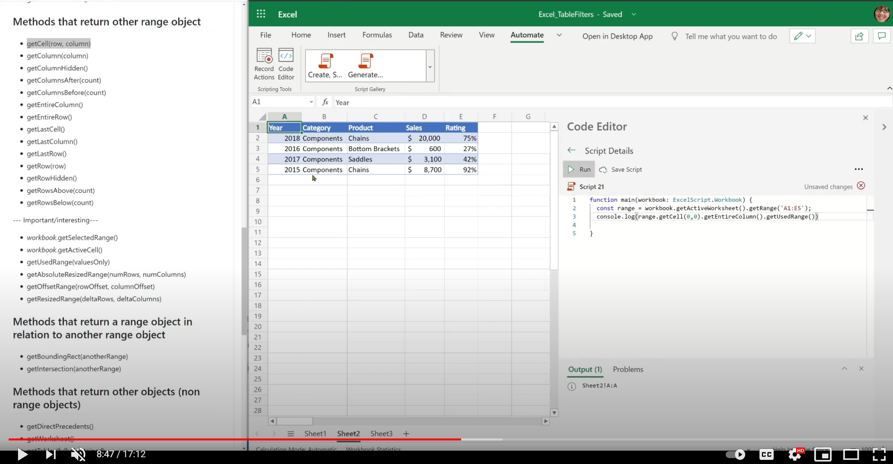
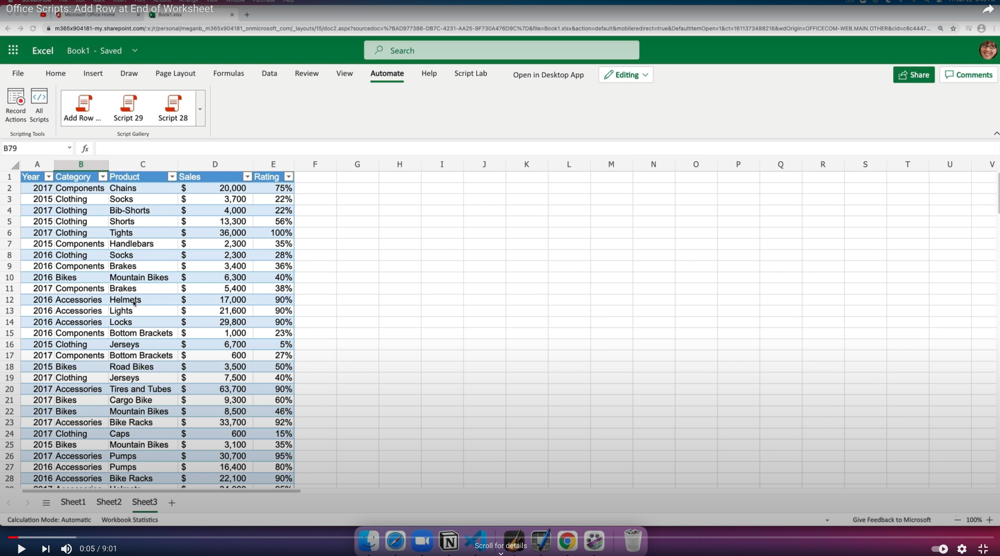

# <a name="range-basics"></a>Основы диапазона

`Range` является фундаментальным объектом в объектной модели Office Scripts Excel. [API диапазона](/javascript/api/office-scripts/excelscript/excelscript.range) позволяют получать доступ к данным и формату, доступным в сетке, и связывать другие ключевые объекты в Excel, такие как таблицы, таблицы, диаграммы и т.д.

Диапазон идентифицирован с помощью такого адреса, как "A1:B4" или с помощью имени элемента, который является именем ключа для данного набора ячеек. В объектной модели Excel ячейки и группы ячеек называются _диапазоном._ `Range` может содержать атрибуты уровня ячейки, такие как данные внутри ячейки, а также атрибуты уровня ячейки и ячейки, такие как формат, границы и т.д.

`Range` можно также получить с помощью выбора пользователя, состоящего по крайней мере из одной ячейки. При взаимодействии с диапазоном важно сохранить эти отношения между ячейками и диапазонами.

Ниже приводится основной набор геттеров, сеттеров и других полезных методов, наиболее часто используемых в скриптах. Это отличная отправная точка для вашего путешествия по API. В более поздних разделах сгруппировка методов и помощь в создании умственной модели при начале разблокирования `Range` API объекта.

## <a name="example-scripts"></a>Примеры скриптов

* [Базовое чтение и написание](#basic-read-and-write)
* [Добавление строки в конце таблицы](#add-row-at-the-end-of-worksheet)
* [Фильтр четких столбцов](clear-table-filter-for-active-cell.md)
* [Цвет каждой ячейки уникальным цветом](#color-each-cell-with-unique-color)
* [Диапазон обновлений со значениями с помощью 2-мерного (2D) массива](#update-range-with-values-using-2d-array)

### <a name="basic-read-and-write"></a>Базовое чтение и написание

```TypeScript
/**
 * This script demonstrates basic read-write operations on the Range object.
 */
function main(workbook: ExcelScript.Workbook) {
  const cell = workbook.getActiveCell();
  const prevValue = cell.getValue();
  if (prevValue) {
      console.log(`Active cell's value is: ${prevValue}`);
  } else {
      console.log("Setting active cell's value..");
      cell.setValue("Sample");
  }

  // Get cell next to the right column and set its value and fill color.
  const nextCell = cell.getOffsetRange(0,1);
  nextCell.setValue("Next cell");
  console.log(`Next cell's address is: ${nextCell.getAddress()}`);
  console.log("Setting fill color and font color of next cell...");
  nextCell.getFormat().getFill().setColor("Magenta");
  nextCell.getFormat().getFill().setColor("Cyan");

  // Get the target range address to update with 2-dimensional value.
  const dataRange = nextCell.getOffsetRange(1, 0).getResizedRange(2, 1);
  const DATA = [
    [10, 7],
    [8, 15],
    [12, 1]
  ];
  console.log(`Updating range ${dataRange.getAddress()} with values: ${DATA}`);
  dataRange.setValues(DATA);

  // Formula range.
  const formulaRange = dataRange.getOffsetRange(3, 0).getRow(0);
  console.log(`Updating formula for range: ${formulaRange.getAddress()}`)
  // Since relative formula is being set, we can set the formula of the entire range to the same value.
  formulaRange.setFormulaR1C1("=SUM(R[-3]C:R[-1]C)");
  console.log(`Updating number format for range: ${formulaRange.getAddress()}`)
  // Since the number format is common to the entire range, we can set it to a common format.
  formulaRange.setNumberFormat("0.00");
  return;
}
```

### <a name="add-row-at-the-end-of-worksheet"></a>Добавление строки в конце таблицы

```TypeScript
function main(workbook: ExcelScript.Workbook) {
    const sheet = workbook.getWorksheet('Sheet5');
    const data = ['2016', 'Bikes', 'Seats', '1500', .05];
    addRow(sheet, data);
    return;
}

function addRow(sheet: ExcelScript.Worksheet, data: (string | number | boolean)[]): void {

    const usedRange = sheet.getUsedRange();
    let startCell: ExcelScript.Range;
    // If the sheet is empty, then use A1 as starting cell for the update.
    if (usedRange) {
      startCell = usedRange.getLastRow().getCell(0, 0).getOffsetRange(1, 0);
    } else {
      startCell = sheet.getRange('A1');
    }
    console.log(startCell.getAddress());
    const targetRange = startCell.getResizedRange(0, data.length - 1);
    targetRange.setValues([data]);
    return;
}
```

### <a name="color-each-cell-with-unique-color"></a>Цвет каждой ячейки уникальным цветом

```TypeScript
/**
 * This sample demonstrates how to iterate over a selected range and set cell property.
   It colors each cell within the selected range with a random color.
 */
function main(workbook: ExcelScript.Workbook) {

    const syncStart = new Date().getTime();
    // Get selected range
    const range = workbook.getSelectedRange();
    const rows = range.getRowCount();
    const cols = range.getColumnCount();
    console.log("Start");

    // Color each cell with random color.
    for (let row = 0; row < rows; row++) {
        for (let col = 0; col < cols; col++) {
            range
                .getCell(row, col)
                .getFormat()
                .getFill()
                .setColor(`#${Math.random().toString(16).substr(-6)}`);
        }
    }

    console.log("End");
    const syncEnd = new Date().getTime();
    console.log("Completed, took: " + (syncEnd - syncStart) / 1000 + " Sec");
}
```

### <a name="update-range-with-values-using-2d-array"></a>Диапазон обновлений со значениями с помощью массива 2D

Динамически вычисляется измерение диапазона для обновления на основе значений массива 2D.

```TypeScript
function main(workbook: ExcelScript.Workbook) {
  const currentCell = workbook.getActiveCell();
  let inputRange = computeTargetRange(currentCell, DATA);
  // Set range values.
  console.log(inputRange.getAddress());
  inputRange.setValues(DATA);
  // Call a helper function to place border around the range.
  borderAround(inputRange);
}

/**
 * A helper function that computes the target range given the target range's starting cell and selected range. 
 */
function computeTargetRange(targetCell: ExcelScript.Range, data: string[][]): ExcelScript.Range {
  const targetRange = targetCell.getResizedRange(data.length - 1, data[0].length - 1);
  return targetRange;
}

/**
 * A helper function that places a border around the range.
 */
function borderAround(range: ExcelScript.Range): void {
  range.getFormat().getRangeBorder(ExcelScript.BorderIndex.edgeLeft).setStyle(ExcelScript.BorderLineStyle.dash);
  range.getFormat().getRangeBorder(ExcelScript.BorderIndex.edgeRight).setStyle(ExcelScript.BorderLineStyle.dash);
  range.getFormat().getRangeBorder(ExcelScript.BorderIndex.edgeTop).setStyle(ExcelScript.BorderLineStyle.dash);
  range.getFormat().getRangeBorder(ExcelScript.BorderIndex.edgeBottom).setStyle(ExcelScript.BorderLineStyle.dash);
  return;
}

// Values used for range setup.
const DATA = [
  ['Item', 'Bread', 'Donuts', 'Cookies', 'Cakes', 'Pies'],
  ['Amount', '2', '1.5', '4', '12', '26']
]
```

## <a name="training-videos-range-basics"></a>Обучающие видео: основы диапазона

_Основы диапазона_

[](https://youtu.be/4emjkOFdLBA "Пошаговая видеозапись об основах диапазона")

_Добавление строки в конце таблицы_

[](https://youtu.be/RgtUar013D0 "Пошаговая видеозапись добавления строки в конце таблицы")

## <a name="methods-that-return-some-range-metadata"></a>Методы, возвращая метаданные некоторых диапазонов

* getAddress(), getAddressLocal()
* getCellCount()
* getRowCount(), getColumnCount()

## <a name="methods-that-return-dataconstants-associated-with-a-given-range"></a>Методы возврата данных и констант, связанных с заданным диапазоном

### <a name="returned-as-single-cell-value"></a>Возвращено в качестве одноклеточного значения

* getFormula(), getFormulaLocal()
* getFormulaR1C1()
* getNumberFormat(), getNumberFormatLocal()
* getText()
* getValue()
* getValueType()

### <a name="returned-as-2d-arrays-whole-range"></a>Возвращается в качестве 2D-массивов (весь диапазон)

* getFormulas(), getFormulasLocal()
* getFormulasR1C1()
* getNumberFormatCategories()
* getNumberFormats(), getNumberFormatsLocal()
* getTexts()
* getValues()
* getValueTypes()
* getHidden()
* getIsEntireRow()
* getIsEntireColumn()

## <a name="methods-that-return-other-range-object"></a>Методы, возвращая другой объект диапазона

* getSurroundingRegion() — аналогично CurrentRegion в VBA
* getCell (строка, столбец)
* getColumn(column)
* getColumnHidden()
* getColumnsAfter (count)
* getColumnsBefore (count)
* getEntireColumn()
* getEntireRow()
* getLastCell()
* getLastColumn()
* getLastRow()
* getRow (row)
* getRowHidden()
* getRowsAbove (count)
* getRowsBelow (count)

**Важные и интересные**

* _книга_.getSelectedRange()
* _книга_.getActiveCell()
* getUsedRange (valuesOnly)
* getAbsoluteResizedRange (numRows, numColumns)
* getOffsetRange (rowOffset, columnOffset)
* getResizedRange (deltaRows, deltaColumns)

## <a name="methods-that-return-a-range-object-in-relation-to-another-range-object"></a>Методы, возвращая объект диапазона по отношению к другому объекту диапазона

* getBoundingRect (anotherRange)
* getIntersection (anotherRange)

## <a name="methods-that-return-other-objects-non-range-objects"></a>Методы, возвращая другие объекты (не в диапазоне объектов)

* getDirectPrecedents()
* getWorksheet()
* getTables(fullyContained)
* getPivotTables(fullyContained)
* getDataValidation()
* getPredefinedCellStyle()

## <a name="set-methods"></a>Настройка методов

### <a name="singular-cell-set-methods"></a>Методы набора сингулярных клеток

* setFormula(formula)
* setFormulaLocal (formulaLocal)
* setFormulaR1C1 (formulaR1C1)
* setNumberFormatLocal (numberFormatLocal)
* setValue(value)

### <a name="2d--entire-range-set-methods"></a>Методы набора диапазонов 2D /всего диапазона

* setFormulas(formulas)
* setFormulasLocal (formulasLocal)
* setFormulasR1C1 (formulasR1C1)
* setNumberFormat (numberFormat)
* setNumberFormats (numberFormats)
* setNumberFormatsLocal (numberFormatsLocal)
* setValues(values)

## <a name="other-methods"></a>Другие методы

* слияние (поперек)
* unmerge()

## <a name="coming-soon"></a>Скоро

* API края диапазона
