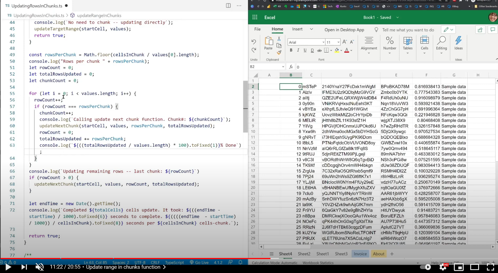

# <a name="performance-optimization-when-writing-a-large-dataset"></a><span data-ttu-id="4148f-103">Оптимизация производительности при написании большого набора данных</span><span class="sxs-lookup"><span data-stu-id="4148f-103">Performance optimization when writing a large dataset</span></span>

## <a name="basic-performance-optimization"></a><span data-ttu-id="4148f-104">Базовая оптимизация производительности</span><span class="sxs-lookup"><span data-stu-id="4148f-104">Basic performance optimization</span></span>

<span data-ttu-id="4148f-105">Основы производительности в сценариях Office см. в разделе [Производительность](getting-started.md#basic-performance-considerations) статьи Начало работы.</span><span class="sxs-lookup"><span data-stu-id="4148f-105">For performance basics in Office Scripts, see the [performance section](getting-started.md#basic-performance-considerations) of the Getting Started article.</span></span>

## <a name="sample-code-optimize-performance-of-a-large-dataset"></a><span data-ttu-id="4148f-106">Пример кода. Оптимизация производительности большого набора данных</span><span class="sxs-lookup"><span data-stu-id="4148f-106">Sample code: Optimize performance of a large dataset</span></span>

<span data-ttu-id="4148f-107">API диапазона позволяет устанавливать значения `setValues()` диапазона.</span><span class="sxs-lookup"><span data-stu-id="4148f-107">The `setValues()` Range API allows setting the values of a range.</span></span> <span data-ttu-id="4148f-108">Этот API имеет ограничения данных в зависимости от различных факторов, таких как размер данных, параметры сети и т.д. Чтобы надежно обновить большой диапазон данных, необходимо подумать о том, чтобы делать обновления данных небольшими фрагментами.</span><span class="sxs-lookup"><span data-stu-id="4148f-108">This API has data limitations depending on various factors such as data size, network settings, etc. In order to reliably update a large range of data, you'll need to think about doing data updates in smaller chunks.</span></span> <span data-ttu-id="4148f-109">Этот сценарий пытается сделать это и записывает строки диапазона в куски, чтобы при обновлении большого диапазона его можно было сделать в меньших частях.</span><span class="sxs-lookup"><span data-stu-id="4148f-109">This script attempts to do this and writes rows of a range in chunks so that if a large range needs to be updated, it can be done in smaller parts.</span></span> <span data-ttu-id="4148f-110">**Предупреждение.** Он не был протестирован в разных размерах, поэтому следует помнить об этом, если вы хотите использовать это в скрипте.</span><span class="sxs-lookup"><span data-stu-id="4148f-110">**Warning**: It has not been tested across various sizes so be aware of that if you want to use this in your script.</span></span> <span data-ttu-id="4148f-111">Поскольку у нас есть возможность проверить, мы будем обновляться с выводами о том, как она выполняется для различных размеров данных.</span><span class="sxs-lookup"><span data-stu-id="4148f-111">As we have opportunity to test, we'll update with findings around how it performs for various data sizes.</span></span>

<span data-ttu-id="4148f-112">Этот сценарий выбирает 1K-ячейки на каждый кусок, но вы можете переопреять, чтобы проверить, как он работает для вас.</span><span class="sxs-lookup"><span data-stu-id="4148f-112">This script selects 1K cells per chunk but you can override to test out how it works for you.</span></span> <span data-ttu-id="4148f-113">Он обновляет 100-тысячные строки с 6 столбцами данных.</span><span class="sxs-lookup"><span data-stu-id="4148f-113">It updates 100k rows with 6 columns of data.</span></span> <span data-ttu-id="4148f-114">Запустите это на пустом листе, чтобы изучить.</span><span class="sxs-lookup"><span data-stu-id="4148f-114">Run this on a blank sheet to examine.</span></span>

```TypeScript
function main(workbook: ExcelScript.Workbook) {
  const sheet = workbook.getActiveWorksheet();

  let data: (string | number | boolean)[][] = [];
  // Number of rows in the random data (x 6 columns).
  const sampleRows = 100000;

  console.log(`Generating data...`)
  // Dynamically generate some random data for testing purpose. 
  for (let i = 0; i < sampleRows; i++) {
    data.push([i, ...[getRandomString(5), getRandomString(20), getRandomString(10), Math.random()], "Sample data"]);
  }

  console.log(`Calling update range function...`);
  const updated = updateRangeInChunks(sheet.getRange("B2"), data);
  if (!updated) {
    console.log(`Update did not take place or complete. Check and run again.`)
  }

  return;
}

function updateRangeInChunks(
  startCell: ExcelScript.Range,
  values: (string | boolean | number)[][],
  cellsInChunk: number = 10000
): boolean {

  const startTime = new Date().getTime();
  console.log(`Cells per chunk setting: ${cellsInChunk}`);
  if (!values) {
    console.log(`Invalid input values to update.`);
    return false;
  }
  if (values.length === 0 || values[0].length === 0) {
    console.log(`Empty data -- nothing to update.`);
    return true;
  }
  const totalCells = values.length * values[0].length;

  console.log(`Total cells to update in the target range: ${totalCells}`);
  if (totalCells <= cellsInChunk) {
    console.log(`No need to chunk -- updating directly`);
    updateTargetRange(startCell, values);
    return true;
  }

  const rowsPerChunk = Math.floor(cellsInChunk / values[0].length);
  console.log("Rows per chunk: " + rowsPerChunk);
  let rowCount = 0;
  let totalRowsUpdated = 0;
  let chunkCount = 0;

  for (let i = 0; i < values.length; i++) {
    rowCount++;
    if (rowCount === rowsPerChunk) {
      chunkCount++;
      console.log(`Calling update next chunk function. Chunk#: ${chunkCount}`);
      updateNextChunk(startCell, values, rowsPerChunk, totalRowsUpdated);
      rowCount = 0;
      totalRowsUpdated += rowsPerChunk;
      console.log(`${((totalRowsUpdated / values.length) * 100).toFixed(1)}% Done`);

    }
  }
  console.log(`Updating remaining rows -- last chunk: ${rowCount}`)
  if (rowCount > 0) {
    updateNextChunk(startCell, values, rowCount, totalRowsUpdated);
  }

  let endTime = new Date().getTime();
  console.log(`Completed ${totalCells} cells update. It took: ${((endTime - startTime) / 1000).toFixed(6)} seconds to complete. ${((((endTime  - startTime) / 1000)) / cellsInChunk).toFixed(8)} seconds per ${cellsInChunk} cells-chunk.`);

  return true;
}

/**
 * A helper function that computes the target range and updates. 
 */

function updateNextChunk(
  startingCell: ExcelScript.Range,
  data: (string | boolean | number)[][],
  rowsPerChunk: number,
  totalRowsUpdated: number
) {

  const newStartCell = startingCell.getOffsetRange(totalRowsUpdated, 0);
  const targetRange = newStartCell.getResizedRange(rowsPerChunk - 1, data[0].length - 1);
  console.log(`Updating chunk at range ${targetRange.getAddress()}`);
  const dataToUpdate = data.slice(totalRowsUpdated, totalRowsUpdated + rowsPerChunk);
  try {
    targetRange.setValues(dataToUpdate);
  } catch (e) {
    throw `Error while updating the chunk range: ${JSON.stringify(e)}`;
  }
  return;
}

/**
 * A helper function that computes the target range given the target range's starting cell
 * and selected range and updates the values.
 */
function updateTargetRange(
  targetCell: ExcelScript.Range,
  values: (string | boolean | number)[][]
) {
  const targetRange = targetCell.getResizedRange(values.length - 1, values[0].length - 1);
  console.log(`Updating the range: ${targetRange.getAddress()}`);
  try {
    targetRange.setValues(values);
  } catch (e) {
    throw `Error while updating the whole range: ${JSON.stringify(e)}`;
  }
  return;
}

// Credit: https://www.codegrepper.com/code-examples/javascript/random+text+generator+javascript
function getRandomString(length: number): string {
  var randomChars = 'ABCDEFGHIJKLMNOPQRSTUVWXYZabcdefghijklmnopqrstuvwxyz0123456789';
  var result = '';
  for (var i = 0; i < length; i++) {
    result += randomChars.charAt(Math.floor(Math.random() * randomChars.length));
  }
  return result;
}
```

## <a name="training-video-optimize-performance-when-writing-a-large-dataset"></a><span data-ttu-id="4148f-115">Обучающее видео. Оптимизация производительности при написании большого набора данных</span><span class="sxs-lookup"><span data-stu-id="4148f-115">Training video: Optimize performance when writing a large dataset</span></span>

<span data-ttu-id="4148f-116">[](https://youtu.be/BP9Kp0Ltj7U "Видео о том, как оптимизировать производительность при написании большого наборов данных")</span><span class="sxs-lookup"><span data-stu-id="4148f-116">[](https://youtu.be/BP9Kp0Ltj7U "Video on how to optimize performance when writing a large dataset")</span></span>
