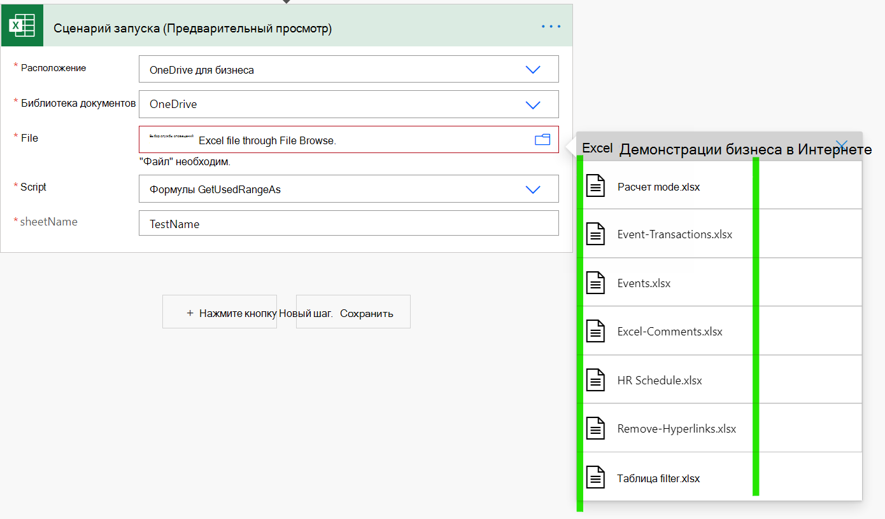
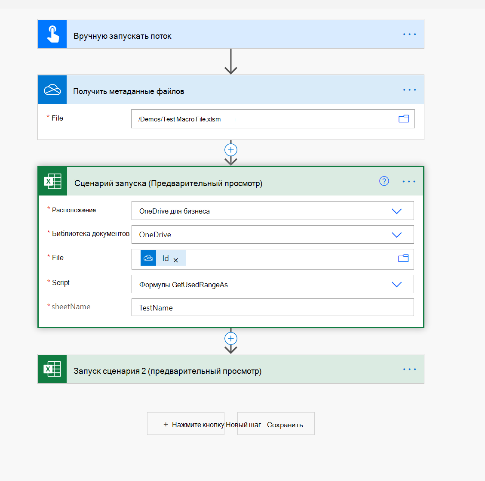

# Использование макрофайлов в потоках Power AutomateHow to use macro files in Power Automate flows

[Потоки Power Automate](https://flow.microsoft.com/) предоставляют [соединители Excel,](https://flow.microsoft.com/connectors/shared_excelonlinebusiness/excel-online-business/) которые помогают подключать файлы Excel к остальным организационным данным и приложениям, таким как Teams, Outlook и SharePoint.[Power Automate flows](https://flow.microsoft.com/) provide [Excel connectors](https://flow.microsoft.com/connectors/shared_excelonlinebusiness/excel-online-business/) to help connect Excel files with the rest of your organizational data and apps such as Teams, Outlook, and SharePoint.

Однако макрофайлы не могут быть выбраны в отсеве файла (см. пример на следующем скриншоте).However, macro files can't be selected in the file dropdown (see an example in the following screenshot).

Один из способов решения этой проблемы — включите действие "Get File Metadata" (OneDrive или SharePoint) и используйте свойство ID в действии "Сценарий запуска", как показано на следующем скриншоте.One way to get around this issue is by including the "Get File Metadata" action (OneDrive or SharePoint) and use the ID property in the "Run Script" action as shown in the following screenshot.

> [!NOTE]
> Некоторые XLSM (особенно те, которые ActiveX/Form) могут не работать в сетевом соединитель Excel.Some XLSM (especially the ones with ActiveX/Form controls) may not work in the Excel online connector. Убедитесь, что перед развертыванием решения необходимо протестировать.Be sure to test before deploying your solution.

