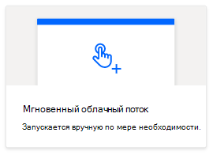
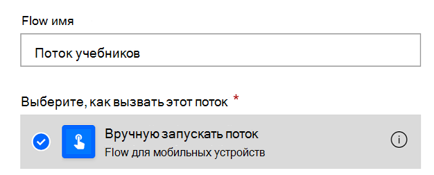
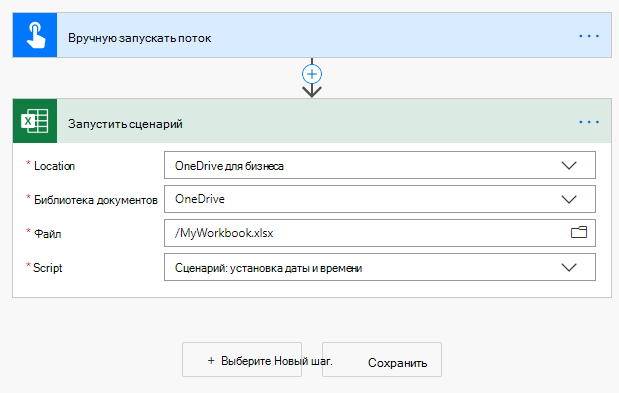
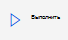
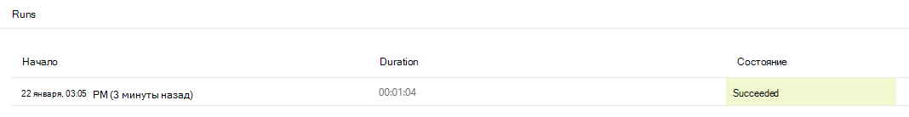

# <a name="call-scripts-from-a-manual-power-automate-flow-preview"></a><span data-ttu-id="c13ec-103">Вызов сценариев из активированного вручную потока Power Automate (предварительный просмотр)</span><span class="sxs-lookup"><span data-stu-id="c13ec-103">Call scripts from a manual Power Automate flow (preview)</span></span>

<span data-ttu-id="c13ec-104">В этом руководстве объясняется, как запускать сценарий Office для Excel в Интернете с помощью [Power Automate](https://flow.microsoft.com).</span><span class="sxs-lookup"><span data-stu-id="c13ec-104">This tutorial teaches you how to run an Office Script for Excel on the web through [Power Automate](https://flow.microsoft.com).</span></span> <span data-ttu-id="c13ec-105">Вы создадите сценарий, обновляющий значения двух ячеек текущим временем.</span><span class="sxs-lookup"><span data-stu-id="c13ec-105">You'll make a script that updates the values of two cells with the current time.</span></span> <span data-ttu-id="c13ec-106">После этого вы подключите этот сценарий к запускаемому вручную потоку Power Automate, чтобы этот сценарий выполнялся при каждом нажатии кнопки Power Automate.</span><span class="sxs-lookup"><span data-stu-id="c13ec-106">You'll then connect that script to a manually triggered Power Automate flow, so that the script is run whenever a button in Power Automate is pressed.</span></span> <span data-ttu-id="c13ec-107">После знакомства с базовым шаблоном вы можете расширить поток, чтобы включить другие приложения и автоматизировать дополнительные повседневные рабочие процессы.</span><span class="sxs-lookup"><span data-stu-id="c13ec-107">Once you understand the basic pattern, you can expand the flow to include other applications and automate more of your daily workflow.</span></span>

> [!TIP]
> <span data-ttu-id="c13ec-108">Если вы только приступили к работе со сценариями Office, рекомендуем начать с учебника [Запись, редактирование и создание сценариев Office в Excel в Интернете](excel-tutorial.md).</span><span class="sxs-lookup"><span data-stu-id="c13ec-108">If you are new to Office Scripts, we recommend starting with the [Record, edit, and create Office Scripts in Excel on the web](excel-tutorial.md) tutorial.</span></span> <span data-ttu-id="c13ec-109">[Сценарии Office используют TypeScript](../overview/code-editor-environment.md), и этот учебник предназначен для пользователей с начальным и средним уровнем знаний по JavaScript или TypeScript.</span><span class="sxs-lookup"><span data-stu-id="c13ec-109">[Office Scripts use TypeScript](../overview/code-editor-environment.md) and this tutorial is intended for people with beginner to intermediate-level knowledge of JavaScript or TypeScript.</span></span> <span data-ttu-id="c13ec-110">Если вы впервые работаете с JavaScript, рекомендуем начать с [учебника Mozilla по JavaScript](https://developer.mozilla.org/docs/Web/JavaScript/Guide/Introduction).</span><span class="sxs-lookup"><span data-stu-id="c13ec-110">If you're new to JavaScript, we recommend starting with the [Mozilla JavaScript tutorial](https://developer.mozilla.org/docs/Web/JavaScript/Guide/Introduction).</span></span>

## <a name="prerequisites"></a><span data-ttu-id="c13ec-111">Предварительные условия</span><span class="sxs-lookup"><span data-stu-id="c13ec-111">Prerequisites</span></span>

[!INCLUDE [Tutorial prerequisites](../includes/power-automate-tutorial-prerequisites.md)]

## <a name="prepare-the-workbook"></a><span data-ttu-id="c13ec-112">Подготовка книги</span><span class="sxs-lookup"><span data-stu-id="c13ec-112">Prepare the workbook</span></span>

<span data-ttu-id="c13ec-113">Power Automate не должен использовать [относительные ссылки](../testing/power-automate-troubleshooting.md#avoid-using-relative-references), такие как `Workbook.getActiveWorksheet`, для доступа к компонентам книги.</span><span class="sxs-lookup"><span data-stu-id="c13ec-113">Power Automate shouldn't use [relative references](../testing/power-automate-troubleshooting.md#avoid-using-relative-references) like `Workbook.getActiveWorksheet` to access workbook components.</span></span> <span data-ttu-id="c13ec-114">Поэтому нужно использовать книгу и лист с именами, на которые может ссылаться Power Automate.</span><span class="sxs-lookup"><span data-stu-id="c13ec-114">So, we need a workbook and worksheet with consistent names that Power Automate can reference.</span></span>

1. <span data-ttu-id="c13ec-115">Создайте новую книгу под названием **MyWorkbook**.</span><span class="sxs-lookup"><span data-stu-id="c13ec-115">Create a new workbook named **MyWorkbook**.</span></span>

2. <span data-ttu-id="c13ec-116">В книге **MyWorkbook** создайте лист под названием **TutorialWorksheet**.</span><span class="sxs-lookup"><span data-stu-id="c13ec-116">In the **MyWorkbook** workbook, create a worksheet called **TutorialWorksheet**.</span></span>

## <a name="create-an-office-script"></a><span data-ttu-id="c13ec-117">Создание сценария Office</span><span class="sxs-lookup"><span data-stu-id="c13ec-117">Create an Office Script</span></span>

1. <span data-ttu-id="c13ec-118">Перейдите на вкладку **Автоматизировать** и выберите **Все сценарии**.</span><span class="sxs-lookup"><span data-stu-id="c13ec-118">Go to the **Automate** tab and select **All Scripts**.</span></span>

2. <span data-ttu-id="c13ec-119">Выберите **Новый сценарий**.</span><span class="sxs-lookup"><span data-stu-id="c13ec-119">Select **New Script**.</span></span>

3. <span data-ttu-id="c13ec-120">Замените сценарий по умолчанию следующим сценарием.</span><span class="sxs-lookup"><span data-stu-id="c13ec-120">Replace the default script with the following script.</span></span> <span data-ttu-id="c13ec-121">Этот сценарий добавляет текущую дату и время в первые две ячейки листа **TutorialWorksheet**.</span><span class="sxs-lookup"><span data-stu-id="c13ec-121">This script adds the current date and time to the first two cells of the **TutorialWorksheet** worksheet.</span></span>

    ```TypeScript
    function main(workbook: ExcelScript.Workbook) {
      // Get the "TutorialWorksheet" worksheet from the workbook.
      let worksheet = workbook.getWorksheet("TutorialWorksheet");

      // Get the cells at A1 and B1.
      let dateRange = worksheet.getRange("A1");
      let timeRange = worksheet.getRange("B1");

      // Get the current date and time using the JavaScript Date object.
      let date = new Date(Date.now());

      // Add the date string to A1.
      dateRange.setValue(date.toLocaleDateString());

      // Add the time string to B1.
      timeRange.setValue(date.toLocaleTimeString());
    }
    ```

4. <span data-ttu-id="c13ec-122">Переименуйте сценарий в **Установка даты и времени**.</span><span class="sxs-lookup"><span data-stu-id="c13ec-122">Rename the script to **Set date and time**.</span></span> <span data-ttu-id="c13ec-123">Нажмите на имя сценария, чтобы изменить его.</span><span class="sxs-lookup"><span data-stu-id="c13ec-123">Press the script name to change it.</span></span>

5. <span data-ttu-id="c13ec-124">Сохраните сценарий, нажав кнопку **Сохранить сценарий**.</span><span class="sxs-lookup"><span data-stu-id="c13ec-124">Save the script by pressing **Save Script**.</span></span>

## <a name="create-an-automated-workflow-with-power-automate"></a><span data-ttu-id="c13ec-125">Создание автоматизированного рабочего процесса с помощью Power Automate</span><span class="sxs-lookup"><span data-stu-id="c13ec-125">Create an automated workflow with Power Automate</span></span>

1. <span data-ttu-id="c13ec-126">Войдите на [сайт Power Automate](https://flow.microsoft.com).</span><span class="sxs-lookup"><span data-stu-id="c13ec-126">Sign in to the [Power Automate site](https://flow.microsoft.com).</span></span>

2. <span data-ttu-id="c13ec-127">В меню в левой части экрана выберите **Создать**.</span><span class="sxs-lookup"><span data-stu-id="c13ec-127">In the menu that's displayed on the left side of the screen, press **Create**.</span></span> <span data-ttu-id="c13ec-128">При этом откроется список способов создания новых рабочих процессов.</span><span class="sxs-lookup"><span data-stu-id="c13ec-128">This brings you to list of ways to create new workflows.</span></span>

    

3. <span data-ttu-id="c13ec-130">В разделе **Создание нового** выберите пункт **Мгновенный поток**.</span><span class="sxs-lookup"><span data-stu-id="c13ec-130">In the **Start from blank** section, select **Instant flow**.</span></span> <span data-ttu-id="c13ec-131">В результате будет создан активированный вручную рабочий процесс.</span><span class="sxs-lookup"><span data-stu-id="c13ec-131">This creates a manually activated workflow.</span></span>

    

4. <span data-ttu-id="c13ec-133">В открывшемся диалоговом окне введите имя для своего потока в поле **Имя потока**, выберите **Запустить поток вручную** из списка вариантов в разделе **Выбор способа запуска потока** и нажмите **Создать**.</span><span class="sxs-lookup"><span data-stu-id="c13ec-133">In the dialog window that appears, enter a name for your flow in the **Flow name** text box, select **Manually trigger a flow** from the list of options under **Choose how to trigger the flow**, and press **Create**.</span></span>

    

    <span data-ttu-id="c13ec-135">Обратите внимание: запускаемый вручную поток — это лишь один из многих типов потоков.</span><span class="sxs-lookup"><span data-stu-id="c13ec-135">Note that a manually triggered flow is just one of many types of flows.</span></span> <span data-ttu-id="c13ec-136">В следующем руководстве описывается создание потока, который будет выполняться автоматически при получении вами сообщения электронной почты.</span><span class="sxs-lookup"><span data-stu-id="c13ec-136">In the next tutorial, you'll make a flow that automatically runs when you receive an email.</span></span>

5. <span data-ttu-id="c13ec-137">Нажмите клавишу **Следующий шаг**.</span><span class="sxs-lookup"><span data-stu-id="c13ec-137">Press **New step**.</span></span>

6. <span data-ttu-id="c13ec-138">Перейдите на вкладку **Стандартные** и выберите **Excel Online (бизнес)**.</span><span class="sxs-lookup"><span data-stu-id="c13ec-138">Select the **Standard** tab, then select **Excel Online (Business)**.</span></span>

    

7. <span data-ttu-id="c13ec-140">В разделе **Действия** выберите **Запустить сценарий (предварительная версия)**.</span><span class="sxs-lookup"><span data-stu-id="c13ec-140">Under **Actions**, select **Run script (preview)**.</span></span>

    

8. <span data-ttu-id="c13ec-142">Затем выберите книгу и сценарий для использования на следующем шаге.</span><span class="sxs-lookup"><span data-stu-id="c13ec-142">Next, you'll select the workbook and script to use in the flow step.</span></span> <span data-ttu-id="c13ec-143">В этом учебнике вы будете использовать книгу, созданную в OneDrive, но вы можете воспользоваться любой книгой в OneDrive или на сайте SharePoint.</span><span class="sxs-lookup"><span data-stu-id="c13ec-143">For the tutorial, you'll use the workbook you created in your OneDrive, but you could use any workbook in a OneDrive or SharePoint site.</span></span> <span data-ttu-id="c13ec-144">Укажите следующие параметры для соединителя **Запуск сценария**.</span><span class="sxs-lookup"><span data-stu-id="c13ec-144">Specify the following settings for the **Run script** connector:</span></span>

    - <span data-ttu-id="c13ec-145">**Расположение**: OneDrive для бизнеса</span><span class="sxs-lookup"><span data-stu-id="c13ec-145">**Location**: OneDrive for Business</span></span>
    - <span data-ttu-id="c13ec-146">**Библиотека документов**: OneDrive</span><span class="sxs-lookup"><span data-stu-id="c13ec-146">**Document Library**: OneDrive</span></span>
    - <span data-ttu-id="c13ec-147">**Файл**: MyWorkbook.xlsx *(выбран с помощью браузера файлов)*</span><span class="sxs-lookup"><span data-stu-id="c13ec-147">**File**: MyWorkbook.xlsx *(Chosen through the file browser)*</span></span>
    - <span data-ttu-id="c13ec-148">**Сценарий**: установка даты и времени</span><span class="sxs-lookup"><span data-stu-id="c13ec-148">**Script**: Set date and time</span></span>

    

9. <span data-ttu-id="c13ec-150">Нажмите **Сохранить**.</span><span class="sxs-lookup"><span data-stu-id="c13ec-150">Press **Save**.</span></span>

<span data-ttu-id="c13ec-151">Теперь ваш поток готов к запуску с помощью Power Automate.</span><span class="sxs-lookup"><span data-stu-id="c13ec-151">Your flow is now ready to be run through Power Automate.</span></span> <span data-ttu-id="c13ec-152">Вы можете проверить его с помощью кнопки **Тест** в редакторе потока или выполнить остальные действия согласно руководству, чтобы запустить поток из вашей коллекции потоков.</span><span class="sxs-lookup"><span data-stu-id="c13ec-152">You can test it using the **Test** button in the flow editor or follow the remaining tutorial steps to run the flow from your flow collection.</span></span>

## <a name="run-the-script-through-power-automate"></a><span data-ttu-id="c13ec-153">Запуск сценария с помощью Power Automate</span><span class="sxs-lookup"><span data-stu-id="c13ec-153">Run the script through Power Automate</span></span>

1. <span data-ttu-id="c13ec-154">На главной странице Power Automate выберите **Мои потоки**.</span><span class="sxs-lookup"><span data-stu-id="c13ec-154">From the main Power Automate page, select **My flows**.</span></span>

    

2. <span data-ttu-id="c13ec-156">Выберите **Мой учебный поток** из списка во вкладке **Мои потоки**. При этом будут показаны подробные сведения о потоке, который мы создали ранее.</span><span class="sxs-lookup"><span data-stu-id="c13ec-156">Select **My tutorial flow** from the list of flows displayed in the **My flows** tab. This shows the details of the flow we previously created.</span></span>

3. <span data-ttu-id="c13ec-157">Нажмите кнопку **Запуск**.</span><span class="sxs-lookup"><span data-stu-id="c13ec-157">Press **Run**.</span></span>

    

4. <span data-ttu-id="c13ec-159">Появится панель задач для запуска потока.</span><span class="sxs-lookup"><span data-stu-id="c13ec-159">A task pane will appear for running the flow.</span></span> <span data-ttu-id="c13ec-160">Когда будет предложено выполнить **Вход** в Excel Online, нажмите кнопку **Продолжить**.</span><span class="sxs-lookup"><span data-stu-id="c13ec-160">If you are asked to **Sign in** to Excel Online, do so by pressing **Continue**.</span></span>

5. <span data-ttu-id="c13ec-161">Щелкните **Запустить поток**.</span><span class="sxs-lookup"><span data-stu-id="c13ec-161">Press **Run flow**.</span></span> <span data-ttu-id="c13ec-162">При этом запустится поток, выполняющий связанный сценарий Office.</span><span class="sxs-lookup"><span data-stu-id="c13ec-162">This runs the flow, which runs the related Office Script.</span></span>

6. <span data-ttu-id="c13ec-163">Нажмите кнопку **Готово**.</span><span class="sxs-lookup"><span data-stu-id="c13ec-163">Press **Done**.</span></span> <span data-ttu-id="c13ec-164">Вы можете заметить, что раздел **Запуски** соответствующим образом обновлен.</span><span class="sxs-lookup"><span data-stu-id="c13ec-164">You should see the **Runs** section update accordingly.</span></span>

7. <span data-ttu-id="c13ec-165">Обновите страницу, чтобы увидеть результаты работы Power Automate.</span><span class="sxs-lookup"><span data-stu-id="c13ec-165">Refresh the page to see the results of the Power Automate.</span></span> <span data-ttu-id="c13ec-166">После этого перейдите в книгу, где должны отобразиться обновленные ячейки.</span><span class="sxs-lookup"><span data-stu-id="c13ec-166">If it succeeded, go to the workbook to see the updated cells.</span></span> <span data-ttu-id="c13ec-167">В случае неудачи проверьте параметры этого потока и запустите его еще раз.</span><span class="sxs-lookup"><span data-stu-id="c13ec-167">If it failed, verify the flow's settings and run it a second time.</span></span>

    

## <a name="next-steps"></a><span data-ttu-id="c13ec-169">Дальнейшие действия</span><span class="sxs-lookup"><span data-stu-id="c13ec-169">Next steps</span></span>

<span data-ttu-id="c13ec-170">Прочитайте раздел руководства [Передача данных сценариям в автоматически запускаемом потоке Power Automate](excel-power-automate-trigger.md).</span><span class="sxs-lookup"><span data-stu-id="c13ec-170">Complete the [Pass data to scripts in an automatically-run Power Automate flow](excel-power-automate-trigger.md) tutorial.</span></span> <span data-ttu-id="c13ec-171">В нем рассказывается о том, как передать данные из службы рабочего процесса в ваш сценарий Office и запустить поток Power Automate при возникновении определенных событий.</span><span class="sxs-lookup"><span data-stu-id="c13ec-171">It teaches you how to pass data from a workflow service to your Office Script and run the Power Automate flow when certain events occur.</span></span>
