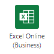

# <a name="return-data-from-a-script-to-an-automatically-run-power-automate-flow-preview"></a><span data-ttu-id="f8e35-103">Возвращение данных из сценария в автоматически запускаемый поток Power Automate (предварительная версия)</span><span class="sxs-lookup"><span data-stu-id="f8e35-103">Return data from a script to an automatically-run Power Automate flow (preview)</span></span>

<span data-ttu-id="f8e35-104">В этом руководстве объясняется, как возвращать сведения из сценария Office для Excel в Интернете в рамках автоматизированного рабочего процесса [Power Automate](https://flow.microsoft.com).</span><span class="sxs-lookup"><span data-stu-id="f8e35-104">This tutorial teaches you how to return information from an Office Script for Excel on the web as part of an automated [Power Automate](https://flow.microsoft.com) workflow.</span></span> <span data-ttu-id="f8e35-105">Создайте сценарий, который выполняется по расписанию и работает с потоком для отправки напоминаний по электронной почте.</span><span class="sxs-lookup"><span data-stu-id="f8e35-105">You'll make a script that looks through a schedule and works with a flow to send reminder emails.</span></span> <span data-ttu-id="f8e35-106">Этот поток будет запускаться по расписанию и предоставлять напоминания от вашего имени.</span><span class="sxs-lookup"><span data-stu-id="f8e35-106">This flow will run on a regular schedule, providing these reminders on your behalf.</span></span>

> [!TIP]
> <span data-ttu-id="f8e35-107">Если вы только приступили к работе со сценариями Office, рекомендуем начать с учебника [Запись, редактирование и создание сценариев Office в Excel в Интернете](excel-tutorial.md).</span><span class="sxs-lookup"><span data-stu-id="f8e35-107">If you are new to Office Scripts, we recommend starting with the [Record, edit, and create Office Scripts in Excel on the web](excel-tutorial.md) tutorial.</span></span>
>
> <span data-ttu-id="f8e35-108">Если вы впервые используете Power Automate, рекомендуем начать с учебников [Вызов сценариев из активированного вручную потока Power Automate](excel-power-automate-manual.md) и [Передача данных в сценарии в автоматически запускаемом потоке Power Automate](excel-power-automate-trigger.md).</span><span class="sxs-lookup"><span data-stu-id="f8e35-108">If you are new to Power Automate, we recommend starting with the [Call scripts from a manual Power Automate flow](excel-power-automate-manual.md) and [Pass data to scripts in an automatically-run Power Automate flow](excel-power-automate-trigger.md) tutorials.</span></span>
>
> <span data-ttu-id="f8e35-109">[Сценарии Office используют TypeScript](../overview/code-editor-environment.md), и этот учебник предназначен для пользователей с начальным и средним уровнем знаний по JavaScript или TypeScript.</span><span class="sxs-lookup"><span data-stu-id="f8e35-109">[Office Scripts use TypeScript](../overview/code-editor-environment.md) and this tutorial is intended for people with beginner to intermediate-level knowledge of JavaScript or TypeScript.</span></span> <span data-ttu-id="f8e35-110">Если вы впервые работаете с JavaScript, рекомендуем начать с [учебника Mozilla по JavaScript](https://developer.mozilla.org/docs/Web/JavaScript/Guide/Introduction).</span><span class="sxs-lookup"><span data-stu-id="f8e35-110">If you're new to JavaScript, we recommend starting with the [Mozilla JavaScript tutorial](https://developer.mozilla.org/docs/Web/JavaScript/Guide/Introduction).</span></span>

## <a name="prerequisites"></a><span data-ttu-id="f8e35-111">Предварительные условия</span><span class="sxs-lookup"><span data-stu-id="f8e35-111">Prerequisites</span></span>

[!INCLUDE [Tutorial prerequisites](../includes/power-automate-tutorial-prerequisites.md)]

## <a name="prepare-the-workbook"></a><span data-ttu-id="f8e35-112">Подготовка книги</span><span class="sxs-lookup"><span data-stu-id="f8e35-112">Prepare the workbook</span></span>

1. <span data-ttu-id="f8e35-113">Загрузите книгу <a href="on-call-rotation.xlsx">on-call-rotation.xlsx</a> в OneDrive.</span><span class="sxs-lookup"><span data-stu-id="f8e35-113">Download the workbook <a href="on-call-rotation.xlsx">on-call-rotation.xlsx</a> to your OneDrive.</span></span>

1. <span data-ttu-id="f8e35-114">Откройте **on-call-rotation.xlsx** в Excel в Интернете.</span><span class="sxs-lookup"><span data-stu-id="f8e35-114">Open **on-call-rotation.xlsx** in Excel on the web.</span></span>

1. <span data-ttu-id="f8e35-115">Добавьте в таблицу строку со своим именем, адресом электронной почты и датами начала и окончания, которые перекрываются с текущей датой.</span><span class="sxs-lookup"><span data-stu-id="f8e35-115">Add a row to the table with your name, email address, and start and end dates that overlap with the current date.</span></span>

    > [!IMPORTANT]
    > <span data-ttu-id="f8e35-116">Сценарий, который вы создаете, использует первую соответствующую запись в таблице, поэтому убедитесь, что ваше имя расположено выше строки с текущей неделей.</span><span class="sxs-lookup"><span data-stu-id="f8e35-116">The script you'll write uses the first matching entry in the table, so make sure your name is above any row with the current week.</span></span>

    

## <a name="create-an-office-script"></a><span data-ttu-id="f8e35-118">Создание сценария Office</span><span class="sxs-lookup"><span data-stu-id="f8e35-118">Create an Office Script</span></span>

1. <span data-ttu-id="f8e35-119">Перейдите на вкладку **Автоматизация** и выберите **Все сценарии**.</span><span class="sxs-lookup"><span data-stu-id="f8e35-119">Go to the **Automate** tab and select **All Scripts**.</span></span>

1. <span data-ttu-id="f8e35-120">Выберите **Новый сценарий**.</span><span class="sxs-lookup"><span data-stu-id="f8e35-120">Select **New Script**.</span></span>

1. <span data-ttu-id="f8e35-121">Назовите сценарий **Получение дежурного**.</span><span class="sxs-lookup"><span data-stu-id="f8e35-121">Name the script **Get On-Call Person**.</span></span>

1. <span data-ttu-id="f8e35-122">Сейчас у вас должен быть пустой сценарий.</span><span class="sxs-lookup"><span data-stu-id="f8e35-122">You should now have an empty script.</span></span> <span data-ttu-id="f8e35-123">Нам нужно использовать его для получения адреса электронной почты с листа.</span><span class="sxs-lookup"><span data-stu-id="f8e35-123">We want to use the script to get an email address from the spreadsheet.</span></span> <span data-ttu-id="f8e35-124">Измените функцию `main`, чтобы вернуть строку наподобие этой:</span><span class="sxs-lookup"><span data-stu-id="f8e35-124">Change `main` to return a string, like this:</span></span>

    ```typescript
    function main(workbook: ExcelScript.Workbook) : string {
    }
    ```

1. <span data-ttu-id="f8e35-125">Затем нам нужно получить все данные из таблицы.</span><span class="sxs-lookup"><span data-stu-id="f8e35-125">Next, we need to get all the data from the table.</span></span> <span data-ttu-id="f8e35-126">Это позволит нам просмотреть каждую строку с помощью сценария.</span><span class="sxs-lookup"><span data-stu-id="f8e35-126">That lets us look through each row with the script.</span></span> <span data-ttu-id="f8e35-127">Добавьте следующий код в функцию `main`.</span><span class="sxs-lookup"><span data-stu-id="f8e35-127">Add the following code inside the `main` function.</span></span>

    ```typescript
    // Get the H1 worksheet.
    let worksheet = workbook.getWorksheet("H1");

    // Get the first (and only) table in the worksheet.
    let table = worksheet.getTables()[0];

    // Get the data from the table.
    let tableValues = table.getRangeBetweenHeaderAndTotal().getValues();
    ```

1. <span data-ttu-id="f8e35-128">Даты в таблице хранятся в виде [порядковых номеров в Excel](https://support.microsoft.com/office/date-systems-in-excel-e7fe7167-48a9-4b96-bb53-5612a800b487).</span><span class="sxs-lookup"><span data-stu-id="f8e35-128">The dates in the table are stored using [Excel's date serial number](https://support.microsoft.com/office/date-systems-in-excel-e7fe7167-48a9-4b96-bb53-5612a800b487).</span></span> <span data-ttu-id="f8e35-129">Необходимо преобразовать эти даты в даты JavaScript для сравнения.</span><span class="sxs-lookup"><span data-stu-id="f8e35-129">We need to convert those dates to JavaScript dates in order to compare them.</span></span> <span data-ttu-id="f8e35-130">Добавим вспомогательную функцию в наш сценарий.</span><span class="sxs-lookup"><span data-stu-id="f8e35-130">We'll add a helper function to our script.</span></span> <span data-ttu-id="f8e35-131">Добавьте следующий код вне функции `main`:</span><span class="sxs-lookup"><span data-stu-id="f8e35-131">Add the following code outside of the `main` function:</span></span>

    ```typescript
    // Convert the Excel date to a JavaScript Date object.
    function convertDate(excelDateValue: number) {
        let javaScriptDate = new Date(Math.round((excelDateValue - 25569) * 86400 * 1000));
        return javaScriptDate;
    }
    ```

1. <span data-ttu-id="f8e35-132">Теперь необходимо определить, кто на дежурстве сейчас.</span><span class="sxs-lookup"><span data-stu-id="f8e35-132">Now, we need to figure out which person is on call right now.</span></span> <span data-ttu-id="f8e35-133">В строке с его именем дата начала будет предшествовать текущей дате, а дата окончания — следовать за ней.</span><span class="sxs-lookup"><span data-stu-id="f8e35-133">Their row will have a start and end date surrounding the current date.</span></span> <span data-ttu-id="f8e35-134">Создавая сценарий, предположим, что сотрудники дежурят по одному.</span><span class="sxs-lookup"><span data-stu-id="f8e35-134">We'll write the script to assume only one person is on call at a time.</span></span> <span data-ttu-id="f8e35-135">Сценарии могут возвращать массивы для обработки нескольких значений, но в этот раз будет возвращен первый соответствующий адрес электронной почты.</span><span class="sxs-lookup"><span data-stu-id="f8e35-135">Scripts can return arrays to handle multiple values, but for now we'll return the first matching email address.</span></span> <span data-ttu-id="f8e35-136">Добавьте ниже указанный код в конец функции `main`.</span><span class="sxs-lookup"><span data-stu-id="f8e35-136">Add the following code to the end of the `main` function.</span></span>

    ```typescript
    // Look for the first row where today's date is between the row's start and end dates.
    let currentDate = new Date();
    for (let row = 0; row < tableValues.length; row++) {
        let startDate = convertDate(tableValues[row][2] as number);
        let endDate = convertDate(tableValues[row][3] as number);
        if (startDate <= currentDate && endDate >= currentDate) {
            // Return the first matching email address.
            return tableValues[row][1].toString();
        }
    }
    ```

1. <span data-ttu-id="f8e35-137">Окончательный вариант сценария должен выглядеть так:</span><span class="sxs-lookup"><span data-stu-id="f8e35-137">The final script should look like this:</span></span>

    ```typescript
    function main(workbook: ExcelScript.Workbook) : string {
        // Get the H1 worksheet.
        let worksheet = workbook.getWorksheet("H1");

        // Get the first (and only) table in the worksheet.
        let table = worksheet.getTables()[0];
    
        // Get the data from the table.
        let tableValues = table.getRangeBetweenHeaderAndTotal().getValues();
    
        // Look for the first row where today's date is between the row's start and end dates.
        let currentDate = new Date();
        for (let row = 0; row < tableValues.length; row++) {
            let startDate = convertDate(tableValues[row][2] as number);
            let endDate = convertDate(tableValues[row][3] as number);
            if (startDate <= currentDate && endDate >= currentDate) {
                // Return the first matching email address.
                return tableValues[row][1].toString();
            }
        }
    }

    // Convert the Excel date to a JavaScript Date object.
    function convertDate(excelDateValue: number) {
        let javaScriptDate = new Date(Math.round((excelDateValue - 25569) * 86400 * 1000));
        return javaScriptDate;
    }
    ```

## <a name="create-an-automated-workflow-with-power-automate"></a><span data-ttu-id="f8e35-138">Создание автоматизированного рабочего процесса с помощью Power Automate</span><span class="sxs-lookup"><span data-stu-id="f8e35-138">Create an automated workflow with Power Automate</span></span>

1. <span data-ttu-id="f8e35-139">Войдите на [сайт Power Automate](https://flow.microsoft.com).</span><span class="sxs-lookup"><span data-stu-id="f8e35-139">Sign in to the [Power Automate site](https://flow.microsoft.com).</span></span>

1. <span data-ttu-id="f8e35-140">В меню в левой части экрана выберите **Создать**.</span><span class="sxs-lookup"><span data-stu-id="f8e35-140">In the menu that's displayed on the left side of the screen, press **Create**.</span></span> <span data-ttu-id="f8e35-141">При этом откроется список способов создания новых рабочих процессов.</span><span class="sxs-lookup"><span data-stu-id="f8e35-141">This brings you to list of ways to create new workflows.</span></span>

    

1. <span data-ttu-id="f8e35-143">В разделе **Начать с пустого** выберите **Запланированный облачный поток**.</span><span class="sxs-lookup"><span data-stu-id="f8e35-143">Under the **Start from blank** section, select **Scheduled cloud flow**.</span></span>

    

1. <span data-ttu-id="f8e35-145">Теперь необходимо задать расписание для этого потока.</span><span class="sxs-lookup"><span data-stu-id="f8e35-145">Now we need to set the schedule for this flow.</span></span> <span data-ttu-id="f8e35-146">На нашем листе назначение новых дежурных начинается каждый понедельник в первой половине 2021 года.</span><span class="sxs-lookup"><span data-stu-id="f8e35-146">Our spreadsheet has a new on-call assignment starting every Monday in the first half of 2021.</span></span> <span data-ttu-id="f8e35-147">Настроим запуск потока в первую очередь утром в понедельник.</span><span class="sxs-lookup"><span data-stu-id="f8e35-147">Let's set the flow to run first thing Monday mornings.</span></span> <span data-ttu-id="f8e35-148">Используйте приведенные ниже параметры, чтобы настроить запуск потока каждый понедельник.</span><span class="sxs-lookup"><span data-stu-id="f8e35-148">Use the following options to configure the flow to run on Monday each week.</span></span>

    - <span data-ttu-id="f8e35-149">**Имя потока**: Уведомление дежурного</span><span class="sxs-lookup"><span data-stu-id="f8e35-149">**Flow name**: Notify On-Call Person</span></span>
    - <span data-ttu-id="f8e35-150">**Начало**: 04.01.2021 в 01:00</span><span class="sxs-lookup"><span data-stu-id="f8e35-150">**Starting**: 1/4/21 at 1:00am</span></span>
    - <span data-ttu-id="f8e35-151">**Частота повтора**: 1 неделя</span><span class="sxs-lookup"><span data-stu-id="f8e35-151">**Repeat every**: 1 Week</span></span>
    - <span data-ttu-id="f8e35-152">**В такие дни**: Пн</span><span class="sxs-lookup"><span data-stu-id="f8e35-152">**On these days**: M</span></span>

    

1. <span data-ttu-id="f8e35-154">Нажмите кнопку **Создать**.</span><span class="sxs-lookup"><span data-stu-id="f8e35-154">Press **Create**.</span></span>

1. <span data-ttu-id="f8e35-155">Нажмите кнопку **Новый шаг**.</span><span class="sxs-lookup"><span data-stu-id="f8e35-155">Press **New step**.</span></span>

1. <span data-ttu-id="f8e35-156">Перейдите на вкладку **Стандартные** и выберите **Excel Online (бизнес)**.</span><span class="sxs-lookup"><span data-stu-id="f8e35-156">Select the **Standard** tab, then select **Excel Online (Business)**.</span></span>

    

1. <span data-ttu-id="f8e35-158">В разделе **Действия** выберите **Запуск сценария (предварительная версия)**.</span><span class="sxs-lookup"><span data-stu-id="f8e35-158">Under **Actions**, select **Run script (preview)**.</span></span>

    

1. <span data-ttu-id="f8e35-160">Затем выберите книгу и сценарий для использования на следующем шаге.</span><span class="sxs-lookup"><span data-stu-id="f8e35-160">Next, you'll select the workbook and script to use in the flow step.</span></span> <span data-ttu-id="f8e35-161">Используйте книгу **on-call-rotation.xlsx**, созданную в OneDrive.</span><span class="sxs-lookup"><span data-stu-id="f8e35-161">Use the **on-call-rotation.xlsx** workbook you created in your OneDrive.</span></span> <span data-ttu-id="f8e35-162">Укажите следующие параметры для соединителя **Запуск сценария**.</span><span class="sxs-lookup"><span data-stu-id="f8e35-162">Specify the following settings for the **Run script** connector:</span></span>

    - <span data-ttu-id="f8e35-163">**Расположение**: OneDrive для бизнеса</span><span class="sxs-lookup"><span data-stu-id="f8e35-163">**Location**: OneDrive for Business</span></span>
    - <span data-ttu-id="f8e35-164">**Библиотека документов**: OneDrive</span><span class="sxs-lookup"><span data-stu-id="f8e35-164">**Document Library**: OneDrive</span></span>
    - <span data-ttu-id="f8e35-165">**Файл**: on-call-rotation.xlsx *(выбран с помощью браузера файлов)*</span><span class="sxs-lookup"><span data-stu-id="f8e35-165">**File**: on-call-rotation.xlsx *(Chosen through the file browser)*</span></span>
    - <span data-ttu-id="f8e35-166">**Сценарий**: Получение дежурного</span><span class="sxs-lookup"><span data-stu-id="f8e35-166">**Script**: Get On-Call Person</span></span>

    

1. <span data-ttu-id="f8e35-168">Нажмите кнопку **Новый шаг**.</span><span class="sxs-lookup"><span data-stu-id="f8e35-168">Press **New step**.</span></span>

1. <span data-ttu-id="f8e35-169">Завершим поток отправкой сообщения с напоминанием.</span><span class="sxs-lookup"><span data-stu-id="f8e35-169">We'll end the flow by sending the reminder email.</span></span> <span data-ttu-id="f8e35-170">Выберите **Отправить сообщение (V2)** с помощью панели поиска соединителя.</span><span class="sxs-lookup"><span data-stu-id="f8e35-170">Select **Send an email (V2)** by using the connector's search bar.</span></span> <span data-ttu-id="f8e35-171">Чтобы добавить адрес электронной почты, возвращенный сценарием, используйте элемент управления **Добавить динамическое содержимое**.</span><span class="sxs-lookup"><span data-stu-id="f8e35-171">Use the **Add dynamic content** control to add the email address returned by the script.</span></span> <span data-ttu-id="f8e35-172">Он будет помечен как **результат** и значком Excel.</span><span class="sxs-lookup"><span data-stu-id="f8e35-172">This will be labelled **result** with the Excel icon next to it.</span></span> <span data-ttu-id="f8e35-173">Можно использовать любую тему и основной текст.</span><span class="sxs-lookup"><span data-stu-id="f8e35-173">You can provide whatever subject and body text you'd like.</span></span>

    

    > [!NOTE]
    > <span data-ttu-id="f8e35-175">В этом учебном руководстве используется Outlook.</span><span class="sxs-lookup"><span data-stu-id="f8e35-175">This tutorial uses Outlook.</span></span> <span data-ttu-id="f8e35-176">Можно использовать любую предпочитаемую вами службу электронной почты, хотя в этом случае некоторые параметры могут отличаться.</span><span class="sxs-lookup"><span data-stu-id="f8e35-176">Feel free to use your preferred email service instead, though some options may be different.</span></span>

1. <span data-ttu-id="f8e35-177">Нажмите кнопку **Сохранить**.</span><span class="sxs-lookup"><span data-stu-id="f8e35-177">Press **Save**.</span></span>

## <a name="test-the-script-in-power-automate"></a><span data-ttu-id="f8e35-178">Тестирование сценария в Power Automate</span><span class="sxs-lookup"><span data-stu-id="f8e35-178">Test the script in Power Automate</span></span>

<span data-ttu-id="f8e35-179">Ваш поток будет запускаться каждый понедельник утром.</span><span class="sxs-lookup"><span data-stu-id="f8e35-179">Your flow will run every Monday morning.</span></span> <span data-ttu-id="f8e35-180">Вы можете проверить сценарий, нажав кнопку **Проверить** в правом верхнем углу экрана.</span><span class="sxs-lookup"><span data-stu-id="f8e35-180">You can test the script now by pressing the **Test** button in the upper-right corner of the screen.</span></span> <span data-ttu-id="f8e35-181">Выберите **Вручную** и нажмите **Запустить тест**, чтобы запустить поток и проверить поведение.</span><span class="sxs-lookup"><span data-stu-id="f8e35-181">Select **Manually** and press **Run Test** to run the flow now and test the behavior.</span></span> <span data-ttu-id="f8e35-182">Возможно, вам понадобится предоставить разрешения для Excel и Outlook, чтобы продолжить.</span><span class="sxs-lookup"><span data-stu-id="f8e35-182">You may need to grant permissions to Excel and Outlook to continue.</span></span>


> [!TIP]
> <span data-ttu-id="f8e35-184">Если поток не сможет отправить сообщение, еще раз проверьте, чтобы на листе был указан действительный адрес электронной почты для текущего диапазона дат в верхней части страницы.</span><span class="sxs-lookup"><span data-stu-id="f8e35-184">If your flow fails to send an email, double-check in the spreadsheet that a valid email is listed for the current date range at the top of the table.</span></span>

## <a name="next-steps"></a><span data-ttu-id="f8e35-185">Дальнейшие действия</span><span class="sxs-lookup"><span data-stu-id="f8e35-185">Next steps</span></span>

<span data-ttu-id="f8e35-186">Посетите страницу [Запуск сценариев Office с помощью Power Automate](../develop/power-automate-integration.md) для получения дополнительных сведений о подключениях сценариев Office с помощью Power Automate.</span><span class="sxs-lookup"><span data-stu-id="f8e35-186">Visit [Run Office Scripts with Power Automate](../develop/power-automate-integration.md) to learn more about connecting Office Scripts with Power Automate.</span></span>

<span data-ttu-id="f8e35-187">Кроме того, прочтите статью [Образец сценария автоматизированных напоминаний о задачах](../resources/scenarios/task-reminders.md), чтобы узнать, как использовать сценарии Office и Power Automate с адаптивными карточками Teams.</span><span class="sxs-lookup"><span data-stu-id="f8e35-187">You can also check out the [Automated task reminders sample scenario](../resources/scenarios/task-reminders.md) to learn how to combine Office Scripts and Power Automate with Teams Adaptive Cards.</span></span>
